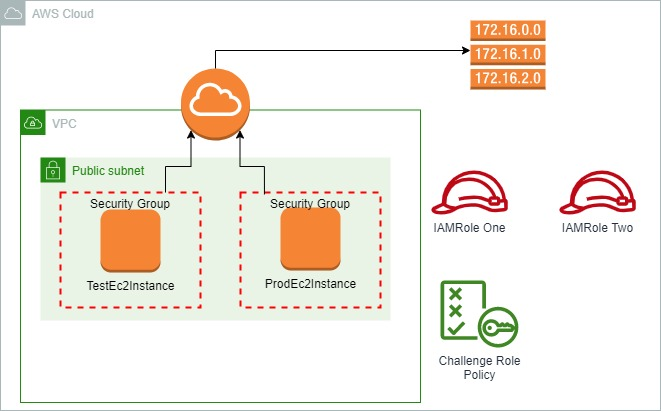
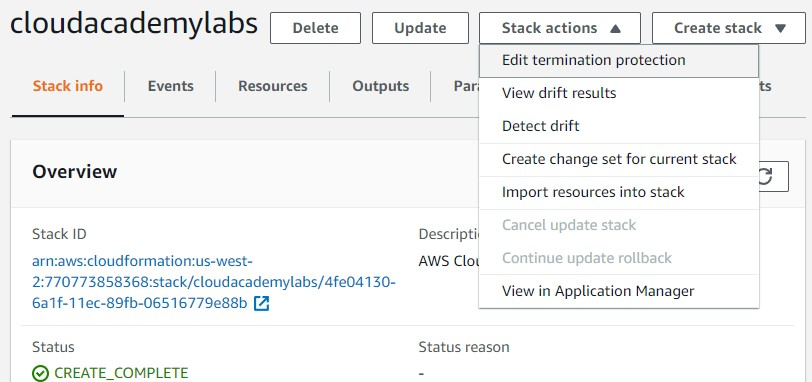
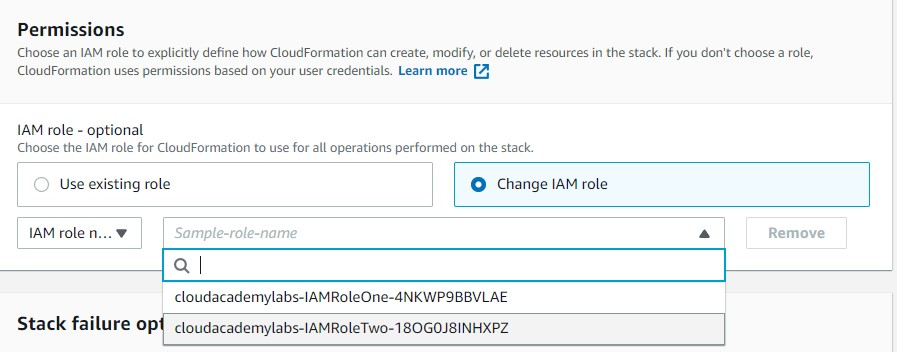
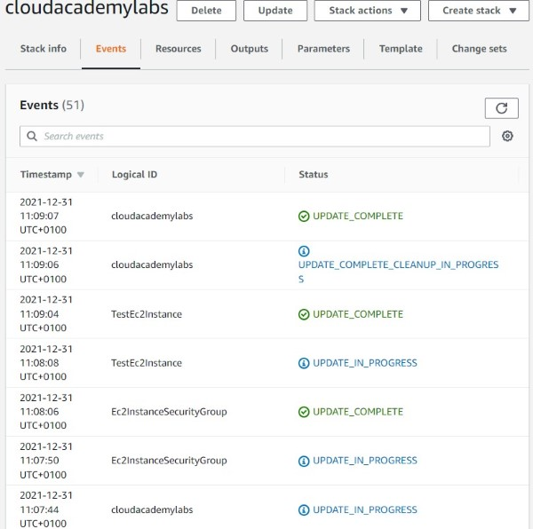

<br />

<p align="center">
  <a href="img/">
    
  </a>
  <h3 align="center">100 days in Cloud</h3>
<p align="center">
  CloudFormation stack update
    <br />
    Lab 0
    <br/>
  </p>
</p>

<details open="open">
  <summary><h2 style="display: inline-block">Lab Details</h2></summary>
  <ol>
    <li><a href="#services-covered">Services covered</a>
    <li><a href="#lab-description">Lab description</a></li>
    </li>
    <li><a href="#lab-date">Lab date</a></li>
    <li><a href="#prerequisites">Prerequisites</a></li>    
    <li><a href="#lab-steps">Lab steps</a></li>
    <li><a href="#lab-files">Lab files</a></li>
    <li><a href="#acknowledgements">Acknowledgements</a></li>
  </ol>
</details>

---

## Services Covered
*  **CloudFormation**

---

## Lab description
*You have been tasked with the following:
Increasing the size of one of the instances
Allowing HTTP access to the instances from anywhere
Exposing the instance Id of one of the instances as a stack template output*

---

### Learning Objectives
:bulb: **Enable Stack Termination Protection**

:bulb: **Update template**

---

### Lab date
31-12-2021

---

### Prerequisites
:cloud: AWS account

:computer: EC2 Instance running or Terraform installed locally


---

### Lab steps
1. **Enable Stack Termination Protection**. Using AWS Management Console enable termination protection for the lab CloudFormation stack.

   

2. **Update EC2 Instance Type**. 

   ```
   TestEc2Instance:
       Type: "AWS::EC2::Instance"
       Properties:
         ImageId: !Ref LatestAmiId
         InstanceType: t3.micro
         KeyName: !Ref "AWS::AccountId"
         NetworkInterfaces:
           - AssociatePublicIpAddress: "true"
             DeviceIndex: "0"
             GroupSet:
               - Ref: Ec2InstanceSecurityGroup
             SubnetId: !Ref PublicSubnet
         Tags:
           - Key: Name
             Value: !Sub ${TagPrefix} Test Instance
   ```

3. **Add a Security Group Ingress Rule**.

   ```
   Ec2InstanceSecurityGroup:
       Type: "AWS::EC2::SecurityGroup"
       Properties:
         GroupDescription: Security group for EC2 instances
         GroupName: ec2-instance-sg
         VpcId: !Ref VPC
         SecurityGroupIngress:
         - IpProtocol: tcp
           FromPort: 80
           ToPort: 80
           CidrIp: 0.0.0.0/0
   ```

4. **Add a Template Output**.

   ```
   ProdEc2Instance:
       Description: Instance Id
       Value: !Ref ProdEc2Instance
   ```

5. **Use Specific IAM Role for Updates**.

   

6. Update stack.

   

### Lab files
* [template.json](template.json)

---

### Acknowledgements
* [cloud academy](https://cloudacademy.com/lab-challenge/cloudformation-stack-update-challenge/)

