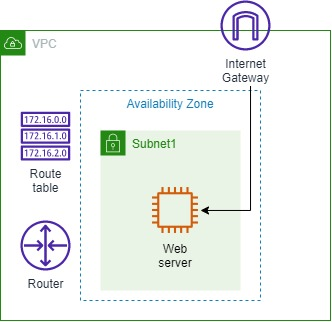
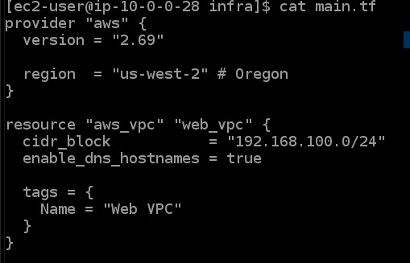

<br />

<p align="center">
  <a href="img/">
    
  </a>
  <h3 align="center">100 days in Cloud</h3>
<p align="center">
  Deploy infrastructure on AWS using Terraform
    <br />
    Lab 1
    <br/>
  </p>
</p>

<details open="open">
  <summary><h2 style="display: inline-block">Lab Details</h2></summary>
  <ol>
    <li><a href="#services-covered">Services covered</a>
    <li><a href="#lab-description">Lab description</a></li>
    </li>
    <li><a href="#lab-date">Lab date</a></li>
    <li><a href="#prerequisites">Prerequisites</a></li>    
    <li><a href="#lab-steps">Lab steps</a></li>
    <li><a href="#lab-files">Lab files</a></li>
    <li><a href="#acknowledgements">Acknowledgements</a></li>
  </ol>
</details>

---

## Services Covered
*  **Terraform**
*  **EC2**

---

## Lab description
*You must modify an existing Terraform configuration to deploy a subnet within the Web VPC and provision an EC2 instance inside the subnet. Only t2.micro instances and volumes up to 10GBs are allowed in this lab challenge.*

---

### Learning Objectives
:bulb: Create Terraform configuration

---

### Lab date
30-12-2021

---

### Prerequisites
:cloud: AWS account

:computer: EC2 Instance running or Terraform installed locally


---

### Lab steps
1. SSH into the **Development** EC2 instance (Shell or EC2 Instance Connect). 

2. Add to the existing `main.tf` file to configure the following:

   - Create a subnet resource in **Web VPC**

   - Create an EC2 instance into the newly created subnet within **Web VPC**

  That's how it looks pre:

  

3. That's want it look afterwards:

```
provider "aws" {
  version = "2.69"

  region  = "us-west-2" # Oregon
}

data "aws_availability_zones" "available" {
  state = "available"
}

resource "aws_vpc" "web_vpc" {
  cidr_block           = "192.168.100.0/24"
  enable_dns_hostnames = true

  tags = {
    Name = "Web VPC"
  }
}

resource "aws_subnet" "subnet1" {
  vpc_id            = aws_vpc.web_vpc.id
  cidr_block        = cidrsubnet(aws_vpc.web_vpc.cidr_block, 8, 1)
  availability_zone = data.aws_availability_zones.available.names[0]
}

resource "aws_instance" "web" {
  ami = "ami-0528a5175983e7f28"
  instance_type = "t2.micro"
  subnet_id = aws_subnet.subnet1.id
  root_block_device {
    volume_size = "10"
  }
}
```


### Lab files
* [main.tf](main.tf)

---

### Acknowledgements
* [cloud academy](https://cloudacademy.com/lab-challenge/terraform-deploy-infrastructure-challenge/)

