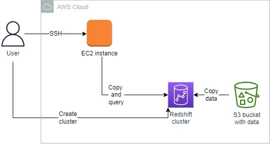
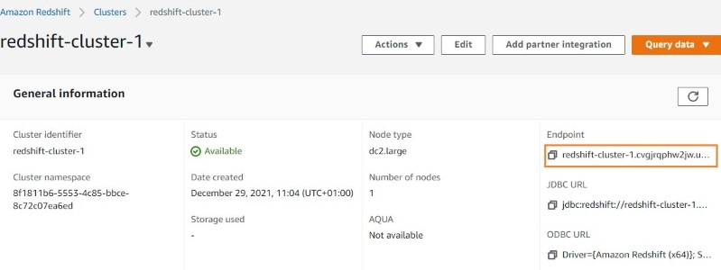
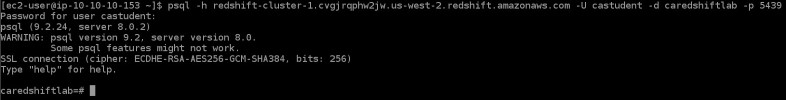
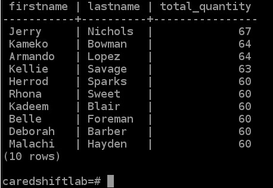
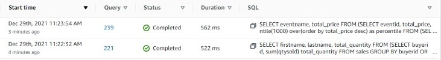
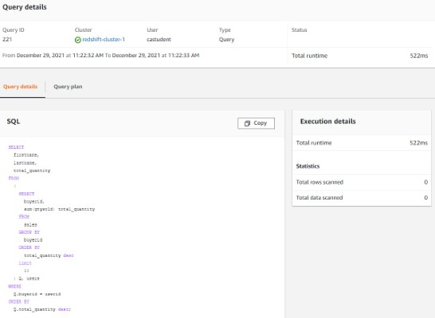
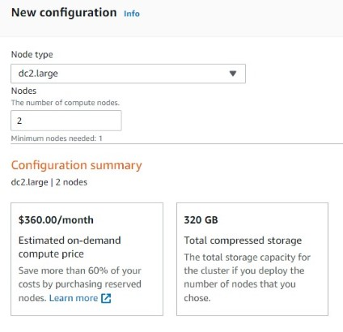
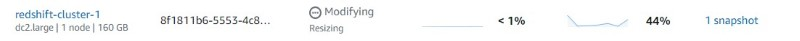

<br />

<p align="center">
  <a href="img/">
    
  </a>
  <h3 align="center">100 days in Cloud</h3>
<p align="center">
  Run sample queries using Redshift cluster
    <br />
    Lab 2
    <br/>
  </p>
</p>

<details open="open">
  <summary><h2 style="display: inline-block">Lab Details</h2></summary>
  <ol>
    <li><a href="#services-covered">Services covered</a>
    <li><a href="#lab-description">Lab description</a></li>
    </li>
    <li><a href="#lab-date">Lab date</a></li>
    <li><a href="#prerequisites">Prerequisites</a></li>    
    <li><a href="#lab-steps">Lab steps</a></li>
    <li><a href="#lab-files">Lab files</a></li>
    <li><a href="#acknowledgements">Acknowledgements</a></li>
  </ol>
</details>

---

## Services Covered
*  **Redshift**
*  **EC2**

---

## Lab description

*Creating a Redshift cluster comes at significant cost, make sure to use the Free Tier version and delete resources afterward.
This lab comes with sample data stored on S3 bucket.*

Create an Amazon Redshift cluster. Connect to EC2 instance to copy data from S3 to Redshift. Create tables in Redshift database and query that data.


---

### Learning Objectives
:bulb: Create a Redshift cluster

:bulb: Load data into Redshift using command-line prompt on a remote Linux host

:bulb: Run sample SQL queries on a single-node Redshift cluster

:bulb: View query details and metrics


---

### Lab date
29-12-2021

---

### Prerequisites
:cloud: AWS account

:ledger:  This lab comes with huge amount of data stored on S3

:computer: EC2 Instance running


---

### Lab steps
1. Create a IAM Role with *AmazonS3ReadOnlyAcces* policy attached to it. In VPC section create a Security Group that allows Inbound traffic for Redshift on port 5439, SSH on port 22 and HTTP on port 80.

2. In the AWS Management Console navigate to Redshift and create cluster. Under **Node type**, in the **DC2** tile, select **dc2.large** and enter 1 for number of nodes. Under **Cluster permissions** choose a role created in step 1.

   Under the **Additional configurations** section remove the default flag by deselecting **Use defaults** and for Network and security choose default VPC and Security Group from step 1. Leave rest at their defaults. Create the cluster - it might take up to 10 minutes. When created copy the enpoint from **General information**.

   

3. Connect to EC2 instance using Instance Connect. connect to the Redshift cluster by entering the following command:

   ```
   psql -h <YOURCLUSTERENDPOINT> -U <YOUR_USERNAME> -p 5439 -d <DATABASE_NAME> -p 5439
   ```

   

4. Create tables and enter data into the Redshift cluster by copying and pasting the following table creation SQL statements:

   ```
   create table users(
       userid integer not null distkey sortkey,
       username char(8),
       firstname varchar(30),
       lastname varchar(30),
       city varchar(30),
       state char(2),
       email varchar(100),
       phone char(14),
       likesports boolean,
       liketheatre boolean,
       likeconcerts boolean,
       likejazz boolean,
       likeclassical boolean,
       likeopera boolean,
       likerock boolean,
       likevegas boolean,
       likebroadway boolean,
       likemusicals boolean);
   create table venue(
       venueid smallint not null distkey sortkey,
       venuename varchar(100),
       venuecity varchar(30),
       venuestate char(2),
       venueseats integer);
   create table category(
       catid smallint not null distkey sortkey,
       catgroup varchar(10),
       catname varchar(10),
       catdesc varchar(50));
   create table date(
       dateid smallint not null distkey sortkey,
       caldate date not null,
       day character(3) not null,
       week smallint not null,
       month character(5) not null,
       qtr character(5) not null,
       year smallint not null,
       holiday boolean default('N'));
   create table event(
       eventid integer not null distkey,
       venueid smallint not null,
       catid smallint not null,
       dateid smallint not null sortkey,
       eventname varchar(200),
       starttime timestamp);
   create table listing(
       listid integer not null distkey,
       sellerid integer not null,
       eventid integer not null,
       dateid smallint not null  sortkey,
       numtickets smallint not null,
       priceperticket decimal(8,2),
       totalprice decimal(8,2),
       listtime timestamp);
   create table sales(
       salesid integer not null,
       listid integer not null distkey,
       sellerid integer not null,
       buyerid integer not null,
       eventid integer not null,
       dateid smallint not null sortkey,
       qtysold smallint not null,
       pricepaid decimal(8,2),
       commission decimal(8,2),
       saletime timestamp);
   
   ```

   To copy data from S3 buckets into your Redshift cluster, enter the following commands:

   ```
   copy users
   from 's3://awssampledbuswest2/tickit/allusers_pipe.txt'
   credentials 'aws_iam_role=arn:aws:iam::672258087279:role/caredshiftlab'
   delimiter '|' region 'us-west-2';
        
   copy venue
   from 's3://awssampledbuswest2/tickit/venue_pipe.txt'
   credentials 'aws_iam_role=arn:aws:iam::672258087279:role/caredshiftlab'
   delimiter '|' region 'us-west-2';
        
   copy category
   from 's3://awssampledbuswest2/tickit/category_pipe.txt'
   credentials 'aws_iam_role=arn:aws:iam::672258087279:role/caredshiftlab'
   delimiter '|' region 'us-west-2';
        
   copy date
   from 's3://awssampledbuswest2/tickit/date2008_pipe.txt'
   credentials 'aws_iam_role=arn:aws:iam::672258087279:role/caredshiftlab'
   delimiter '|' region 'us-west-2';
        
   copy event
   from 's3://awssampledbuswest2/tickit/allevents_pipe.txt'
   credentials 'aws_iam_role=arn:aws:iam::672258087279:role/caredshiftlab'
   delimiter '|' timeformat 'YYYY-MM-DD HH:MI:SS' region 'us-west-2';
        
   copy listing
   from 's3://awssampledbuswest2/tickit/listings_pipe.txt'
   credentials 'aws_iam_role=arn:aws:iam::672258087279:role/caredshiftlab'
   delimiter '|' region 'us-west-2';
        
   copy sales
   from 's3://awssampledbuswest2/tickit/sales_tab.txt'
   credentials 'aws_iam_role=arn:aws:iam::672258087279:role/caredshiftlab'
   delimiter '\t' timeformat 'MM/DD/YYYY HH:MI:SS' region 'us-west-2';
   ```

5. This command returns a list of the top 10 buyer names by quantity from the example data. 

   ```
   SELECT firstname, lastname, total_quantity 
   FROM (SELECT buyerid, sum(qtysold) total_quantity
           FROM  sales
           GROUP BY buyerid
           ORDER BY total_quantity desc limit 10) Q, users
   WHERE Q.buyerid = userid
   ORDER BY Q.total_quantity desc;
   ```

   

6. Back in the Redshift cluster dashboard, click the **Query monitoring**, that's where the query history is

   

   

7. To resize the cluster select it and click **Actions** drop-down menu box and select **Resize**. Under **New cluster configuration**, set **Nodes** to *2*, then scroll to the bottom of the page and click the **Resize cluster now** button. 

   

   

### Lab files
* 

---

### Acknowledgements
* [cloud academy](https://cloudacademy.com/lab/getting-started-with-amazon-redshift/)

