<br />

<p align="center">
  <a href="img/">
    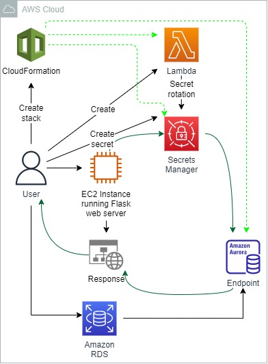
  </a>
  <h3 align="center">100 days in Cloud</h3>
<p align="center">
  Storing and Rotating RDS Credentials in Secrets Manager
    <br />
    Lab 3
    <br/>
  </p>
</p>

<details open="open">
  <summary><h2 style="display: inline-block">Lab Details</h2></summary>
  <ol>
    <li><a href="#services-covered">Services covered</a>
    <li><a href="#lab-description">Lab description</a></li>
    </li>
    <li><a href="#lab-date">Lab date</a></li>
    <li><a href="#prerequisites">Prerequisites</a></li>    
    <li><a href="#lab-steps">Lab steps</a></li>
    <li><a href="#lab-files">Lab files</a></li>
    <li><a href="#acknowledgements">Acknowledgements</a></li>
  </ol>
</details>

---

## Services Covered
*  **RDS**
*  **Secrets Manager**
*  **Lambda**
*  **CloudFormation**
*  **EC2**

---

## Lab description

Using the command-line shell, update a simple Python web application to connect to the RDS instance using the credentials added to AWS Secrets Manager. Use a simple Python application to fetch credentials from AWS Secrets Manager and use them to connect to a database. 

---

### Learning Objectives
:bulb: Use AWS Secrets Manager to store a password for use with an RDS database.
:bulb: Connect to RDS instance from EC2 instance using Python app
:bulb: AWS Secrets Manager to rotate the password in the secret you created previously
:bulb: Use CloudFormation to create and rotate a secret in AWS Secrets Manager

---

### Lab date
28-12-2021

---

### Prerequisites
:cloud: AWS account
:ledger: Aurora MySQL cluster running (make note of the instance endpoint address)
:computer: EC2 Instance running

---

### Lab steps
1. Create a Lambda function for rotating the secrets using this [file](SecretsManagerRotationFunction.py). Note the Function ARN.

1. In AWS Management Console navigate to Secrets Manager. Click **Store a new secret**, select **Credentials for RDS database** and provide credentials. In the **Select the encryption key** drop-down, ensure **DefaultEncryptionKey** is selected. 

   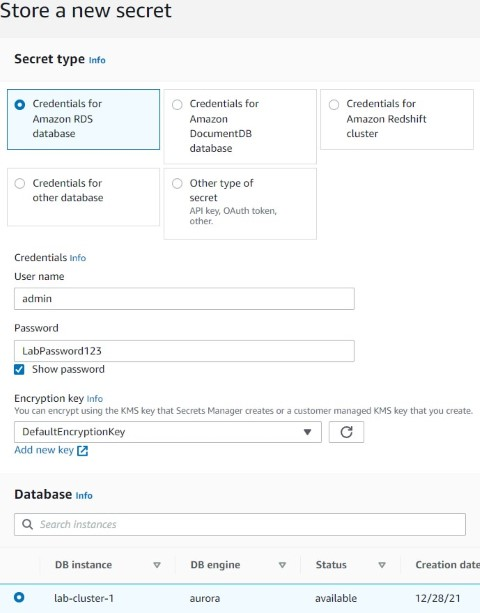

   Provide **Secret name and description**, and let **Disable automatic rotation** selected.

1. Use the EC2 Instance Connect and connect to the instance. Create a `app.py` and paste the following code:

   ```python
   from flask import Flask
   from flaskext.mysql import MySQL
   from flask import jsonify
   
   
   def hardcoded_credentials():
   
     return dict(username='username', password='password', host='rds-endpoint')
   
   
   def configure_app(credentials):
   
     app.config['MYSQL_DATABASE_USER'] = credentials['username']
     app.config['MYSQL_DATABASE_PASSWORD'] = credentials['password']
     app.config['MYSQL_DATABASE_HOST'] = credentials['host']
     app.config['MYSQL_DATABASE_DB'] = 'information_schema'
   
   
   app = Flask(__name__)
   mysql = MySQL()
   mysql.init_app(app)
   
   
   @app.route('/')
   def db_connect():
     credentials = hardcoded_credentials()
     try:
       configure_app(credentials)
       conn = mysql.connect()
       
       return jsonify(db_status="CONNECTED", credentials=credentials)
   
     except Exception as error:
       return jsonify(db_status="DISCONNECTED",
                   credentials=credentials,
                   error_message=str(error))
   
   
   if __name__ == '__main__':
    # Make the server publicly available by default
     app.run(debug=True, host='0.0.0.0')
   
   ```

   Create a `requirements.txt` file with following content:

   ```
   flask == 1.1.2
   flask-mysql == 1.5.1
   config == 0.5.0
   boto3 == 1.13.24
   ```

1.  Get the IP address of the EC2 instance, enter the following command:

   ```
   curl "https://checkip.amazonaws.com"
   ```

   To run the application enter the following commands:

   ```
   pip3 install -r requirements.txt
   python3 app.py
   ```

   You will see output similar to the following:

   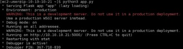

1. Open a new browser tab, and enter the following, replacing **<IP-ADDRESS>** with the IP address of the EC2 instance you copied earlier:

   ```
   http://<IP-ADDRESS>:5000
   ```

   You will see a JSON response like the following:

   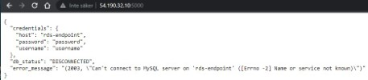

1. In the command-line shell, Press *Ctrl-C* to stop the application. Using `nano secretes_manager.py` create following script:

   ```
   # Use this code snippet in your app.
   # If you need more information about configurations or implementing the sample code, visit the AWS docs:   
   # https://aws.amazon.com/developers/getting-started/python/
   import boto3
   import base64
   from botocore.exceptions import ClientError
   import json
   def get_secret(secret_name):
       region_name = "us-west-2"
       # Create a Secrets Manager client
       session = boto3.session.Session()
       client = session.client(
           service_name='secretsmanager',
           region_name=region_name
       )
       # In this sample we only handle the specific exceptions for the 'GetSecretValue' API.
       # See https://docs.aws.amazon.com/secretsmanager/latest/apireference/API_GetSecretValue.html
       # We rethrow the exception by default.
       try:
           get_secret_value_response = client.get_secret_value(
               SecretId=secret_name
           )
           secret_string = get_secret_value_response['SecretString']
           return json.loads(secret_string)
       except ClientError as e:
           if e.response['Error']['Code'] == 'DecryptionFailureException':
               # Secrets Manager can't decrypt the protected secret text using the provided KMS key.
               # Deal with the exception here, and/or rethrow at your discretion.
               raise e
           elif e.response['Error']['Code'] == 'InternalServiceErrorException':
               # An error occurred on the server side.
               # Deal with the exception here, and/or rethrow at your discretion.
               raise e
           elif e.response['Error']['Code'] == 'InvalidParameterException':
               # You provided an invalid value for a parameter.
               # Deal with the exception here, and/or rethrow at your discretion.
               raise e
           elif e.response['Error']['Code'] == 'InvalidRequestException':
               # You provided a parameter value that is not valid for the current state of the resource.
               # Deal with the exception here, and/or rethrow at your discretion.
               raise e
           elif e.response['Error']['Code'] == 'ResourceNotFoundException':
               # We can't find the resource that you asked for.
               # Deal with the exception here, and/or rethrow at your discretion.
               raise e
   
   ```

   With `nano app.py` add the following line to the imports:

   ```
   import secrets_manager
   ```

   Delete the **credentials = hardcoded_credentials()** line, and paste the following code in the same place, replacing **<SECRET_NAME>** with the name of the secret you created earlier:

   ```
   credentials=secrets_manager.get_secret("<SECRET_NAME>")
   ```

   To run the application again, enter `python3 app.py`.

   Refresh the browser tab with the IP address of the EC2 instance.

   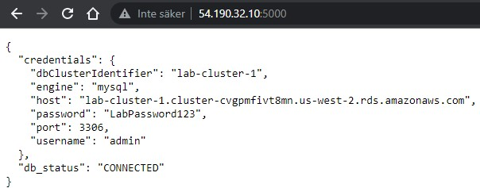

1. Navigate to Secrets Manager and select the secret created in step 1. Click **Edit rotation** and enable it. Then click **Rotate secret immediately. **In the **Secret value** section of the page, click **Retrieve secret value**. Refresh your browser tab with the Python application running from the previous lab step.

   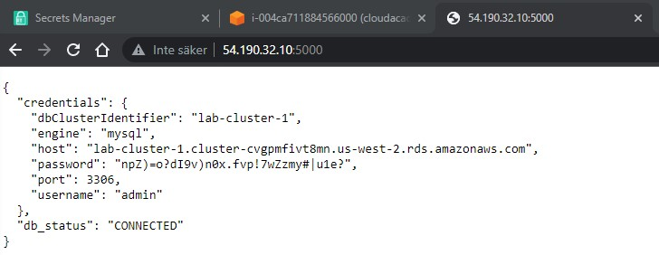

1. In the shell, to stop the application, press *Ctrl-c*. With `nano app.py`, in the line that fetches the secret, prefix the existing secret name with `cfn/`: 

   ```python
   credentials=secrets_manager.get_secret("cfn/<SECRET_NAME>")
   ```

1. Navigate to **CloudFormation** and create a stack. Upload the [template.json](template.json). 

   Under **Parameters**, enter the following:

   - **DatabaseInstanceHost**: Paste the RDS instance endpoint you copied earlier

   - **DatabaseInstanceId**: Ensure this is *lab-instance-1*

   - **RotationFunctionArn**: Paste the Lambda rotation function ARN you copied earlier

   - **SecretName**: Enter the new name of the secret, this must match the new secret name you entered when you edited the **app.py** file earlier.

     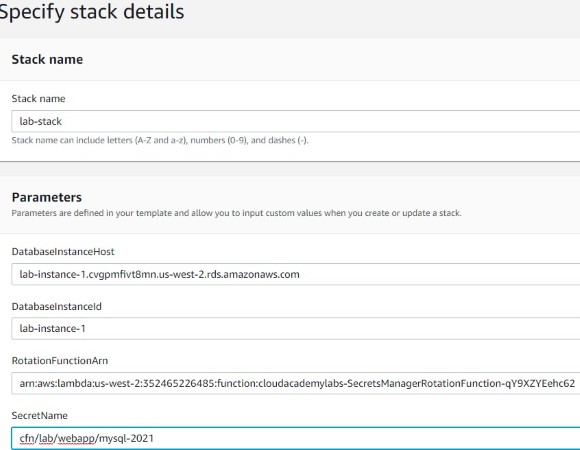

     Create the stack

     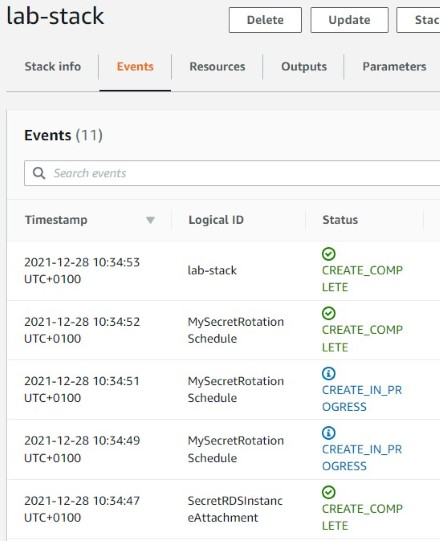

1. Refresh the browser tab for your application.

   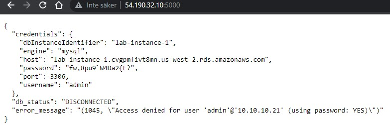

   This is because the application is trying to connect to the database instance with a completely new password. The password for the RDS instance is currently set to the value of the secret you created manually.

1. Navigate to Secrets Manager in the AWS Management Console. Copy password from the initial secret to the one created with CloudFormation stack

   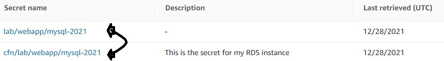

1. Refresh your browser tab with your application running. You will see the db_status field change to CONNECTED.

   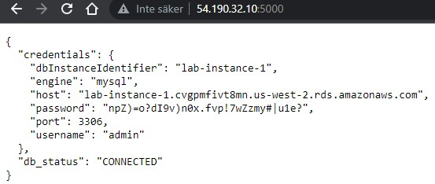


### Lab files
* [app.py](app.py) - simple Python app to run a Flask web server
* [secrets_manager.py](secrets_manager.py) - python script to get credentials from Secrets Manager
* [SecretsManagerRotationFunction.py](SecretsManagerRotationFunction.py) - Lambda function for Secrets Manager auto rotation
* [template.json](template.json) - CloudFormation template to create secret rotation using above Lambda and preexisting RDS Aurora endpoint

---

### Acknowledgements
* [cloud academy](https://cloudacademy.com/lab/configuring-rds-use-credentials-secrets-manager/)

