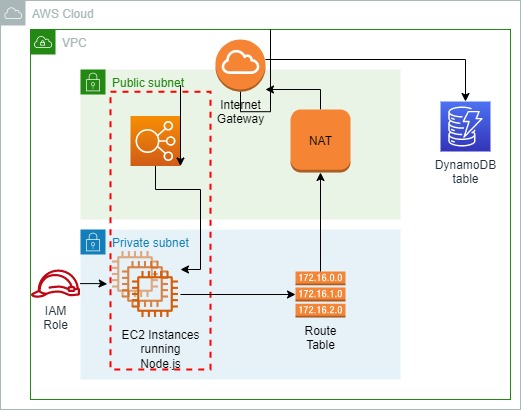
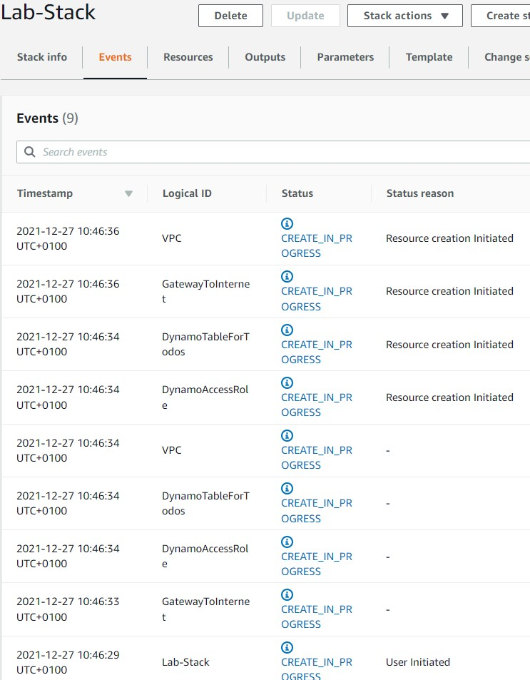

 

  
  <h3 align="center">100 days in Cloud</h3>

  Deploy a TODO app on ELB, ASG and DynamoDB table
     
    Lab 4
     
  

  
<h2 style="display: inline-block">Lab Details</h2>

  <ol>
    <li><a href="#services-covered">Services covered</a>
    <li><a href="#lab-description">Lab description</a></li>
    </li>
    <li><a href="#lab-date">Lab date</a></li>
    <li><a href="#prerequisites">Prerequisites</a></li>    
    <li><a href="#lab-steps">Lab steps</a></li>
    <li><a href="#lab-files">Lab files</a></li>
    <li><a href="#acknowledgements">Acknowledgements</a></li>
  </ol>

---

## Services Covered
*  **CloudFormation**

---

## Lab description

* *A business has tasked you with deploying a prototype of a new application. The business has given you the following requirements:*

- *Deploy [this Todo application](http://github.com/cloudacademy/dynamo-demo) in AWS*
- *Allow for simple scaling of the compute and database layers*
- *Use the following:*
  - *AWS EC2 to host the application*
  - *AWS ELB to load balance public traffic*
  - *AWS DynamoDB for the database*
- *Appropriately use public and private subnets*
- *Deployments should be easily repeatable*
- *Allow for the deployment of multiple environments (development, testing, and production)*
- *Allow for deployment into any AWS Region*
- *As this is a prototype, multi-availability zone redundancy is not required*

---

### Learning Objectives
:star: Create a template
:star: Create a stack

---

### Lab date
27-12-2021

---

### Prerequisites
AWS account

---

### Lab steps
1. Create a CLoudFormation template. This is the result: [template.json](template.json).

2. In CloudFormation dashboard create a stack by uploading that template. Then create a stack

   

3. When the stack creation completes go to Outputs and navigate to the address.
    

### Lab files
* [template.json](template.json)

---

### Acknowledgements
* [cloud academy](https://cloudacademy.com/lab/hands-cloudformation-deploy-scalability/?context_id=2654&context_resource=lp)

