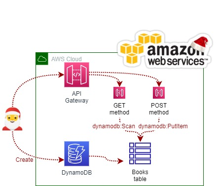
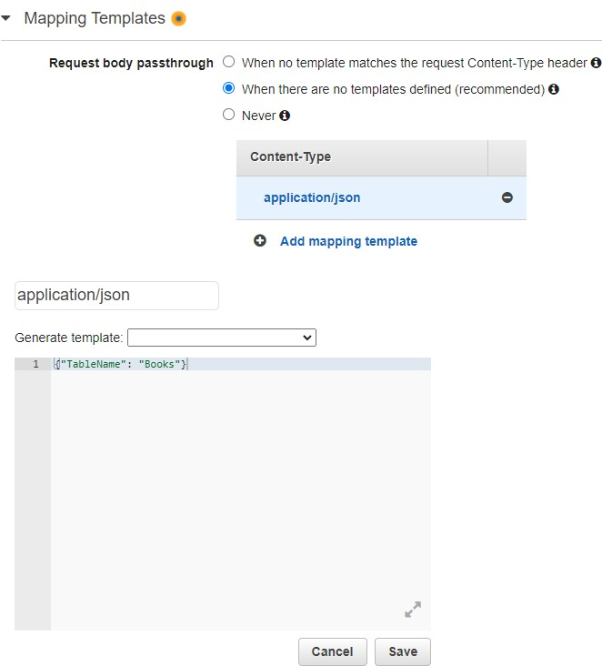
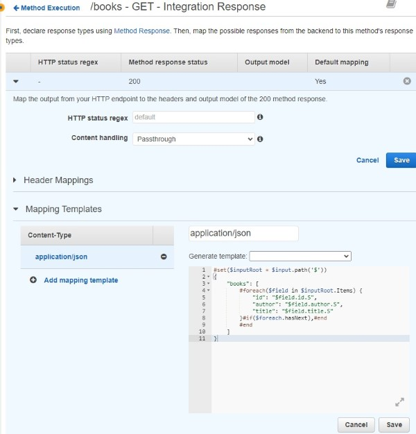
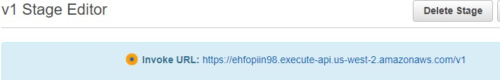
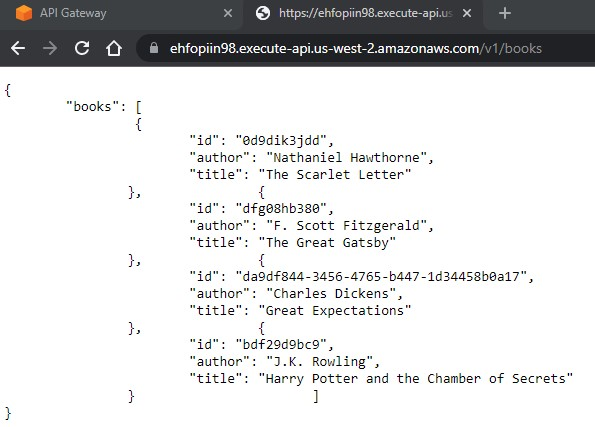

<br />

<p align="center">
  <a href="img/">
    
  </a>
  <h3 align="center">100 days in Cloud</h3>
<p align="center">
  :sparkles: Accessing Amazon DynamoDB Using Amazon API Gateway Service Proxy :sparkles:
    <br />
    Lab 5
    <br/>
  </p>
</p>

<details open="open">
  <summary><h2 style="display: inline-block">Lab Details</h2></summary>
  <ol>
    <li><a href="#services-covered">Services covered</a>
    <li><a href="#lab-description">Lab description</a></li>
    </li>
    <li><a href="#lab-date">Lab date</a></li>
    <li><a href="#prerequisites">Prerequisites</a></li>    
    <li><a href="#lab-steps">Lab steps</a></li>
    <li><a href="#lab-files">Lab files</a></li>
    <li><a href="#acknowledgements">Acknowledgements</a></li>
  </ol>
</details>

---

## Services Covered
*  **DynamoDB**
*  **API Gateway**

---

## Lab description

:christmas_tree: Accessing Amazon DynamoDB Using Amazon API Gateway Service Proxy :star2:.

---

### Learning Objectives
:star: Create a GET method to scan a DynamoDB table
:star: Create a POST method to put items into a table
:star: Deploy a REST API to stage

---

### Lab date
:christmas_tree: 26-12-2021

---

### Prerequisites
:christmas_tree: AWS account

---

### Lab steps
1. Create a DynamoDB table with keys: *id* (string), *author* (string), *title* (string). Call ti ***Books***.

1. :santa: In API Gateway create a new API with /books path. Then create a method of type GET. Configure it accordingly with your region and execution role that allows **dynamodb:PutItem** and **dynamodb:Scan** as follows:

   
   
1. On the next tab choose Integration Request then Mapping Templates. For the **Request body passthrough** setting, select **When there are no templates defined**. Click **Add mapping template** and in the resulting field above it, enter *application/json*. Enter the following JSON snippet, then click **Save**:

   ```
   {"TableName": "Books"}
   ```
   
   
   
1. Return back the **Method Execution** then click **Integration Response**, Select the **arrow** icon next to the **200** Method response status entry in the table. Below **Mapping Templates** click **application/json**. Paste in the following code, then click **Save** below:

   ```
   #set($inputRoot = $input.path('$'))
   {
   	"books": [
   		#foreach($field in $inputRoot.Items) {
   			"id": "$field.id.S",
   			"author": "$field.author.S",
   			"title": "$field.title.S"
   		}#if($foreach.hasNext),#end
   		#end
   	]
   }
   ```
   
   
   
1. Create a POST method for /books path. Integration type: Select AWS Service
   AWS Region: Select us-west-2
   AWS Service: Select DynamoDB
   HTTP method: Select POST
   Action Type: Ensure Use action name is selected
   Action: Enter PutItem
   
1. For the **Request body passthrough** setting, select **When there are no templates defined**. Click **Add mapping template** and in the resulting field above it, enter *application/json*, Enter the following JSON snippet

   ```
   {
       "TableName": "Books",
       "Item": {
           "id": { "S": "$context.requestId" },
           "author": { "S": "$input.path('$.author')" },
           "title": { "S": "$input.path('$.title')" }
       }
   }
   ```
   
1. For the **Integration Response** choose Mapping Templates and click **application/json**. In the template editor, enter an empty set of curly braces {}. 

1.  In the API Gateway console, click **Actions**: click **Deploy API**. Copy the **Invoke URL** at the top of the page and append /books to the end of the URL:

   
   
   
   
   


### Lab files
* 

---

### Acknowledgements
* [cloud academy](https://cloudacademy.com/lab/interacting-with-dynamodb-using-api-gateway-service-integrations/)

