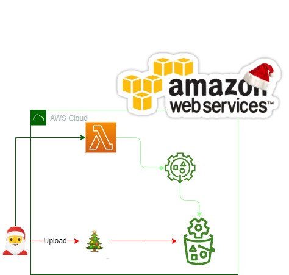
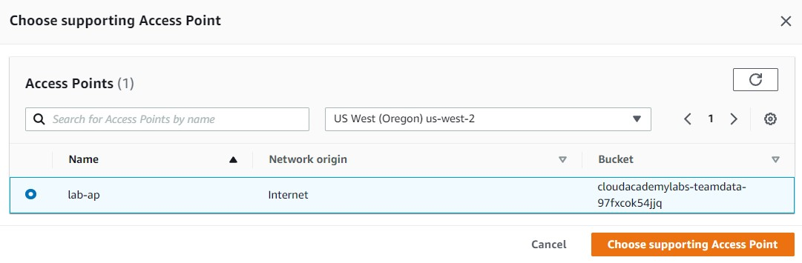

<br />

<p align="center">
  <a href="img/">
    
  </a>
  <h3 align="center">100 days in Cloud</h3>
<p align="center">
  :sparkles: Transforming Your Data with Amazon S3 Object Lambda :sparkles:
    <br />
    Lab 6
    <br/>
  </p>
</p>

<details open="open">
  <summary><h2 style="display: inline-block">Lab Details</h2></summary>
  <ol>
    <li><a href="#services-covered">Services covered</a>
    <li><a href="#lab-description">Lab description</a></li>
    </li>
    <li><a href="#lab-date">Lab date</a></li>
    <li><a href="#prerequisites">Prerequisites</a></li>    
    <li><a href="#lab-steps">Lab steps</a></li>
    <li><a href="#lab-files">Lab files</a></li>
    <li><a href="#acknowledgements">Acknowledgements</a></li>
  </ol>
</details>

---

## Services Covered
*  **S3**
*  **Lambda**

---

## Lab description

:christmas_tree: Transforming Your Data with Amazon S3 Object Lambda :star2:magic:star2:.

---

### Learning Objectives
:star: Create amazing Lambda
:star: Create an Amazon S3 Access Point
:star: Create Object Lambda Access Point

---

### Lab date
:christmas_tree: 25-12-2021

---

### Prerequisites
:christmas_tree: AWS account

---

### Lab steps
1. :santa:Create a S3 :snowman: bucket.

   

2. Click the Access Points tab. Configure the following properties for your access point: Access point name: Enter lab-ap Network origin: Select Internet Block Public Access settings for this Access Point: Unselect the checkbox for Block all public access.

3.  Click **Object Lambda Access Points** in the left-hand navigation menu: Object Lambda Access Point name: Enter lab-olap Supporting Access Point: Click Browse S3 In the resulting Choose supporting Access Point popup, select lab-ap, then click Choose supporting Access Point.

   

   - **Invoke Lambda function**: Ensure **Choose from functions in your account** is selected
   - **Lambda function**: Select the **CsvToJsonConverter** function

4. Navigate to Lambda and create **CsvToJsonConverter** in Python:

   ```
   import boto3
   import urllib3
   import csv
   import json
        
   def lambda_handler(event, context):
            
       object_get_context = event["getObjectContext"]
       request_route = object_get_context["outputRoute"]
       request_token = object_get_context["outputToken"]
       s3_url = object_get_context["inputS3Url"]
        
       # Get object from S3
       http = urllib3.PoolManager()
       response = http.request('GET', s3_url)
       original_object = response.data.decode('utf-8').splitlines()
       csv_reader = csv.DictReader(original_object)
       data = {}
        
       for rows in csv_reader:
           id = rows['Identifier']
           data[id] = rows
                
       json_object = json.dumps(data, indent=4)
        
       # Write object back to S3 Object Lambda
       s3 = boto3.client('s3')
       s3.write_get_object_response(
           Body=json_object,
           RequestRoute=request_route,
           RequestToken=request_token)
        
       return {'status_code': 200}
   ```

   


### Lab files
* 

---

### Acknowledgements
* [cloud academy](https://cloudacademy.com/lab/transforming-objects-with-s3-object-lambda/)

