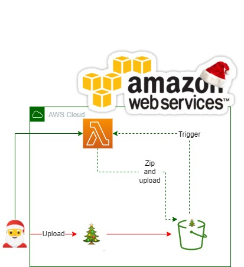
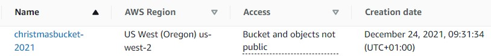
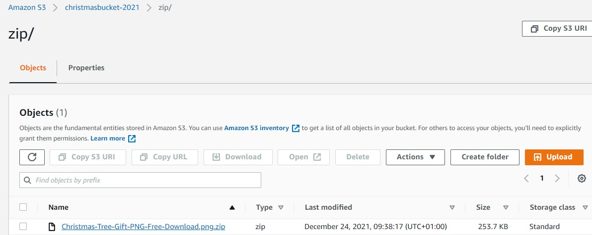

<br />

<p align="center">
  <a href="img/">
    
  </a>
  <h3 align="center">100 days in Cloud</h3>
<p align="center">
  :sparkles: Process Amazon S3 Events with AWS Lambda :sparkles:
    <br />
    Lab 7
    <br/>
  </p>
</p>

<details open="open">
  <summary><h2 style="display: inline-block">Lab Details</h2></summary>
  <ol>
    <li><a href="#services-covered">Services covered</a>
    <li><a href="#lab-description">Lab description</a></li>
    </li>
    <li><a href="#lab-date">Lab date</a></li>
    <li><a href="#prerequisites">Prerequisites</a></li>    
    <li><a href="#lab-steps">Lab steps</a></li>
    <li><a href="#lab-files">Lab files</a></li>
    <li><a href="#acknowledgements">Acknowledgements</a></li>
  </ol>
</details>

---

## Services Covered
*  **S3**
*  **Lambda**

---

## Lab description

Upload a :christmas_tree: Christmas tree into S3 bucket and let Lambda do it's :star2:magic:star2:.

---

### Learning Objectives
:star: Create amazing Lambda
:star: Send Christmas tree
:star: Let Events call the Lambda and do the magic

---

### Lab date
:christmas_tree: 24-12-2021

---

### Prerequisites
:christmas_tree: AWS account

---

### Lab steps
1. :santa:Create a S3 :snowman: bucket.

   

2. :santa:Create a Lambda function with Python as runtime. 

   ```
   import os, zipfile
   from io import BytesIO
   import boto3
   
   s3 = boto3.client('s3')
   
   def lambda_handler(event, context):
   
       # read bucket and key from event data
       record = event['Records'][0]['s3']
       bucket = record['bucket']['name']
       key = record['object']['key']
   
       # generate new key name
       new_key = "zip/%s.zip" % os.path.basename(key)
   
       # read the source obj content
       body = s3.get_object(Bucket=bucket, Key=key)['Body'].read()
   
       # create new obj with compressed data
       s3.put_object(
           Body=compress(body, key),
           Key=new_key,
           Bucket=bucket,
       )
   
       return "OK"
   
   def compress(body, key):
       data = BytesIO()
       with zipfile.ZipFile(data, 'w', zipfile.ZIP_DEFLATED) as f:
           f.writestr(os.path.basename(key), body)
       data.seek(0)
       return data.read()
   ```

3. :santa:Add trigger and select S3.

4. :santa:In your S3 bucket create a folder called images.Then upload a file to that folder. 

   

   This will invoke a Lambda function and create a new folder called *zip* with output file:

   

   


### Lab files
* 

---

### Acknowledgements
* [cloud academy](https://cloudacademy.com/lab/aws-lambda-s3-events/)

