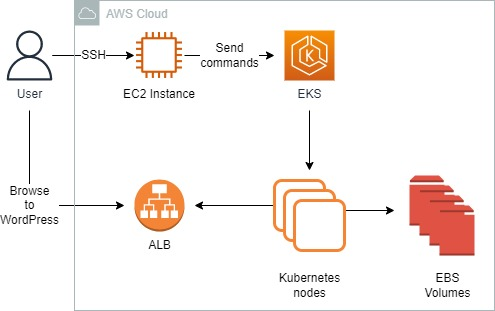
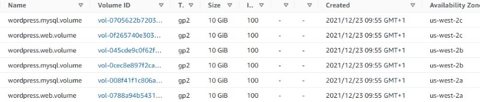
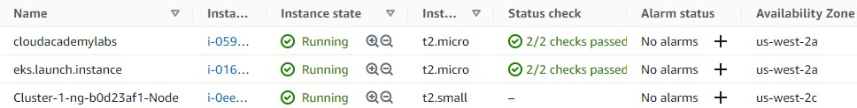
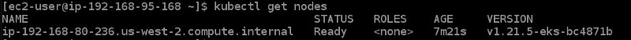
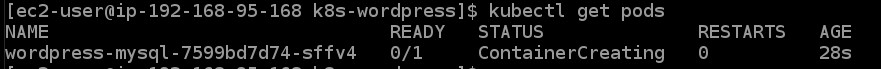
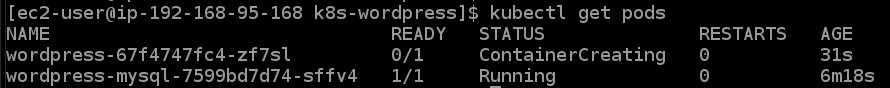
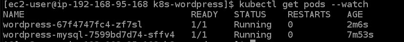
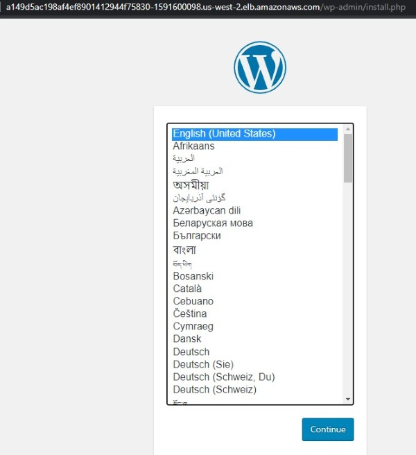
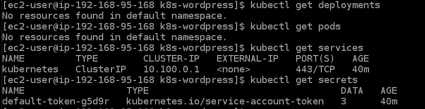

<br />

<p align="center">
  <a href="img/">
    
  </a>
  <h3 align="center">100 days in Cloud</h3>
<p align="center">
  Deploy WordPress on EKS Kubernetes Cluster
    <br />
    Lab 8
    <br/>
  </p>
</p>

<details open="open">
  <summary><h2 style="display: inline-block">Lab Details</h2></summary>
  <ol>
    <li><a href="#services-covered">Services covered</a>
    <li><a href="#lab-description">Lab description</a></li>
    </li>
    <li><a href="#lab-date">Lab date</a></li>
    <li><a href="#prerequisites">Prerequisites</a></li>    
    <li><a href="#lab-steps">Lab steps</a></li>
    <li><a href="#lab-files">Lab files</a></li>
    <li><a href="#acknowledgements">Acknowledgements</a></li>
  </ol>
</details>

---

## Services Covered
*  **EKS**
---

## Lab description

*This lab comes with an EKS cluster provided by Cloud Academy - it consists one EC2 Worker Node*

---

### Learning Objectives
* Use an EC2 instance to issue commands against the EKS cluster.
* Manage EKS Kubernetes cluster, install several Kubernetes management-related tools and utilities
* Launch the backend MySQL database using the previously prepared Kubernetes deployment
* Launch the frontend Web server using the previously prepared Kubernetes deployment

---

### Lab date
23-12-2021

---

### Prerequisites
* AWS account
* EC2 instance running

---

### Lab steps
1. Launch an instance to be used to connect to EKS cluster. Then use Instance Connect. This lab comes with EKS cluster and six EBS Volumes for persistence storage

   

   And three EC2 instances

   

2. Using the EC2 Connect download the `kubectl` utility:

   ```
   curl -o kubectl https://amazon-eks.s3.us-west-2.amazonaws.com/1.21.2/2021-07-05/bin/linux/amd64/kubectl
   chmod +x ./kubectl
   sudo cp ./kubectl /usr/local/bin
   export PATH=/usr/local/bin:$PATH
   ```

   Download the **AWS CLI** utility, give it executable permissions, and copy it into a directory that is part of the PATH environment variable

   ```
   curl "https://awscli.amazonaws.com/awscli-exe-linux-x86_64.zip" -o "awscliv2.zip"
   unzip awscliv2.zip
   sudo ./aws/install
   ```

   Use the `aws` utility, to retrieve EKS Cluster name:

   ```
   EKS_CLUSTER_NAME=$(aws eks list-clusters --region us-west-2 --query clusters[0] --output text)
   echo $EKS_CLUSTER_NAME
   ```

   Use the `aws` utility to query and retrieve your Amazon EKS cluster connection details, saving them into the **~/.kube/config** file

   ```
   aws eks update-kubeconfig --name $EKS_CLUSTER_NAME --region us-west-2
   ```

   View the EKS Cluster connection details.

   ```
   cat ~/.kube/config 
   ```

   Use the `kubectl` utility to list the EKS Cluster Worker Nodes:

   ```
   kubectl get nodes 
   ```

   

   Use the `kubectl` utility to describe in more detail the EKS Cluster Worker Nodes:

   ```
   kubectl describe nodes
   ```

3. Install the `git` command and then clone the CloudAcademy [k8s-wordpress](https://github.com/cloudacademy/k8s-wordpress) Github repository:

   ```
   sudo yum -y install git curl-devel
   git clone https://github.com/cloudacademy/k8s-wordpress.git
   cd k8s-wordpress
   ```

   Retrieve the AZ (Availability Zone) that the first EKS worker node has been deployed into

   ```
   EKS_WORKER_NODE_AZ=$(kubectl get nodes -o jsonpath="{.items[*].metadata.labels.topology\.kubernetes\.io/zone}" | cut -d" " -f1)
   echo $EKS_WORKER_NODE_AZ
   ```

   Discover the dedicated backend MySQL EBS Volume that was automatically created during the lab provisioning process. Query for the Volume ID and then update the respective Kubernetes deployment YAML file for launching the backend MySQL database:

   ```
   VOLUMEID_DB=$(aws ec2 describe-volumes --region us-west-2 \
     --filters "Name=tag:Name,Values=wordpress.mysql.volume" "Name=tag:Zone,Values=$EKS_WORKER_NODE_AZ" \
     --query Volumes[0].VolumeId \
     --output text)
   echo $VOLUMEID_DB
   
   sed -i.bak s/EBS_VOLUME_ID/$VOLUMEID_DB/g wordpress.deployment.mysql.yaml
   sed -i.bak s/EKS_WORKER_NODE_AZ/$EKS_WORKER_NODE_AZ/g wordpress.deployment.mysql.yaml
   
   echo updated:
   cat wordpress.deployment.mysql.yaml | grep 'volumeID\|zone'
   ```

   Discover the dedicated frontend Web Server EBS Volume that was automatically created during the lab provisioning process. Query for the Volume ID and then update the respective Kubernetes deployment YAML file for launching the frontend Web server:

   ```
   VOLUMEID_WEB=$(aws ec2 describe-volumes --region us-west-2 \
     --filters "Name=tag:Name,Values=wordpress.web.volume" "Name=tag:Zone,Values=$EKS_WORKER_NODE_AZ" \
     --query Volumes[0].VolumeId \
     --output text)
   echo $VOLUMEID_WEB
   
   sed -i.bak s/EBS_VOLUME_ID/$VOLUMEID_WEB/g wordpress.deployment.web.yaml
   sed -i.bak s/EKS_WORKER_NODE_AZ/$EKS_WORKER_NODE_AZ/g wordpress.deployment.web.yaml
   
   echo updated:
   cat wordpress.deployment.web.yaml | grep 'volumeID\|zone'
   ```

4. Launch the backend MySQL database using the previously prepared Kubernetes deployment [wordpress.deployment.mysql.yaml](wordpress.deployment.mysql.yaml)

   ```
   kubectl create -f wordpress.deployment.mysql.yaml
   ```

   Examine the status of the backend MySQL database pod:

   ```
   kubectl get pods
   ```

   

   

5. Launch the frontend Web server using the previously prepared Kubernetes deployment [wordpress.deployment.web.yaml](wordpress.deployment.web.yaml)

   ```
   kubectl create -f wordpress.deployment.web.yaml
   ```

   Examine the status of the frontend Web server pod:

   ```
   kubectl get pods
   ```

   

   

6.  Examine the existing deployed Kubernetes Services using the following command. 

   ```
   kubectl get services -o wide
   ```

7. Open a new web browser tab and navigate to the host 

   

8. Run the following command to delete your Secret:

   ```
   kubectl delete secret mysql-pass
   ```

   Run the following command to delete all Deployments:

   ```javascript
   kubectl delete deployment -l app=wordpress
   ```

   Run the following command to delete all Services:

   ```
   kubectl delete service -l app=wordpress
   ```

   Perform the following list of commands to confirm that all Kubernetes resources have been removed:

   ```javascript
   kubectl get deployments
   kubectl get pods
   kubectl get services
   kubectl get secrets 
   ```

   

1. 

### Lab files
* [wordpress.deployment.mysql.yaml](wordpress.deployment.mysql.yaml)
* [wordpress.deployment.web.yaml](wordpress.deployment.web.yaml)

---

### Acknowledgements
* [cloud academy](https://cloudacademy.com/lab/amazon-eks-launch-cluster-and-deploy-microservices-application/)

