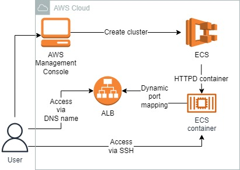
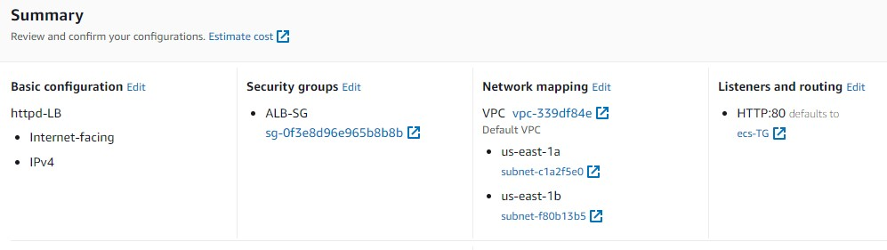
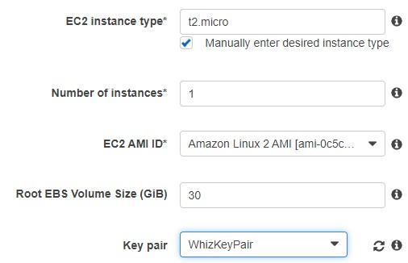
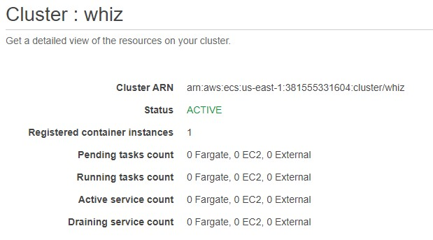
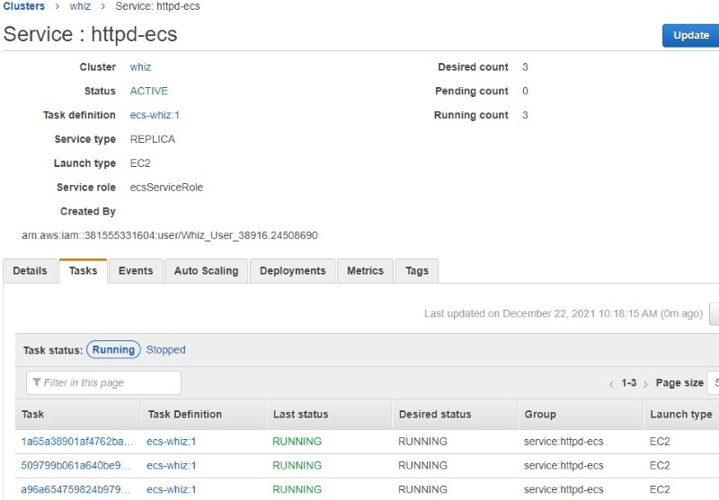
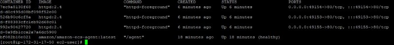
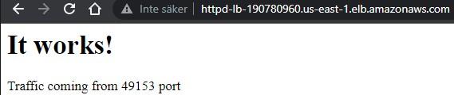
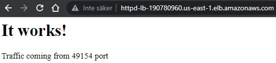
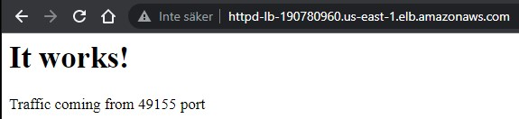

<br />

<p align="center">
  <a href="img/">
    
  </a>
  <h3 align="center">100 days in Cloud</h3>
<p align="center">
  Balance load across containers through Application Load Balancer in ECS
    <br />
    Lab 9
    <br/>
  </p>
</p>

<details open="open">
  <summary><h2 style="display: inline-block">Lab Details</h2></summary>
  <ol>
    <li><a href="#services-covered">Services covered</a>
    <li><a href="#lab-description">Lab description</a></li>
    </li>
    <li><a href="#lab-date">Lab date</a></li>
    <li><a href="#prerequisites">Prerequisites</a></li>    
    <li><a href="#lab-steps">Lab steps</a></li>
    <li><a href="#lab-files">Lab files</a></li>
    <li><a href="#acknowledgements">Acknowledgements</a></li>
  </ol>
</details>

---

## Services Covered
*  **ECS**
---

## Lab description

This lab walks you through the steps to launch, configure, and manage an HTTPD container on ECS Cluster with the application load balancer.

---

### Learning Objectives
* Create ECS Cluster by creating Task definitions and Service
* Create Application Load Balancer and Target Group for ECS cluster
* Connect to containers using SSH and ALB DNS name

---

### Lab date
22-12-2021

---

### Prerequisites
* AWS account

---

### Lab steps
1. Create a Security Group for the Load balancer and allow all TCP inbound traffic.

2. Create a Security Group for the ECS Cluster. Add two rules:

   * Inbound SSH from anywhere
   * Inbound TCP from security group created in previous step

3. Create a Key Pair for the EC2 instances inside the ECS Cluster. 

4. Create Application Load Balancer. Make it **Internet-facing**, Listener on port 80, create a new target group (Instance target type) and use the security group from step one. 

   

5. Navigate to **Elastic Container Service** and create cluster. Choose the cluster template as **EC2 Linux + Networking**. Provisioning Model: Select **On-Demand Instance**. EC2 instance type*: **Check** Manually enter desired instance type and Enter ***t2.micro***. 

   

   Use the default VPC and same subnets as for the ALB. Attach the security group created in step 2. Keep other options as default.

   

6. Create Task Definitions. Select launch type compatibility as **EC2**. Network Mode: Select **Bridge**. Total memory (MiB): Enter 250, Total CPU (unit): Enter 250. In the Container Definition section, click on the **Add container**: Container name: Enter httpd, Image: enter httpd:2.4 (make sure no extra space is given), Memory Limits (MiB): Enter 200, In the Port mappings field, fill the following information: Host port: Enter 0, Container port: Enter 80, Protocol: Select tcp, Click on the Add button. 

   Keep other options as default and click on the **Create** button.

7. Create a Service and start HTTPD container in ECS. Use the task definition defined in previous step and cluster created in step 5. Keep other options as default. In Load Balancing section: Load balancer type : Select Application Load Balancer created in step 4. Service IAM role: Select Create new role, Load balancer name: Select httpd-LB. Container to load balance: Click on the **Add to load balancer** button -> Production listener port: Select **80:HTTP**. Target group name: Select target group created in step 4. Created the service.

   

8. Test the HTTPD container in ECS Cluster. In the ECS Instances tab find the EC2 instance and then its public IP address. SSH into the instance. Update yum

   ```
   sudo su
   yum -y update
   ```

   Check the Docker version and running processes

   ```
   docker version
   docker ps
   ```

   

   Default **ECS agent and 3 httpd containers** are running in the underlying EC2 instance. 

9. SSH into running docker container. 

   ```
   docker exec -it <<CONTAINER ID>> /bin/bash
   ```

   Append text indicating which container is responding

   ```
   echo "Traffic coming from <<PORT>> port" >> htdocs/index.html
   ```

10. Test the load balancer. In EC2 dashboard navigate to Load Balancer and copy the DNS name into you browser tab

    

    

    

### Lab files
*  

---

### Acknowledgements
* [whizlabs](https://play.whizlabs.com/site/task_details?lab_type=1&task_id=197&quest_id=36)

