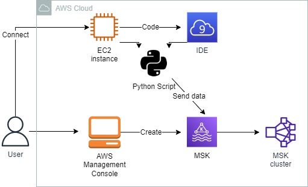
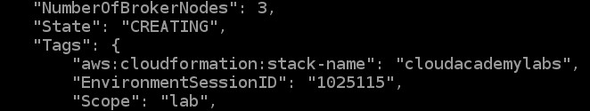
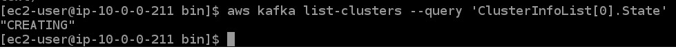
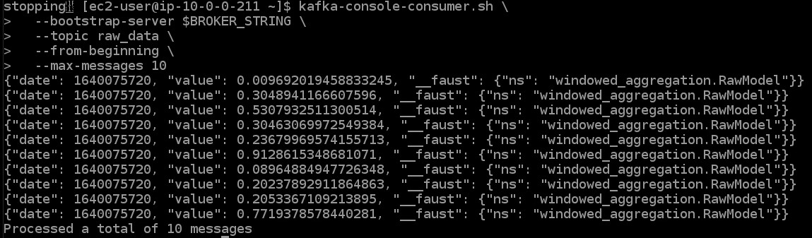
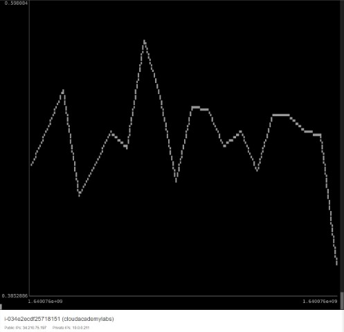

<br />

<p align="center">
  <a href="img/">
    
  </a>
  <h3 align="center">100 days in Cloud</h3>
<p align="center">
  Aggregating Data with Managed Streaming for Apache Kafka
    <br />
    Lab 10
    <br/>
  </p>
</p>

<details open="open">
  <summary><h2 style="display: inline-block">Lab Details</h2></summary>
  <ol>
    <li><a href="#services-covered">Services covered</a>
    <li><a href="#lab-description">Lab description</a></li>
    </li>
    <li><a href="#lab-date">Lab date</a></li>
    <li><a href="#prerequisites">Prerequisites</a></li>    
    <li><a href="#lab-steps">Lab steps</a></li>
    <li><a href="#lab-files">Lab files</a></li>
    <li><a href="#acknowledgements">Acknowledgements</a></li>
  </ol>
</details>

---

## Services Covered
*  **MSK**
---

## Lab description

*This lab comes with a Amazon MSK cluster provided.*

In this lab, you will create a new cluster configuration for an Amazon MSK cluster. You will install the Apache Kafka command-line tools on an EC2 instance and use them to create topics in the Amazon MSK cluster. You'll implement a Python script that'll aggregate events using the Faust stream processing library for Apache Kafka. And finally, you'll execute your script and visualize the results in the Linux shell terminal.

---

### Learning Objectives
* Configure the Amazon MSK cluster using the Apache Kafka command-line tools
* Connect to an EC2 instance using EC2 Instance Connect and access a shell
* Install Faust and use it to implement a script that aggregates data using the Amazon MSK cluster
* Visualize the events in terminal

### Lab date
21-12-2021

---

### Prerequisites
* AWS account
* An Amazon MSK cluster with 3 brokers
* EC2 instance running

---

### Lab steps
1. While waiting for the MSK cluster to create start with cluster configuration. Give it a name and keep the default additional configuration. 

2. Navigate to EC2 and connect to instance using EC2 Instance Connect. In the Linus shell list MSK cluster:

   ```
   aws kafka list-clusters
   ```

   

3. To download a release archive containing the Apache Kafka command-line tools, enter the following command:

   ```
   wget https://clouda-labs-assets.s3-us-west-2.amazonaws.com/amazon-msk/kafka_2.12-2.4.0.tgz
   ```

   To decompress the release archive, enter the following command:

   ```
   tar -xzf kafka_2.12-2.4.0.tgz
   ```

   To rename the directory, enter the following:

   ```
   mv kafka_2.12-2.4.0 kafka
   ```

    To add the bin directory to your path, enter the following:

   ```
   export PATH="$PATH:/home/ec2-user/kafka/bin"
   ```

   To retrieve the Amazon Resource Name (ARN) of the Amazon MSK cluster, enter the following command:

   ```
   CLUSTER_ARN=$(aws kafka list-clusters --query "ClusterInfoList[0].ClusterArn" --output text)
   ```

   To check the status of the Amazon MSK cluster, enter the following:

   ```
   aws kafka list-clusters --query 'ClusterInfoList[0].State'
   ```

   

   The following CLI command will check the state of the Amazon MSK cluster in ten-second intervals until the cluster state becomes active. You can use it to see when it's ready:

   ````
   CLUSTER_STATE=$(aws kafka list-clusters --query 'ClusterInfoList[0].State' | tr -d '"')
   while [ $CLUSTER_STATE != "ACTIVE" ]; do
     echo $CLUSTER_STATE
     sleep 10
     CLUSTER_STATE=$(aws kafka list-clusters --query 'ClusterInfoList[0].State' | tr -d '"')
   done
   echo $CLUSTER_STATE
   ````

   To fetch the broker addresses, enter the following command:

   ```
   aws kafka get-bootstrap-brokers --cluster-arn $CLUSTER_ARN
   ```

   To store the bootstrap broker string in a variable, enter the following command:

   ```
   export BROKER_STRING=$(
     aws kafka get-bootstrap-brokers \
     --cluster-arn $CLUSTER_ARN \
     --query "BootstrapBrokerString" \
     --output text
   )
   ```

4. To create a topic, enter the following:

   ```
   kafka-topics.sh --create \
     --bootstrap-server $BROKER_STRING \
     --topic raw_data \
     --partitions 1 \
     --replication-factor 2
   ```

   To create a second topic, enter the following command:

   ```
   kafka-topics.sh --create \
     --bootstrap-server $BROKER_STRING \
     --topic aggregated_data \
     --partitions 1 \
     --replication-factor 2
   ```

   To view your newly created topics, re-enter the list command:

   ```
   kafka-topics.sh --list --bootstrap-server $BROKER_STRING
   ```

5. To install a Python client library for Apache Kafka, in the Linux shell, enter the following:

   ```
   pip install faust==1.10.4
   ```

   In Cloud9 IDE on the instance (provided in this lab) create a [python file](windowed_aggregation.py).

   

6. To create a topic for the table in your Faust script in the Amazon MSK cluster, in the Linux shell, enter the following command:

   ```
   kafka-topics.sh --create \
     --bootstrap-server $BROKER_STRING \
     --topic windowed-agg-tumbling_table-changelog \
     --replication-factor 2 \
     --partitions 1
   ```

7. To run your python script, in the Linux shell, enter the following command:

   ```
   python3 windowed_aggregation.py worker
   ```

   The `windowed.aggregation.py` will populate the topic with some random data. To see the data from `raw_data` topic run:

   ```
   kafka-console-consumer.sh \
     --bootstrap-server $BROKER_STRING \
     --topic raw_data \
     --from-beginning \
     --max-messages 10
   ```

   

8. While the script is running in background you can run following command to use JSON Plot to visualize data from output JSON file 

   

   

### Lab files
*  [python file](windowed_aggregation.py)

---

### Acknowledgements
* [cloudacademy](https://cloudacademy.com/lab/deploy-mongodb-solution-amazon-documentdb/)

