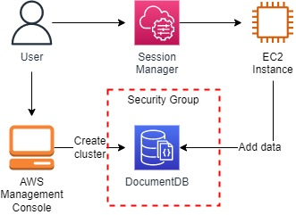
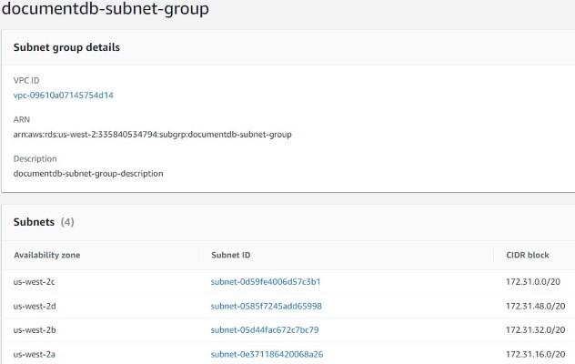
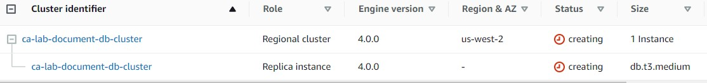
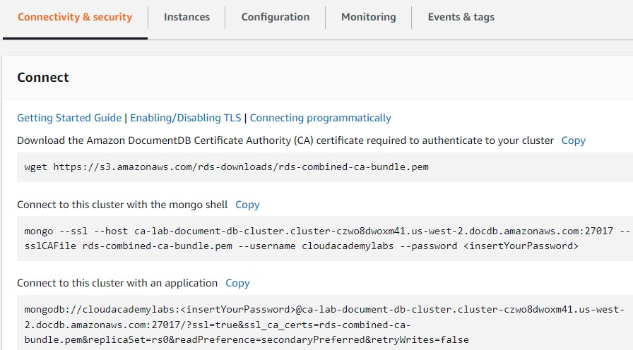
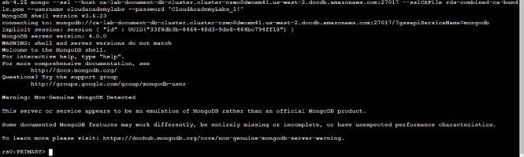
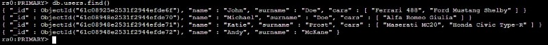

<br />

<p align="center">
  <a href="img/">
    
  </a>
  <h3 align="center">100 days in Cloud</h3>
<p align="center">
  Deploy a MongoDB Solution With Amazon DocumentDB
    <br />
    Lab 11
    <br/>
  </p>
</p>

<details open="open">
  <summary><h2 style="display: inline-block">Lab Details</h2></summary>
  <ol>
    <li><a href="#services-covered">Services covered</a>
    <li><a href="#lab-description">Lab description</a></li>
    </li>
    <li><a href="#lab-date">Lab date</a></li>
    <li><a href="#prerequisites">Prerequisites</a></li>    
    <li><a href="#lab-steps">Lab steps</a></li>
    <li><a href="#lab-files">Lab files</a></li>
    <li><a href="#acknowledgements">Acknowledgements</a></li>
  </ol>
</details>

---

## Services Covered
*  **DocumentDB**
*  **Systems Manager**
*  **EC2**

---

## Lab description

In this lab I will create an Amazon DocumentDB cluster with a security group to restrict access. Then I will connect to the cluster from a EC2 instance, using Session Manager and perform some DB operations using the mongo shell.


---

### Learning Objectives
* 

### Lab date
20-12-2021

---

### Prerequisites
* AWS account
* EC2 instance

---

### Lab steps
1. Navigate to RDS and then to Subnet Groups and create one. Select all AZ's and subnets.

   

2. In the VPC section create a Security Group for DocumentDB cluster. Allow inbound TCP traffic on port 27017 from EC2 instance's IP. 

3. Navigate to DocumentDB dashboard and launch new cluster. Choose one smallest instance: db.t3.medium. In Advanced settings enter the followings: Subnet group: documentdb-subnet-group created in step 1 and for VPC Security groups: documentdb-sg created in step 2. The cluster could take up to 12 minutes to complete the deployment.

   

4. Navigate to AWS Systems Manager > Session Manager and click Start session to create a browser-based Linux shell session. Select you instance as the target and start session. [Move to the DocumentDB clusters section](https://us-west-2.console.aws.amazon.com/docdb/home?region=us-west-2#clusters), and click on the cluster you previously created. Scroll down to the **Connect** section: Copy the **Connect to this cluster with the mongo shell** command so you can use it later.

   

   In the SSM session terminal, to ensure you are in the home directory, enter the following command:

   ```bash
   cd /home/ssm-user
   ```

   Enter the following command to download the AWS digital certificate needed to establish the connection:

   ```
   wget https://s3.amazonaws.com/rds-downloads/rds-combined-ca-bundle.pem
   ```

   Then copy and past the second connect-command with your password.

   

5.  Enter the following command to create a new document related to a user in the **users** collection:

   ```
   db.users.insert({"name": "John", "surname": "Doe", "cars": ["Ferrari 488", "Ford Mustang Shelby"]})
   ```

   ```
   db.users.insert({"name": "Michael", "surname": "Doe", "cars": ["Alfa Romeo Giulia"]})
   db.users.insert({"name": "Katie", "surname": "Prost", "cars": ["Maserati MC20", "Honda Civic Type-R"]})
   db.users.insert({"name": "Andy", "surname": "McKane"})
   ```

   Execute the following command to query all the documents you inserted:

   ```
   db.users.find()
   ```

   

### Lab files
* 

---

### Acknowledgements
* [cloudacademy](https://cloudacademy.com/lab/deploy-mongodb-solution-amazon-documentdb/)

