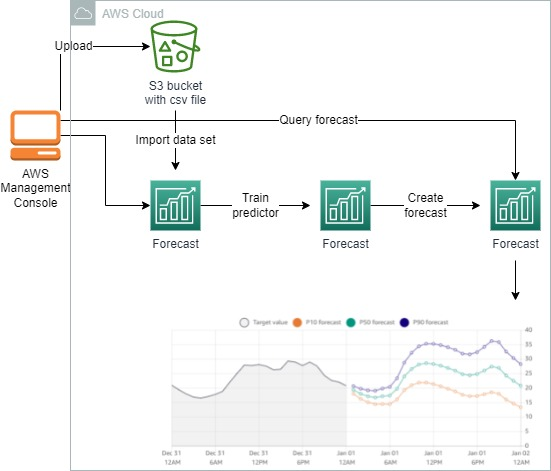
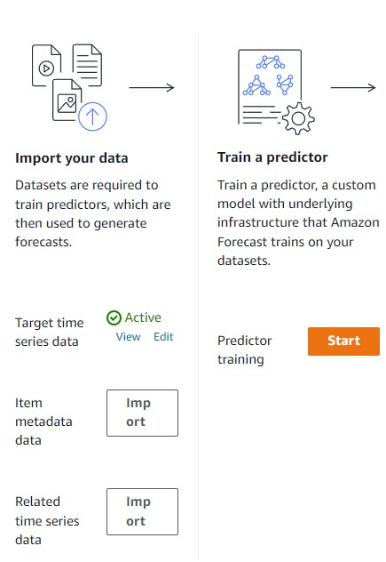
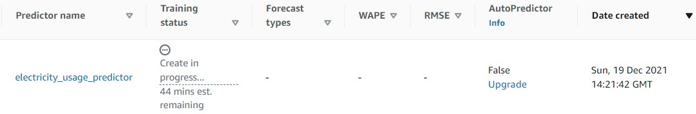
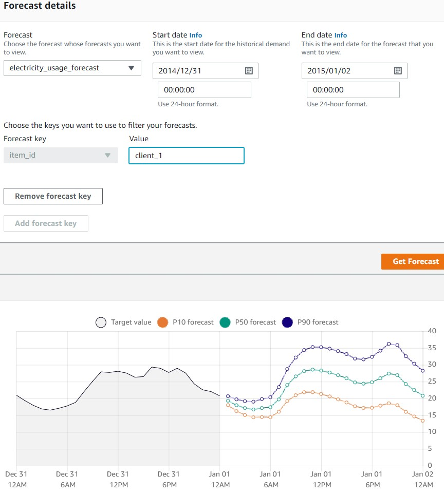

<br />

<p align="center">
  <a href="img/">
    
  </a>
  <h3 align="center">100 days in Cloud</h3>
<p align="center">
  Query into RDS MySQL Using AWS Lambda
    <br />
    Lab 12
    <br/>
  </p>
</p>

<details open="open">
  <summary><h2 style="display: inline-block">Lab Details</h2></summary>
  <ol>
    <li><a href="#services-covered">Services covered</a>
    <li><a href="#lab-description">Lab description</a></li>
    </li>
    <li><a href="#lab-date">Lab date</a></li>
    <li><a href="#prerequisites">Prerequisites</a></li>    
    <li><a href="#lab-steps">Lab steps</a></li>
    <li><a href="#lab-files">Lab files</a></li>
    <li><a href="#acknowledgements">Acknowledgements</a></li>
  </ol>
</details>

---

## Services Covered
*  **Forecast**

---

## Lab description

In this lab, future power consumption will be predicted based on time series data uploaded to S3 in form of csv file.


---

### Learning Objectives
* 

### Lab date
19-12-2021

---

### Prerequisites
* AWS account

---

### Lab steps
1. Upload the [electricityusagedata.csv](electricityusagedata.csv) file to S3 bucket. 

2. Navigate to Amazon Forecast dashboard and create new dataset group. Give it a name and choose *Custom* forecasting domain. On the next tab specify the frequency of data to 1 hour and for data schema use the following JSON:

   ```
   {
       "Attributes": [
           {
               "AttributeName": "timestamp",
               "AttributeType": "timestamp"
           },
           {
               "AttributeName": "target_value",
               "AttributeType": "float"
           },
           {
               "AttributeName": "item_id",
               "AttributeType": "string"
           }
       ]
   }
   ```

   For the data location input the S2 buckets URI. 

3. After the import completes start the predictor training. 

   

   Provide Forecast horizon: Enter 36 and Forecast frequency: Select hour from the drop-down menu. Turn off AutoPredictor and choose **ETS** algorithm. Training will take some time to complete

   

   It took 18 minutes to finish.

4. Back in the dashboard click **Start** to generate forecast. Use the predictor created in previous step. This will also take a while (9 minutes in my case).

5. When forecast finally get created you can go and query it. Specify start date as  *2014/12/31* and end date: *2015/01/02* and key to *client_1*. 

   

   Result explanation: *The actual energy usage is shown in grey on the left and has no quantiles shown because there is no uncertainty. The forecast predictions are shown by three lines. The numbers **P10**, **P50**, and **P90** correspond to the 10%, 50%, and 90% quantiles, respectively. The actual value has an 80% chance of being between the P90 and P10 range (90 - 10 = 80). The larger the number of PXX, the higher the probability that the value will fall within that range. The value of P50 line is the midpoint of the range.*

### Lab files
* [electricityusagedata.csv](electricityusagedata.csv)

---

### Acknowledgements
* [cloudacademy](https://cloudacademy.com/lab/predicting-time-series-data-amazon-forecast/5)

