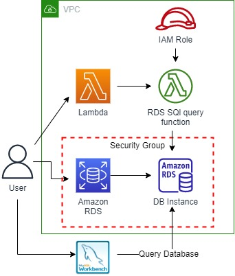
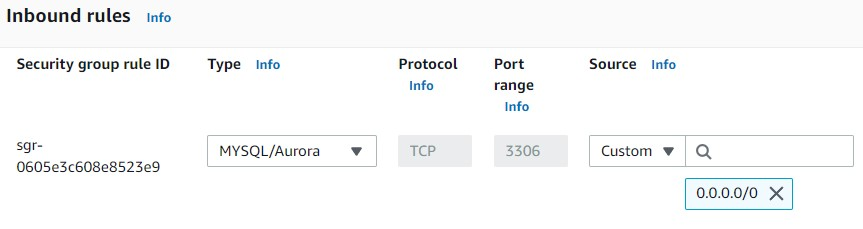
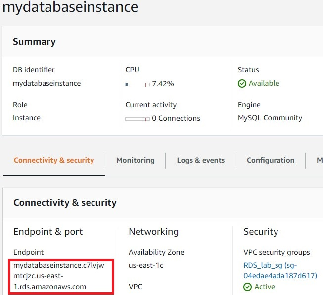
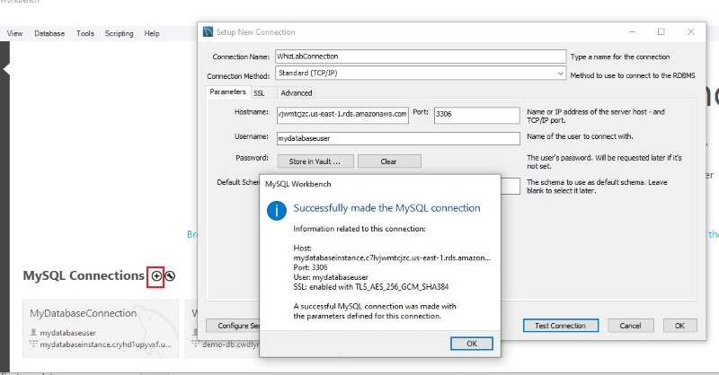
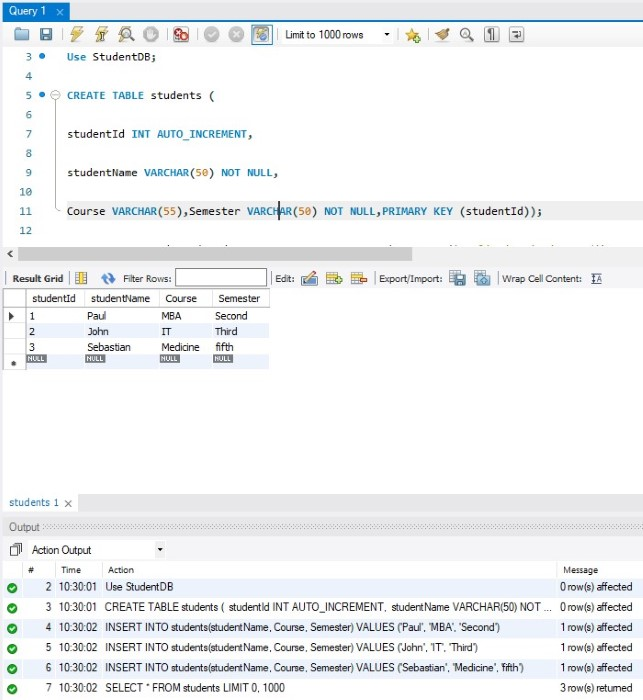
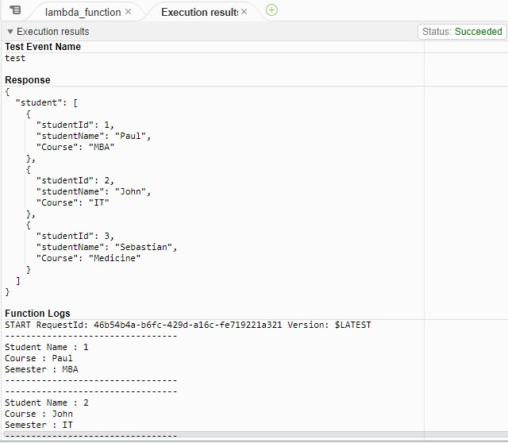

<br />

<p align="center">
  <a href="img/">
    
  </a>
  <h3 align="center">100 days in Cloud</h3>
<p align="center">
  Query into RDS MySQL Using AWS Lambda
    <br />
    Lab 13
    <br/>
  </p>
</p>

<details open="open">
  <summary><h2 style="display: inline-block">Lab Details</h2></summary>
  <ol>
    <li><a href="#services-covered">Services covered</a>
    <li><a href="#lab-description">Lab description</a></li>
    </li>
    <li><a href="#lab-date">Lab date</a></li>
    <li><a href="#prerequisites">Prerequisites</a></li>    
    <li><a href="#lab-steps">Lab steps</a></li>
    <li><a href="#lab-files">Lab files</a></li>
    <li><a href="#acknowledgements">Acknowledgements</a></li>
  </ol>
</details>

---

## Services Covered
*  **RDS**
*  **Lambda**

---

## Lab description

In this lab I will create a MySQL database RDS instance. I will connect to it using MySQL Workbench program in order to create a table with some data. Then I will create a Lambda function to query that database. 


---

### Learning Objectives
* Create MySQL database RDS instance
* Connect to RDS database instance using MySQL Workbench

### Lab date
18-12-2021

---

### Prerequisites
* AWS account
* MySQL Workbench

---

### Lab steps
1. Create a Security Group for RDS instance. In EC2 dashboard navigate to Security Groups and create a new one. Add an Inbound rule that allow MYSQL/Aurora traffic from anywhere. 

   
   
1. Create an IAM Role for Lambda function. Attach two policies ***AWSLambdaVPCAccessExecutionRole*** and ***AWSLambdaBasicExecutionRole***. 

1. Create RDS Database Instance. Choose MySQL in Free Tier on t2.micro. Attach the SG created in step 1, make it publicly available and create user credentials. When database reaches ***Available*** status, copy it's endpoint from ***Connectibity & secuirty*** tab.

   
   
1. In MySQL Workbench create a new connection specifying the endpoint and user credentials.

   
   
   Then connect to the DB. 
   
1. Create a table and insert some data into it by running those commands:

   ```
   CREATE DATABASE StudentDB;
   
   Use StudentDB;
   
   CREATE TABLE students (
   
   studentId INT AUTO_INCREMENT,
   
   studentName VARCHAR(50) NOT NULL,
   
   Course VARCHAR(55),Semester VARCHAR(50) NOT NULL,PRIMARY KEY (studentId));
   
   INSERT INTO students(studentName, Course, Semester) VALUES ('Paul', 'MBA', 'Second');
   
   INSERT INTO students(studentName, Course, Semester) VALUES ('John', 'IT', 'Third');
   
   INSERT INTO students(studentName, Course, Semester) VALUES ('Sebastian', 'Medicine', 'fifth');
   
   SELECT * FROM students;
   ```
   
   
   
1. Create a Lambda function. Use Python 3.8 as runtime and use the role created in step 2. Download the [Lambda zip code](RDS_SQL_query.zip) and upload it to the Lambda configuration. Go to line 5 and replace the **endpoint, username and password** in the python code with your values and click on the **Deploy** button. Deploy the function and test it.

   
      

### Lab files
* [Lambda zip code](RDS_SQL_query.zip)

---

### Acknowledgements
* [whizlabs](https://play.whizlabs.com/site/task_details?lab_type=1&task_id=182&quest_id=35)

