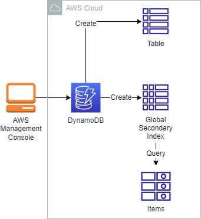
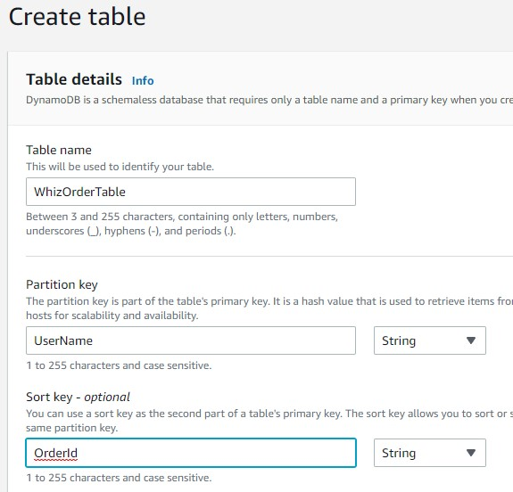
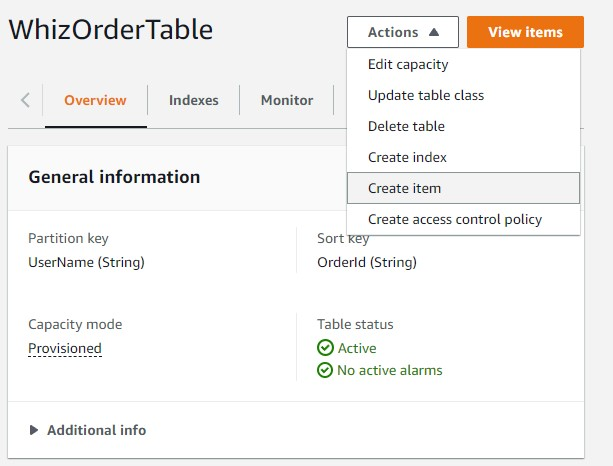
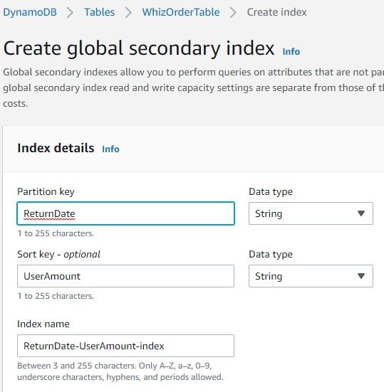
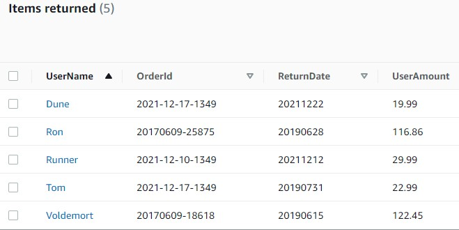
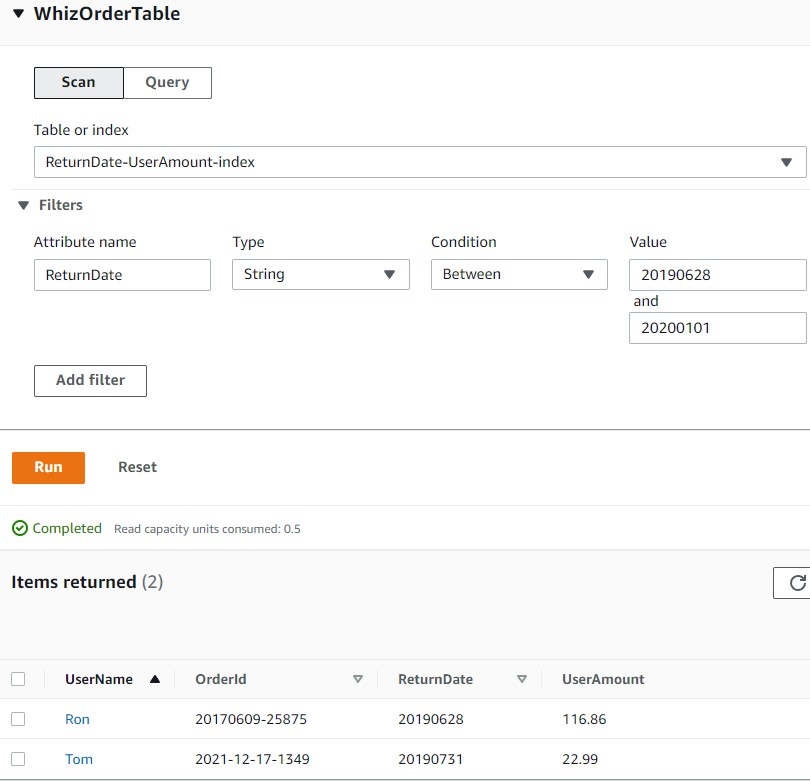

<br />

<p align="center">
  <a href="img/">
    
  </a>
  <h3 align="center">100 days in Cloud</h3>
<p align="center">
   Create a DynamoDB table and use Global Secondary Index
    <br />
    Lab 14
    <br/>
  </p>
</p>

<details open="open">
  <summary><h2 style="display: inline-block">Lab Details</h2></summary>
  <ol>
    <li><a href="#services-covered">Services covered</a>
    <li><a href="#lab-description">Lab description</a></li>
    </li>
    <li><a href="#lab-date">Lab date</a></li>
    <li><a href="#prerequisites">Prerequisites</a></li>    
    <li><a href="#lab-steps">Lab steps</a></li>
    <li><a href="#lab-files">Lab files</a></li>
    <li><a href="#acknowledgements">Acknowledgements</a></li>
  </ol>
</details>

---

## Services Covered
*  **DynamoDB**

---

## Lab description

This lab goes through a process of creating a DynamoDB Table and using a Global Secondary Index to Fetch Data

---

### Learning Objectives
* Create DynamoDB table
* Fetch data using Global Secondary Index

### Lab date
17-12-2021

---

### Prerequisites
* AWS account

---

### Lab steps
1. Create a DynamoDB Table. 

   

2. Once the table is created create an item in that table. 

   

   Add two more String attributes: *ReturnDate* and *UserAmount*. In JSON format it might look something like that:

   ```
   {
     "UserName": {
       "S": "Dune"
     },
     "OrderId": {
       "S": "2021-12-17-1349"
     },
     "ReturnDate": {
       "S": "20211222"
     },
     "UserAmount": {
       "S": "19.99"
     }
   }
   ```

   Create an item.

3. Navigate to the **Tables** and then **Indexes** and create new Index. Enter the Partition key as **ReturnDate** and Sort key as **UserAmount**

   

4. Add few more items into your table. 

   

5. Scan the table using the SGI created in step 3. 

   

   

### Lab files
* []()

---

### Acknowledgements
* [whizlabs](https://play.whizlabs.com/site/task_details?lab_type=1&task_id=40&quest_id=35)

