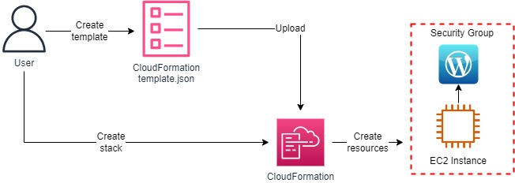
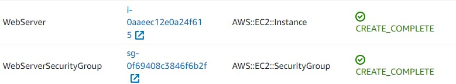
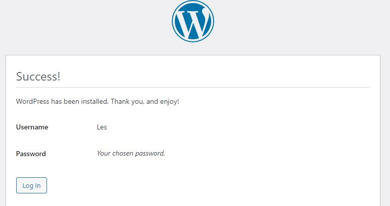
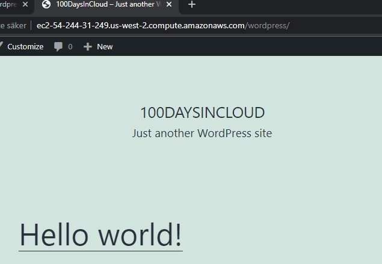

 

  
  <h3 align="center">100 days in Cloud</h3>

   Deploy Wordpress page using CloudFormation
     
    Lab 15
     
  

  
<h2 style="display: inline-block">Lab Details</h2>

  <ol>
    <li><a href="#services-covered">Services covered</a>
    <li><a href="#lab-description">Lab description</a></li>
    </li>
    <li><a href="#lab-date">Lab date</a></li>
    <li><a href="#prerequisites">Prerequisites</a></li>    
    <li><a href="#lab-steps">Lab steps</a></li>
    <li><a href="#lab-files">Lab files</a></li>
    <li><a href="#acknowledgements">Acknowledgements</a></li>
  </ol>

---

## Services Covered
*  **CloudFormation**

---

## Lab description

A quick AWS related lab where I will use a CloudFormation template to deploy a Wordpress website on an EC2 instance.

---

### Learning Objectives
* Create stack

### Lab date
16-12-2021

---

### Prerequisites
* AWS account

---

### Lab steps
1. Download the sample [CloudFormation template](launch-wordpress.template). In AWS console navigate to CloudFormation and create a stack, then upload that template (you may need to create a EC2 KeyPair in advance, because it's one of the stacks parameters).

   

   This stack will create two resources as seen above.

2. In the Outputs section you'll find the WebsiteURL to the EC2 instance.

   

   And the website itself is working too:

   

1. Delete the stack.

### Lab files
* [launch-wordpress.template](launch-wordpress.template)

---

### Acknowledgements
* [cloudacademy](https://cloudacademy.com/lab/deploy-wordpress-cloudformation/?context_id=60&context_resource=lp)

