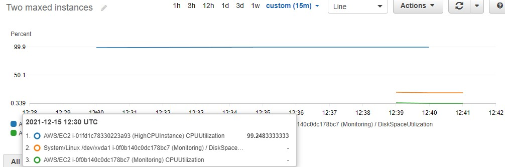
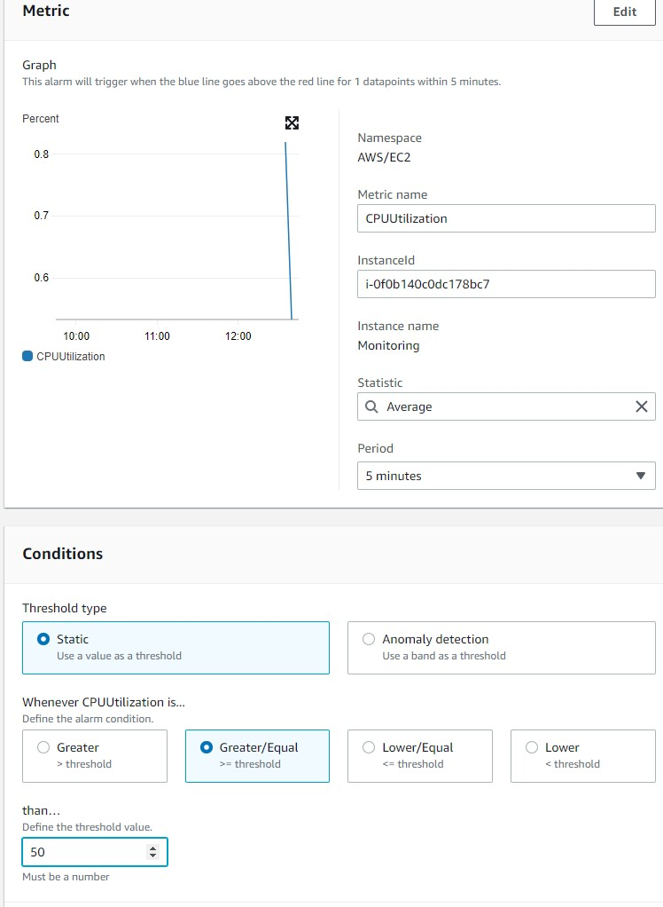
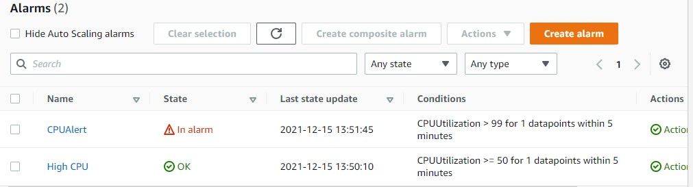

<br />

<p align="center">
  <a href="img/">
    
  </a>
  <h3 align="center">100 days in Cloud</h3>
<p align="center">
   Using CloudWatch monitor EC2 instances
    <br />
    Lab 16
    <br/>
  </p>
</p>

<details open="open">
  <summary><h2 style="display: inline-block">Lab Details</h2></summary>
  <ol>
    <li><a href="#services-covered">Services covered</a>
    <li><a href="#lab-description">Lab description</a></li>
    </li>
    <li><a href="#lab-date">Lab date</a></li>
    <li><a href="#prerequisites">Prerequisites</a></li>    
    <li><a href="#lab-steps">Lab steps</a></li>
    <li><a href="#lab-files">Lab files</a></li>
    <li><a href="#acknowledgements">Acknowledgements</a></li>
  </ol>
</details>

---

## Services Covered
*  **CloudWatch**
*  **EC2**

---

## Lab description

Monitoring EC2 instances in CloudWatch. Create alarm, subscribe to SNS and receive notifications.


---

### Learning Objectives
* Monitoring EC2 instances
* Create CloudWatch Alarm
* Install EC2 monitoring scripts

### Lab date
15-12-2021

---

### Prerequisites
* AWS account

---

### Lab steps
1. In EC2 launch an Amazon Linux instance of type t2.micro. In configuration tab enable *Detailed CloudWatch monitoring* and paste the user data:

   ```
   #!/bin/bash
   yum install -y perl-Switch perl-DateTime perl-Sys-Syslog perl-LWP-Protocol-https perl-Digest-SHA.x86_64
   wget http://aws-cloudwatch.s3.amazonaws.com/downloads/CloudWatchMonitoringScripts-1.2.2.zip
   unzip CloudWatchMonitoringScripts-1.2.2.zip
   rm CloudWatchMonitoringScripts-1.2.2.zip
   echo "*/1 * * * * /aws-scripts-mon/mon-put-instance-data.pl --mem-util --disk-space-util --disk-path=/ --from-cron" > monitoring.txt
   crontab monitoring.txt
   rm monitoring.txt
   ```

   That script will install Perl, CloudWatch Monitoring scripts and configure crontab to run the monitoring.

2. In the CloudWatch dashboard go to Metrics, there should be a *Custom Namespace* with *System/Linux* which corresponds to the metrics coming from CloudWatch monitoring installed from previous step.

   

3. In CloudWatch console navigate to Alarms and create a new one. Set the following values leaving the defaults for the rest: Whenever High CPU is...: Greater/Equal Than...:50.

   

   Whenever this alarm state is...: in Alarm Select an SNS topic: Create new topic

   
### Lab files
* 

---

### Acknowledgements
* [cloudacademy](https://cloudacademy.com/lab/use-aws-fargate-serverless-deployment-container-applications/)

