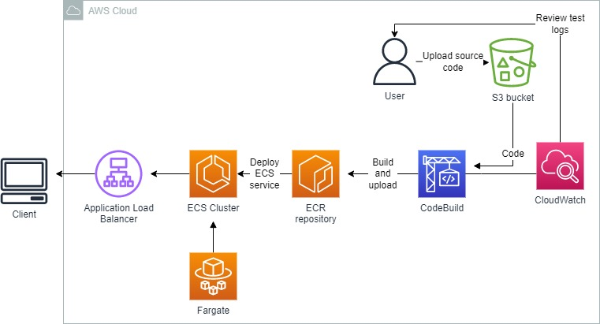
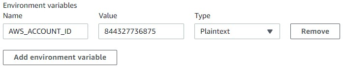
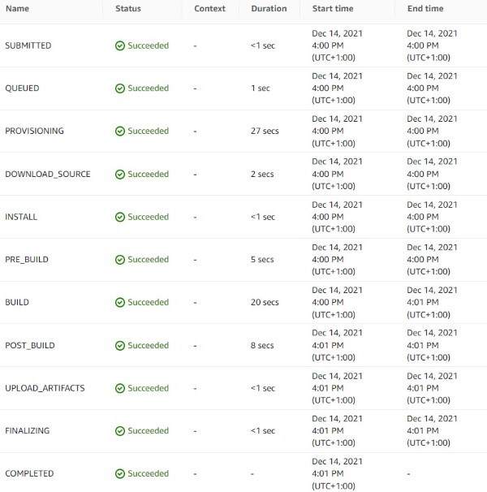
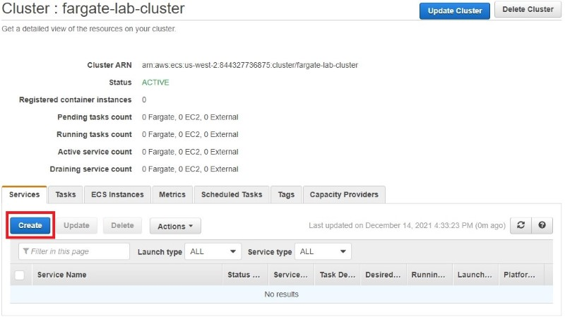
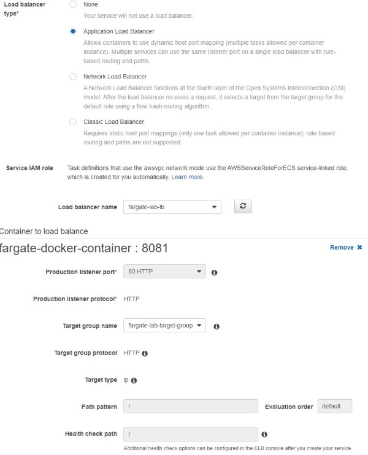
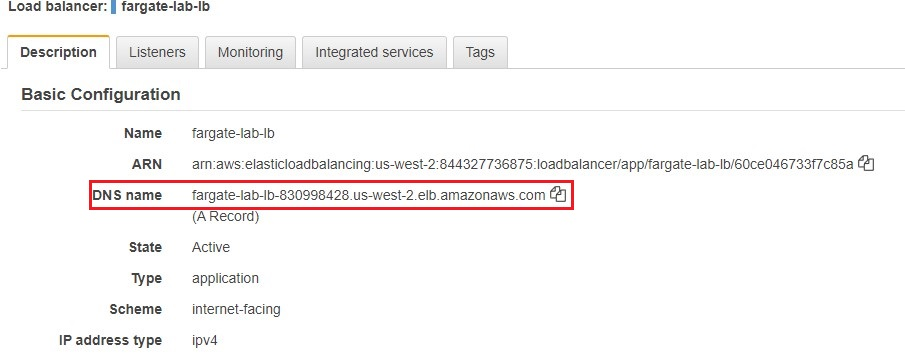
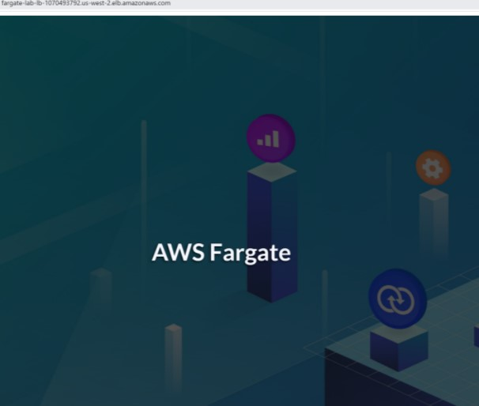

 

  
  <h3 align="center">100 days in Cloud</h3>

   Use AWS Fargate for Serverless Deployment of Container Applications
     
    Lab 17
     
  

  
<h2 style="display: inline-block">Lab Details</h2>

  <ol>
    <li><a href="#services-covered">Services covered</a>
    <li><a href="#lab-description">Lab description</a></li>
    </li>
    <li><a href="#lab-date">Lab date</a></li>
    <li><a href="#prerequisites">Prerequisites</a></li>    
    <li><a href="#lab-steps">Lab steps</a></li>
    <li><a href="#lab-files">Lab files</a></li>
    <li><a href="#acknowledgements">Acknowledgements</a></li>
  </ol>

---

## Services Covered
*  **ECS**
*  **ECR**
*  **S3**
*  **EC2**

---

## Lab description

*In this Lab you will use Amazon ECR to create your own fully-managed Docker container registry within Amazon ECS. You will use CodeBuild to build the Docker image containing the application you need to complete the Lab. The project source files and Amazon S3 bucket are created for you by the Cloud Academy. The project uses Ubuntu Linux with Docker installed as the build environment to create the image.*

---

### Learning Objectives
* Create an ECR repo
* Use CodeBuild to build Docker image
* Create ECS cluster on Fargate
* Create Application Load Balancer and a Target Group to handle traffic to application

### Lab date
14-12-2021

---

### Prerequisites
* AWS account

---

### Lab steps
1. In AWS Management Console navigate to ECS then *Repositories* and create repository with name `ca-container-registry`.

2. Create a bucket for source code for the build project and upload [fargatelab.zip](fargatelab.zip)

3. Navigate to CodeBuild and create build project. 

   - Project configuration
     - **Project name**: *fargate-project*
   - Source:
     - **Source provider**: Select **Amazon S3**
     - **Bucket**: Select <YOUR-BUCKET-NAME>
     - **S3 object key**: Enter *fargate-lab/fargatelab.zip*
   - Environment
     - **Environment image**: Select **Managed image**
     - **Operating system**: Select **Ubuntu**
     - **Runtime**: Select **Standard**
     - **Image**: Select **aws/codebuild/standard:4.0**
     - **Privileged**: Checked
     - **Service role**: Select **Existing service role**
     - **Role name**: CodeBuildServiceRole 
     - **Allow AWS CodeBuild to modify this service role**...: Unchecked
   - Buildspec
     - **Build specification**: Ensure **Use a buildspec file** is selected
   - Artifacts
     - **Artifacts type**: Ensure **No artifacts** is selected

   When done Click **Edit** and click **Environment**: Uncheck the *Allow AWS CodeBuild to modify this service role* and under Additional configuration Add environment variable with name: AWS_ACCOUNT_ID and with value of your account number.

   

4. Click Start build to begin building the docker image.

   Tip: if the build fails it might be because the created IAM Role needs permission to talk to ECR, hence you need to add a`AmazonEC2ContainerRegistryPowerUser` policy to your `CodeBuild` role. 

   

   Navigate to the ECR and in repository created in step one you should find the `testblue` Docker image.

5. Navigate to ECS and create cluster, choose Networking only and create.

6. Navigate to EC2 and create a Application Load Balancer. For the Listeners and routing Create target group and select Ip addresses and give it a name, then create on the next tab. Back in ALB configuration set-up choose that target group for the HTTP on port 80.

7. Back in the ECS create a new Task Definition. Select Fargate and the smallest task size. Add container and past the repository URI for the ECR repository from step 1. Provide port mappings: 8081. Add and create Task definition.

8. Select the cluster you created before from the Amazon ECS > Clusters table, then go to the Service tab and click Create:

   

   Launch type: Select FARGATE,Service name: Enter fargate-service, Number of tasks: Enter 1. On the next tab choose the ALB created in step 6. Under Container to load balancer, select the one available (fargate-docker-container) and click on Add to load balancer. Select the fargate-lab-target-group target group you created before as Target group name:

   

   In the next stepUnder Set Auto Scaling, ensure Do not adjust the service’s desired count is selected before clicking Next step

9. Test your deployment by sending requests to the load balancer you created before. Find the ALB's DNS name:

   

   And browse to that address.

   
### Lab files
* [fargatelab.zip](fargatelab.zip)

---

### Acknowledgements
* [cloudacademy](https://cloudacademy.com/lab/use-aws-fargate-serverless-deployment-container-applications/)

