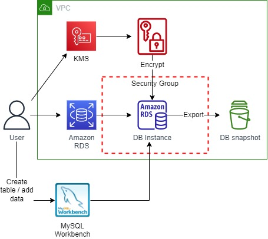
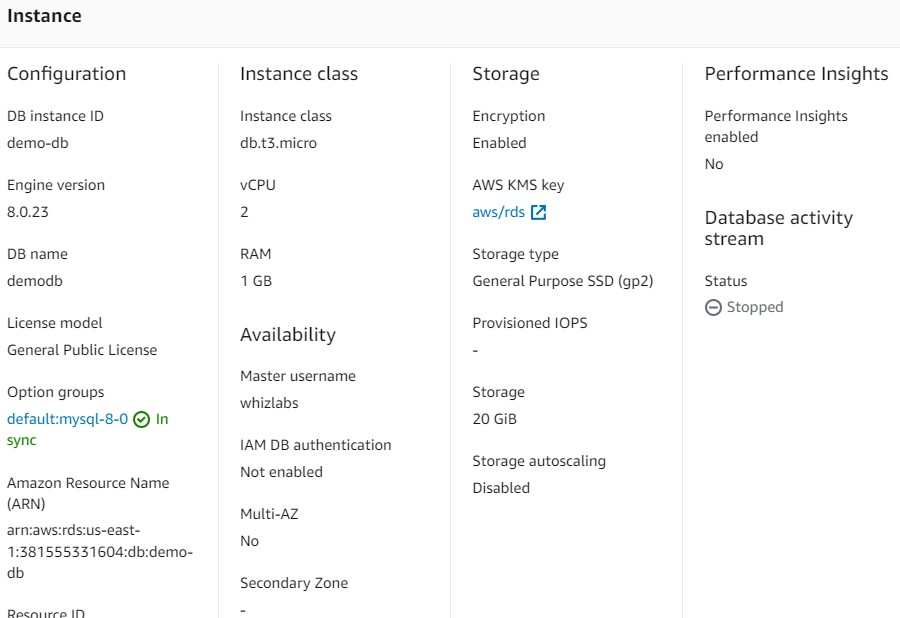
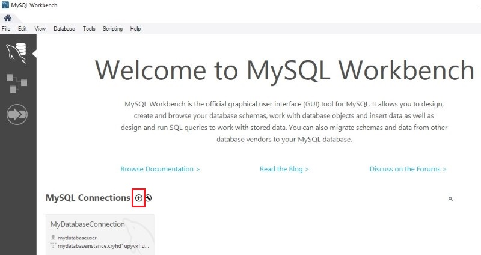
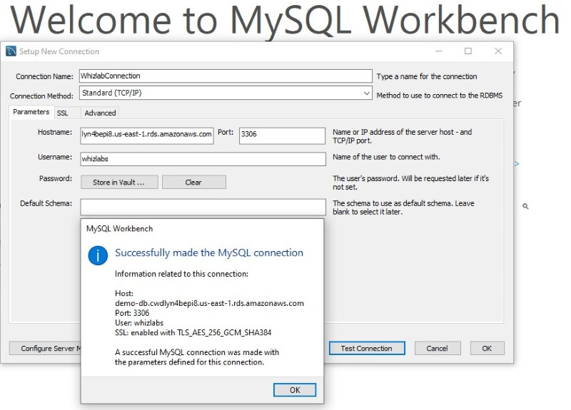
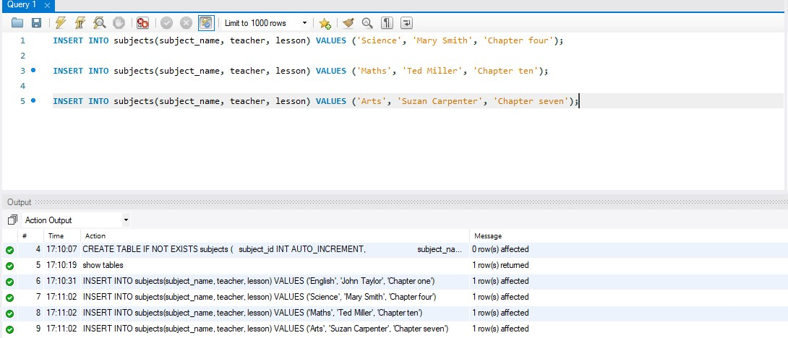
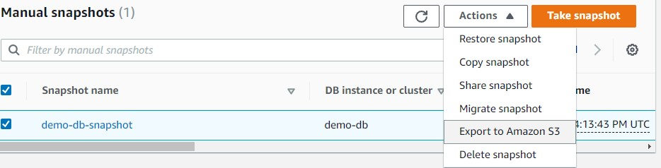

<br />

<p align="center">
  <a href="img/">
    
  </a>
  <h3 align="center">100 days in Cloud</h3>
<p align="center">
   Export Amazon RDS DB Snapshot to S3
    <br />
    Lab 18
    <br/>
  </p>
</p>

<details open="open">
  <summary><h2 style="display: inline-block">Lab Details</h2></summary>
  <ol>
    <li><a href="#services-covered">Services covered</a>
    <li><a href="#lab-description">Lab description</a></li>
    </li>
    <li><a href="#lab-date">Lab date</a></li>
    <li><a href="#prerequisites">Prerequisites</a></li>    
    <li><a href="#lab-steps">Lab steps</a></li>
    <li><a href="#lab-files">Lab files</a></li>
    <li><a href="#acknowledgements">Acknowledgements</a></li>
  </ol>
</details>

---

## Services Covered
*  **CodeCommit**
*  **Lambda**

---

## Lab description

In this lab I will create a encrypted RDS database. Then I will connect to it using a MySQL Workbench and create database, table and insert some data. Then I will take a snapshot of the database and export it to S3.

---

### Learning Objectives
* Create a RDS database
* Connect to database using MySQL Workbench
* Take snapshot and export it to S3

### Lab date
13-12-2021

---

### Prerequisites
* AWS account
* MySQL Workbench

---

### Lab steps
1. Create a S3 bucket. 

1. Create an symmetric KMS Key. No need to change permissions. Copy the key's ARN.

1. Create a Security group for RDS DB Instance. Allow inbound traffic for **MySQL/Aurora** from anywhere.

1. Create an Amazon RDS DB Instance with MySQL engine, with t2.micro instance and as publicly accessible. 

   
   
1. Connect to RDS Database using the MySQL Workbench. To connect to a database on a DB instance using MySQL Workbench, find the endpoint (DNS name) and port number for your DB Instance. Under Connectivity & security section, copy and note the endpoint and port. 

   
   
   Click on the plus icon. And provide connection endpoint and credentials.
   
   
   
   After successfully connecting and opening the database, you can create tables and perform various queries over the connected database.
   
1. Create a sample database and a table. Create a database by running:

   ```sql
   CREATE DATABASE SchoolDB;
   ```
   
   Then switch to the database
   
   ```
   use SchoolDB;
   ```
   
   Create a table
   
   ```
   CREATE TABLE IF NOT EXISTS subjects ( 
   
   subject_id INT AUTO_INCREMENT,
   
                         subject_name VARCHAR(255) NOT NULL,
   
                         teacher VARCHAR(255),
   
                         lesson TEXT,
   
                         PRIMARY KEY (subject_id)
   
                    ) ENGINE=INNODB;
   ```
   
   Insert some data into table
   
   ```
   INSERT INTO subjects(subject_name, teacher, lesson) VALUES ('English', 'John Taylor', 'Chapter one');
   
   INSERT INTO subjects(subject_name, teacher, lesson) VALUES ('Science', 'Mary Smith', 'Chapter four');
   
   INSERT INTO subjects(subject_name, teacher, lesson) VALUES ('Maths', 'Ted Miller', 'Chapter ten');
   
   INSERT INTO subjects(subject_name, teacher, lesson) VALUES ('Arts', 'Suzan Carpenter', 'Chapter seven');
   ```
   
   
   
7. Take a Snapshot from the existing DB Instance in the RDS Dashboard. Select the created DB Instance and click on Actions. Click Take snapshot from the options.

8. Export the DB snapshot to S3. Select the created snapshot and click on the Actions. Click on Export to Amazon S3 from the options. Under the **S3 destination**, select the created S3 from the drop-down. Select the **created KMS key from the drop-down** or enter the ARN that we noted while creating the key. 

   

   This may take **up to 20-25 minutes** as it is exporting the whole database

9. Check the exported data in Amazon S3. Once the export is completed, navigate to the created S3 Bucket.


### Lab files
* 
---

### Acknowledgements
* [whizlabs](https://play.whizlabs.com/site/task_details?lab_type=1&task_id=219&quest_id=35)

