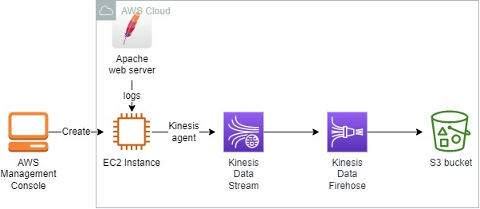
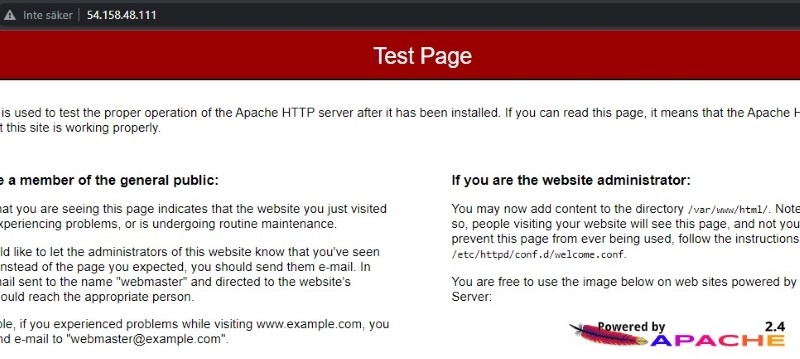
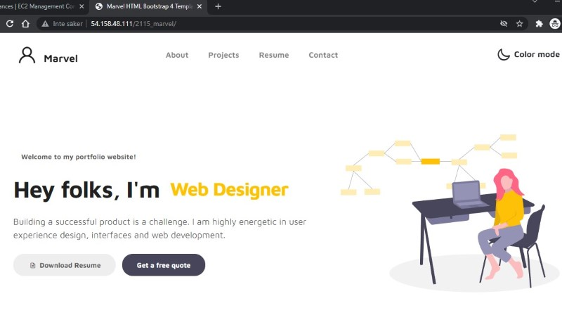
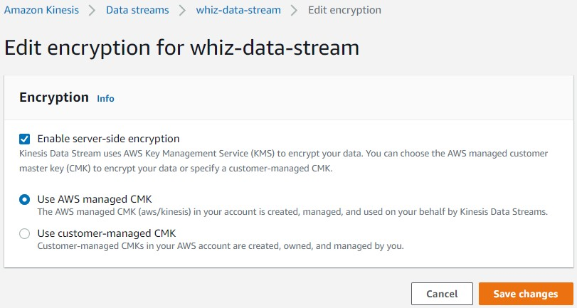
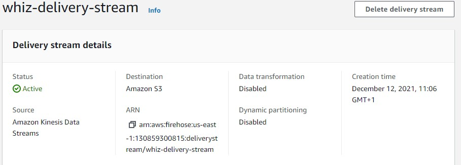
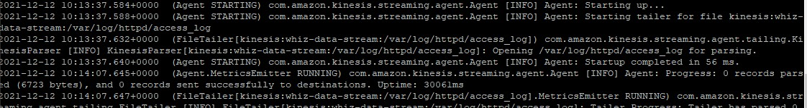
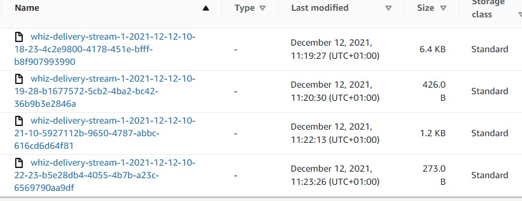

<br />

<p align="center">
  <a href="img/">
    
  </a>
  <h3 align="center">100 days in Cloud</h3>
<p align="center">
   Build a real time data streaming solution with Amazon Kinesis Data Stream and Kinesis Agent
    <br />
    Lab 19
    <br/>
  </p>
</p>

<details open="open">
  <summary><h2 style="display: inline-block">Lab Details</h2></summary>
  <ol>
    <li><a href="#services-covered">Services covered</a>
    <li><a href="#lab-description">Lab description</a></li>
    </li>
    <li><a href="#lab-date">Lab date</a></li>
    <li><a href="#prerequisites">Prerequisites</a></li>    
    <li><a href="#lab-steps">Lab steps</a></li>
    <li><a href="#lab-files">Lab files</a></li>
    <li><a href="#acknowledgements">Acknowledgements</a></li>
  </ol>
</details>

---

## Services Covered
*  **Kinesis Data Streams**
*  **Kinesis Firehose**

---

## Lab description

An application running on the EC2 instance is generating continuous logs, those loge will be pushed into the Kinesis Data Streams. From Kinesis Data Streams, it will be consumed through the Kinesis Firehose and then saved into a S3 bucket.


---

### Learning Objectives
* Host a sample website on EC2 and configure Kinesis Agent on it
* Create Kinesis data stream
* Create Kinesis Data Firehose

### Lab date
12-12-2021

---

### Prerequisites
* AWS account

---

### Lab steps
1. Create an IAM Role for EC2. Attach the *AmazonS3FullAccess* and *AmazonKinesisFullAccess* permissions. 

2. Launch an EC2 instance. Provide the user data script:

   ```
   #!/bin/bash
   
   sudo -s
   
   yum update -y
   
   sudo amazon-linux-extras install -y lamp-mariadb10.2-php7.2 php7.2
   
   sudo yum install -y httpd mariadb-server
   
   sudo systemctl start httpd
   
   sudo systemctl enable httpd
   ```

   It will start a simple web server on that instance.

   

   For the security group allow SSH and HTTp ingress traffic. 

3. SSH into EC2 instance. On the instance go to

   ```
   cd  /var/www/html
   ```

   and download a sample site

   ```
   sudo wget https://www.free-css.com/assets/files/free-css-templates/download/page270/marvel.zip
   ```

   then unzip it

   ```
   sudo unzip marvel.zip
   ```

   Navigate to ` http://<Instances-public-IP>/2115_marvel` 

   

   The website logs will be in the path “**/var/log/httpd/access_log**”. For each click and use of the website, the related logs will be collected and stored here.

4. Create Kinesis Data Stream. Choose Provisioned with 1 data shard. When created, enable server-side encryption.

   

5. Create a S3 bucket to store data from Firehose. Enable server-side encryption with S3 key.

6. Create Kinesis Data Firehose. As source use the Kinesis Data Stream, destination is the S3 bucket, change the buffer interval to 60 seconds.,

   

7. Create and configure Kinesis Agent on the EC2 instance.

   ```
   sudo yum install –y https://s3.amazonaws.com/streaming-data-agent/aws-kinesis-agent-latest.amzn2.noarch.rpm
   ```

   After installing the Kinesis agent, let us update the json file available in the path **/etc/aws-kinesis/agent.json**. Edit the agent.json,

   ```
   sudo nano /etc/aws-kinesis/agent.json
   ```

   Replace the content with following and your access id and key:

   ```
   {
   
     "cloudwatch.emitMetrics": true,
   
     "kinesis.endpoint": "",
   
     "firehose.endpoint": "",
   
    
     "awsAccessKeyId": "AKIA5***************",
   
     "awsSecretAccessKey": "iPpJ***************",
   
    
     "flows": [
   
       {
   
         "filePattern": "/var/log/httpd/access_log",
   
         "kinesisStream": "whiz-data-stream",
   
         "partitionKeyOption": "RANDOM"
   
       }
   
     ]
   
   }
   ```

   Restart the agent

   ```
   sudo service aws-kinesis-agent stop
   sudo service aws-kinesis-agent start
   ```

   You can check if the service is started properly by going through the log.

   ```
   head -10 aws-kinesis-agent.log
   ```

   

   

8. Test the real-time streaming of data by interacting with the ` http://<Instances-public-IP>/2115_marvel`. Then navigate to the S3 bucket and wait for the data logs to be created.

   

   

   

### Lab files
* 
---

### Acknowledgements
* [whizlabs](https://play.whizlabs.com/site/task_details?lab_type=1&task_id=276&quest_id=35)

