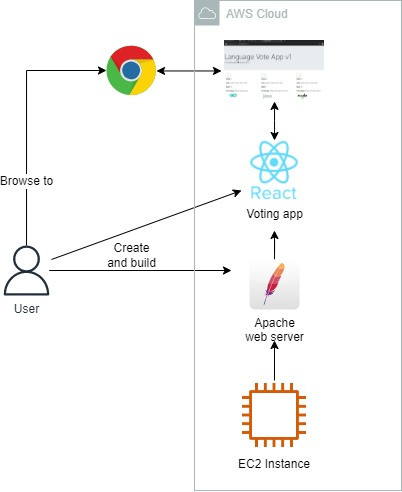
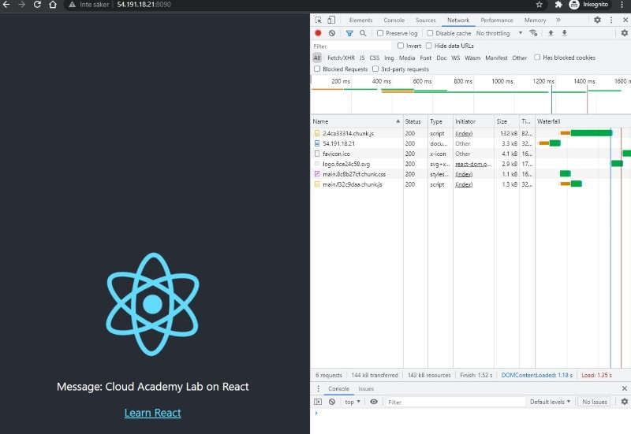
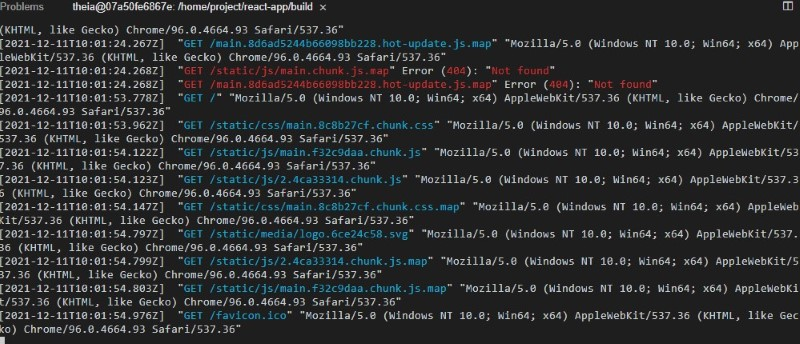
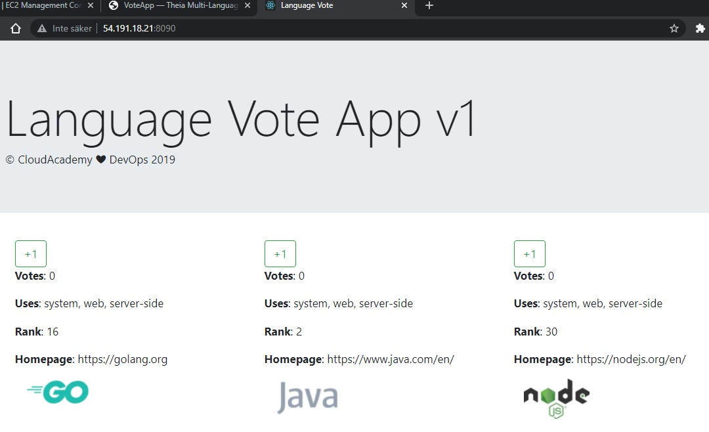
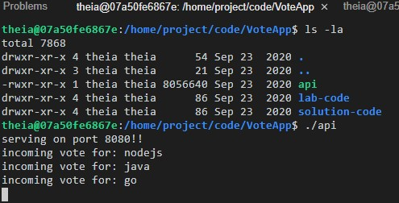

<br />

<p align="center">
  <a href="img/">
    
  </a>
  <h3 align="center">100 days in Cloud</h3>
<p align="center">
   Create a voting React app on EC2
    <br />
    Lab 20
    <br/>
  </p>
</p>

<details open="open">
  <summary><h2 style="display: inline-block">Lab Details</h2></summary>
  <ol>
    <li><a href="#services-covered">Services covered</a>
    <li><a href="#lab-description">Lab description</a></li>
    </li>
    <li><a href="#lab-date">Lab date</a></li>
    <li><a href="#prerequisites">Prerequisites</a></li>    
    <li><a href="#lab-steps">Lab steps</a></li>
    <li><a href="#lab-files">Lab files</a></li>
    <li><a href="#acknowledgements">Acknowledgements</a></li>
  </ol>
</details>

---

## Services Covered
*  **React**

---

## Lab description

On the provided EC2 instance create and host a React app.


---

### Learning Objectives
* Creating and hosting a React app

### Lab date
11-12-2021

---

### Prerequisites
* AWS account
* This lab comes with IDE environment on a EC2 instance (but you can create React app locally and the host it on EC2)

---

### Lab steps
1. In you IDE in the project folder run:

   ```
   npx create-react-app react-app
   ```

   Then:

   ``` 
   cd react-app && ls -la
   ```

   ```
   yarn start
   ```

2. Then after making some changes to the apps code create and compile production build:

   ```
   yarn build --production
   ```

   To serve these files up, install Apache HTTP web server

   ```
   sudo yarn global add http-server
   ```

   Navigate into the new **build** directory and examine the contents

   ```
   cd build && ls -la
   ```

   Start the **http-server**

   ```
   http-server -p 8090 -a 0.0.0.0
   ```

   Browsing to the public ip of the instance on port 8090 returns the website:

   

   The apache server in the backend loggs the calls against it:

   

3. Then I repeated the process with the [voting app]()./voting-app:

   

   And voting API calls works to:

   

### Lab files
* 
* 
---

### Acknowledgements
* [cloud academy](https://cloudacademy.com/lab/create-web-app-using-react/?context_id=1377&context_resource=lp)

