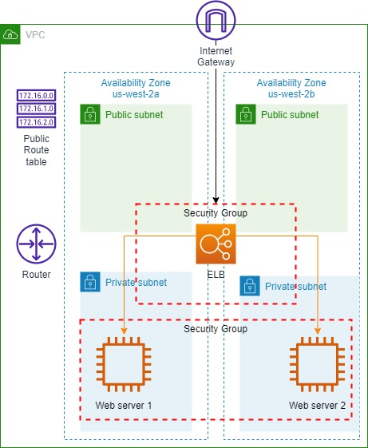
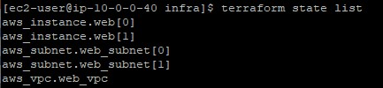
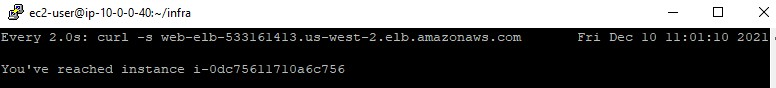
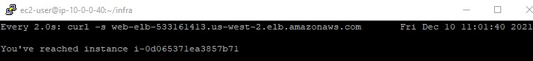

<br />

<p align="center">
  <a href="img/">
    
  </a>
  <h3 align="center">100 days in Cloud</h3>
<p align="center">
   Deploy a Highly Available Website with Terraform on AWS
    <br />
    Lab 21
    <br/>
  </p>
</p>

<details open="open">
  <summary><h2 style="display: inline-block">Lab Details</h2></summary>
  <ol>
    <li><a href="#services-covered">Services covered</a>
    <li><a href="#lab-description">Lab description</a></li>
    </li>
    <li><a href="#lab-date">Lab date</a></li>
    <li><a href="#prerequisites">Prerequisites</a></li>    
    <li><a href="#lab-steps">Lab steps</a></li>
    <li><a href="#lab-files">Lab files</a></li>
    <li><a href="#acknowledgements">Acknowledgements</a></li>
  </ol>
</details>

---

## Services Covered
*  **Terraform**

---

## Lab description

*You are provided with a partially completed Terraform configuration and existing resources in AWS managed by Terraform for this Lab. Your goal is to achieve the following:*

- *Configure existing instances to serve a custom website*
- *Create an Elastic Load Balancer with the instances in its pool*
- *Create public subnets and security groups to secure the deployment*


---

### Learning Objectives
* Creating two web servers in two AZ's in private subnets
* Creating public subnets
* Creating cross-zone ELB to distribute traffic to the web servers

### Lab date
10-12-2021

---

### Prerequisites
* AWS account
* Running EC2 instance
* SSH client
* Terraform installed

---

### Lab steps
1. Connect to your EC2 instance using SSH client. At the beginning the lab provides a VPC, two subnets and two instances

   

   ```
   provider "aws" {
     version = "< 2"
   
     region  = "us-west-2" # Oregon
   }
   
   resource "aws_vpc" "web_vpc" {
     cidr_block           = "192.168.100.0/24"
     enable_dns_hostnames = true
   
     tags {
       Name = "Web VPC"
     }
   }
   
   resource "aws_subnet" "web_subnet" {
     # Use the count meta-parameter to create multiple copies
     count             = 2
     vpc_id            = "${aws_vpc.web_vpc.id}"
     # cidrsubnet function splits a cidr block into subnets
     cidr_block        = "${cidrsubnet(var.network_cidr, 2, count.index)}"
     # element retrieves a list element at a given index
     availability_zone = "${element(var.availability_zones, count.index)}"
   
     tags {
       Name = "Web Subnet ${count.index + 1}"
     }
   }
   
   resource "aws_instance" "web" {
     count         = "${var.instance_count}"
     # lookup returns a map value for a given key
     ami           = "${lookup(var.ami_ids, "us-west-2")}"
     instance_type = "t2.micro"
     subnet_id     = "${element(aws_subnet.web_subnet.*.id, count.index % length(aw
   s_subnet.web_subnet.*.id))}"
   
     tags {
       Name = "Web Server ${count.index + 1}"
     }
   }
   ```

   Theres also a [variables.tf](variables.tf) file that holds variables for configuration.

2. By adding a user_data to the configuration the web server will serve a custom website that echoes back the instance's ID

   ```
   user_data     = "${file("user_data.sh")}"
   ```

   Create the user_data.sh script that will create and serve the custom website:

   ```
   cat >> user_data.sh <<'EOF'
   #!/bin/bash
   cat > /var/www/html/index.php <<'END'
   <?php
   $instance_id = file_get_contents("http://instance-data/latest/meta-data/instance-id");
   echo "You've reached instance ", $instance_id, "\n";
   ?>
   END
   EOF
   ```

   Execution of `terraform apply` will destroy those two existing instances and create two new ones because the `user_data` must be executed when an instance is first launched.

3. Create the required networking resources for public subnets in a configuration file named [networking.tf](networking.tf):

   ```
   # Internet gateway to reach the internet
   resource "aws_internet_gateway" "web_igw" {
     vpc_id = "${aws_vpc.web_vpc.id}"
   }
   
   # Route table with a route to the internet
   resource "aws_route_table" "public_rt" {
     vpc_id = "${aws_vpc.web_vpc.id}"
     
     route {
       cidr_block = "0.0.0.0/0"
       gateway_id = "${aws_internet_gateway.web_igw.id}"
     }
   
     tags {
       Name = "Public Subnet Route Table"
     }
   }
   
   # Subnets with routes to the internet
   resource "aws_subnet" "public_subnet" {
     # Use the count meta-parameter to create multiple copies
     count             = 2
     vpc_id            = "${aws_vpc.web_vpc.id}"
     cidr_block        = "${cidrsubnet(var.network_cidr, 2, count.index + 2)}"
     availability_zone = "${element(var.availability_zones, count.index)}"
   
     tags {
       Name = "Public Subnet ${count.index + 1}"
     }
   }
   
   # Associate public route table with the public subnets
   resource "aws_route_table_association" "public_subnet_rta" {
     count          = 2
     subnet_id      = "${aws_subnet.public_subnet.*.id[count.index]}"
     route_table_id = "${aws_route_table.public_rt.id}"
   }
   ```

   Applying new configuration results with creating 6 resources: two public subnets, public route table, two route table associations and an Internet Gateway.

4. Create the security groups that will secure traffic into the public and private subnets in a configuration file called [security.tf](security.tf):

   ```
   resource "aws_security_group" "elb_sg" {
     name        = "ELB Security Group"
     description = "Allow incoming HTTP traffic from the internet"
     vpc_id      = "${aws_vpc.web_vpc.id}"
   
     ingress {
       from_port   = 80
       to_port     = 80
       protocol    = "tcp"
       cidr_blocks = ["0.0.0.0/0"]
     }
   
     # Allow all outbound traffic
     egress {
       from_port = 0
       to_port = 0
       protocol = "-1"
       cidr_blocks = ["0.0.0.0/0"]
     }
   }
   
   resource "aws_security_group" "web_sg" {
     name        = "Web Server Security Group"
     description = "Allow HTTP traffic from ELB security group"
     vpc_id      = "${aws_vpc.web_vpc.id}"
   
     # HTTP access from the VPC
     ingress {
       from_port       = 80
       to_port         = 80
       protocol        = "tcp"
       security_groups = ["${aws_security_group.elb_sg.id}"]
     }
   
     # Allow all outbound traffic
     egress {
       from_port = 0
       to_port = 0
       protocol = "-1"
       cidr_blocks = ["0.0.0.0/0"]
     }
   }
   ```

   Now additional resource block is necessary in main.tf for the instances to attach web server security group

   ```
   vpc_security_group_ids = ["${aws_security_group.web_sg.id}"]
   ```

5. Create an ELB configuration in a file named [load_balancer.tf](load_balancer.tf):

   ```
   resource "aws_elb" "web" {
     name = "web-elb"
     subnets = ["${aws_subnet.public_subnet.*.id}"]
     security_groups = ["${aws_security_group.elb_sg.id}"]
     instances = ["${aws_instance.web.*.id}"]
   
     # Listen for HTTP requests and distribute them to the instances
     listener { 
       instance_port     = 80
       instance_protocol = "http"
       lb_port           = 80
       lb_protocol       = "http"
     }
   
     # Check instance health every 10 seconds
     health_check {
       healthy_threshold = 2
       unhealthy_threshold = 2
       timeout = 3
       target = "HTTP:80/"
       interval = 10
     }
   }
   ```

   After applying the updated configuration the ELB's DNS address might be reached by:

   ```
   site_address=$(terraform output site_address)
   ```

   ```
   watch curl -s $site_address
   ```

   

   

1. It's time to run `terraform destroy` to delete resources managed by Terraform.

### Lab files
* [main.tf](main.tf)
* [networking.tf](networking.tf)
* [security.tf](security.tf)
* [variables.tf](variables.tf)
* [load_balancer.tf](load_balancer.tf)
* 
---

### Acknowledgements
* [cloud academy](https://cloudacademy.com/lab/deploy-highly-available-website-terraform-aws/?context_id=197&context_resource=lp)

