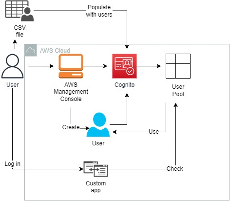
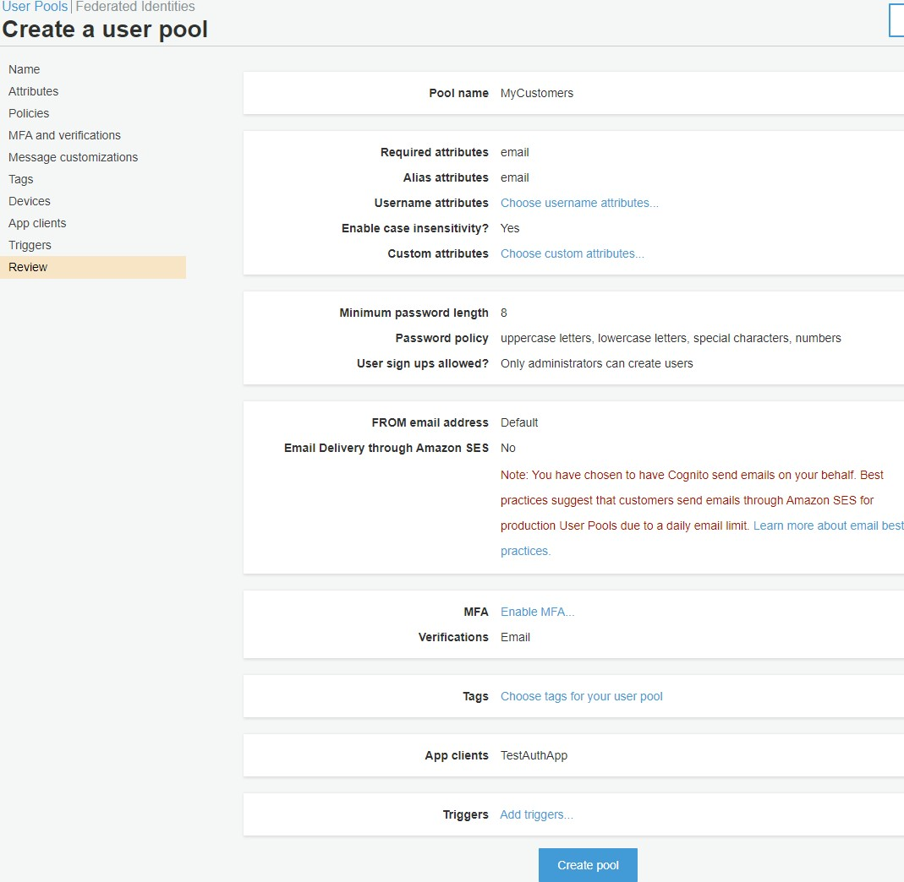
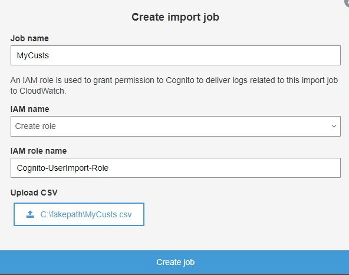
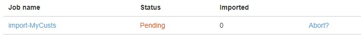
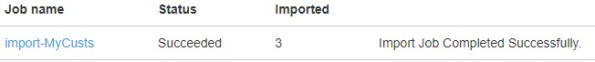
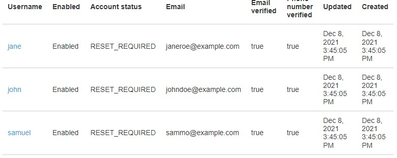
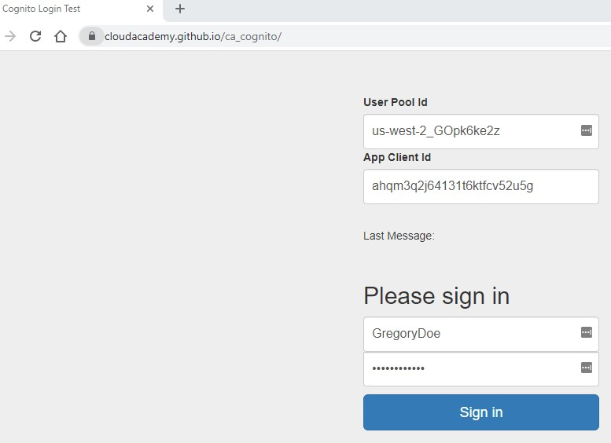

 

  
  <h3 align="center">100 days in Cloud</h3>

   Manage authentication with Cognito
     
    Lab 23
     
  

  
<h2 style="display: inline-block">Lab Details</h2>

  <ol>
    <li><a href="#services-covered">Services covered</a>
    <li><a href="#lab-description">Lab description</a></li>
    </li>
    <li><a href="#lab-date">Lab date</a></li>
    <li><a href="#prerequisites">Prerequisites</a></li>    
    <li><a href="#lab-steps">Lab steps</a></li>
    <li><a href="#lab-files">Lab files</a></li>
    <li><a href="#acknowledgements">Acknowledgements</a></li>
  </ol>

---

## Services Covered
*  **Cognito**

---

## Lab description

In this lab I will create a User Pool that I will populate with users.

---

### Learning Objectives
* Creating Cognito User Pools
* Creating custom runtime Lambda function

### Lab date
08-12-2021

---

### Prerequisites
* AWS account

---

### Lab steps
1. In the Cognito Dashboard click on *Manage User Pools* and then *Create a user pool*. Give it a name and click on click *Set through settings*. In the **Attributes** section check **Also allow sign in with verified email address** and check the email as ***Required*** attribute. On the *Policies* tab choose *Only allow administrators to create users*. No need for MFA authentication. Leave default values on the next tabs. On *App clients* tab add an app that will use this User Pool. Uncheck **Generate client secret**. All other options for the app client should be left at their defaults. No custom workflows are required for the **Triggers** step.

   

   Make a note of your user pool's **Pool Id**.

2. Download the example [MyCusts.csv](MyCusts.csv) file with some users to be imported into User Pool. In the Amazon Cognito console, navigate to **General settings > Users and groups**, click **Import users**. Click **Create import job **and use the .csv file.

   

   Click start afterwards.

   

   

3. Navigate to **General settings > Users and groups** and in the top-right, click the refresh icon.

   

4. Navigate to **General settings** and then **Users and groups**, click **Create user** and create user for yourself. Check the email address that you used when creating the new user.

   

5. Navigate to the **Users and groups** page of your Cognito User Pool. You will create another user for your pool, then authenticate that user using the web app referred to in the Introduction. 

6. Fill out **Create user** dialog with the following information:

   - **Username**: Enter *GregoryDoe* 
   - **Send an invitation to this new user?** Leave this checked. Check **Email** as well (leave **SMS** unchecked)
   - **Temporary password**: Enter *GregoryDoe1* (This will not violate any password policies set up earlier with your user pool.)
   - **Mark phone number as verified?** Leave this unchecked
   - **Email**: Enter a valid email address (*Note*: If possible, enter a unique, valid email that is not attached to an existing user in your pool. You can enter an already used email address, but an extra click to overwrite is required.)
   - **Mark email as verified?** Leave this checked

7. Navigate to the General settings page of your User Pool. Copy the Pool Id to somewhere you can easily retrieve it. Navigate to the App clients page of your User Pool. Copy the App client id somewhere you can easily retrieve it. Cloud academy provided an app for this lab where a user could test loggin credentials from that USer Pool

   

### Lab files

* 
---

### Acknowledgements
* [cloud academy](https://cloudacademy.com/lab/manage-authentication-amazon-cognito/)

