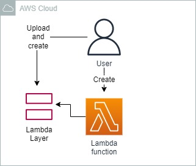
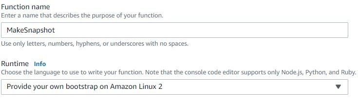
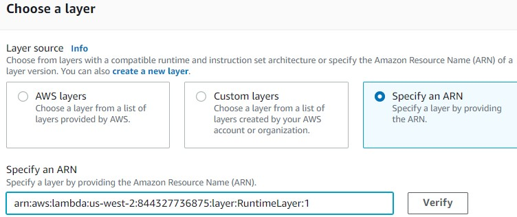

<br />

<p align="center">
  <a href="img/">
    
  </a>
  <h3 align="center">100 days in Cloud</h3>
<p align="center">
   Use Lambda Custom Runtimes to Run Bash Commands
    <br />
    Lab 24
    <br/>
  </p>


</p>

<details open="open">
  <summary><h2 style="display: inline-block">Lab Details</h2></summary>
  <ol>
    <li><a href="#services-covered">Services covered</a>
    <li><a href="#lab-description">Lab description</a></li>
    </li>
    <li><a href="#lab-date">Lab date</a></li>
    <li><a href="#prerequisites">Prerequisites</a></li>    
    <li><a href="#lab-steps">Lab steps</a></li>
    <li><a href="#lab-files">Lab files</a></li>
    <li><a href="#acknowledgements">Acknowledgements</a></li>
  </ol>
</details>

---

## Services Covered
*  **Lambda**

---

## Lab description

In this lab I will creata lambda Layer and set a custom runtime. I will create a Lambda Layer that contains the bootstrap configuration file needed to run Bash code in Lambda functions. 

*In this Lab Step, you invoked the Lambda function and created the snapshot. You also checked the existence of the snapshot. You could use the same custom runtime layer to create other Bash functions that perform tasks that are useful for your environment using the AWS CLI or other Bash commands. You can even use CloudWatch Events triggers to make the Lambda functions run on a schedule.*


---

### Learning Objectives
* Creating Lambda Layers
* Creating custom runtime Lambda function

### Lab date
07-12-2021

---

### Prerequisites
* AWS account

---

### Lab steps
1. Navigate to the S3 Console and record the Bucket name in a file or other location where you can easily retrieve it (it was provided by the cloud academy).

1.  Navigate to the Lambda Console and  Create layer.Name: RuntimeLayer
   Description: Layer for the runtime configuration
   Select Upload a zip file [bash-lambda-layer.zip](bash-lambda-layer.zip)
   
1. Navigate to functions and click on Create function

   
   
1. In the Function overview section, click on Layers and then click Add a layer.  Select Specify an ARN and paste the ARN you copied before into the Specify and ARN text-field. 

   
   
1. Move to the **Code source** section and delete the **bootstrap.sample** file by right-clicking the file, selecting **Delete**, and confirming. 

1. Double-click **hello.sh** to open the file and replace its entire contents with the following Bash function code:

   ```
   function handler () {
     # Event data is passed in as the first argument (unused in this Lab)
     EVENT_DATA=$1 
     
     # Use the ls command to list files and folders
     result=$(ls -a)
     echo $result
   
     # Return a JSON response indicating the function succeeded
     RESPONSE="{\"statusCode\": 200, \"body\": \"Snapshot complete\"}"
     echo $RESPONSE
   }
   ```
   
   To change the function's timeout, click the Configuration tab and click Edit: The Basic settings form will load. Set the following form values: Memory (MB): 256 MB Timeout: 1 min 10 sec. 
   
1. Click on **Test** button at the top of the **Code source** section and fill the content as described **Event name**: *TestMakeSnapshot**Body**: *{}*


​    


### Lab files

* [bash-lambda-layer.zip](bash-lambda-layer.zip)
---

### Acknowledgements
* [whizlabs](https://play.whizlabs.com/site/task_details?lab_type=1&task_id=66&quest_id=35)

