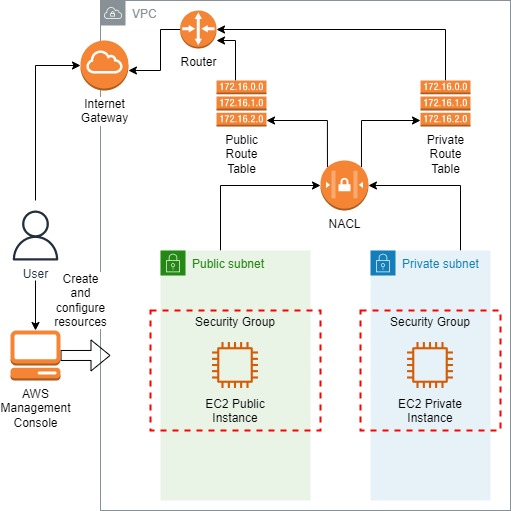
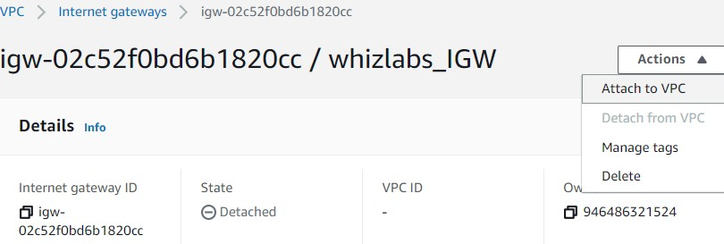
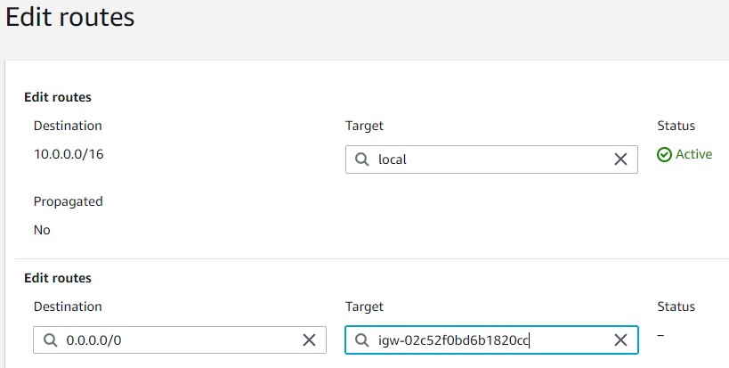
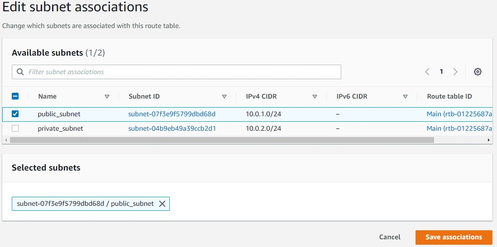
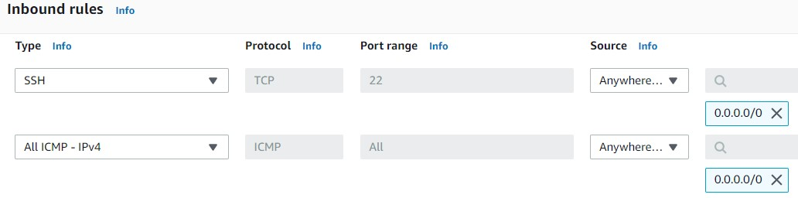
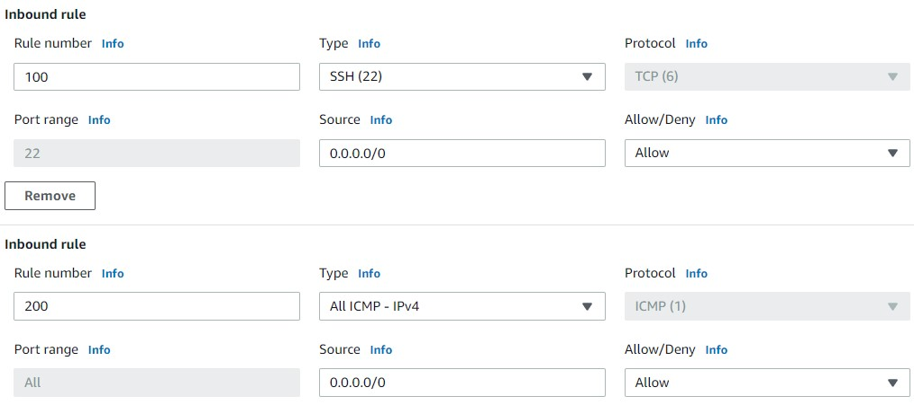
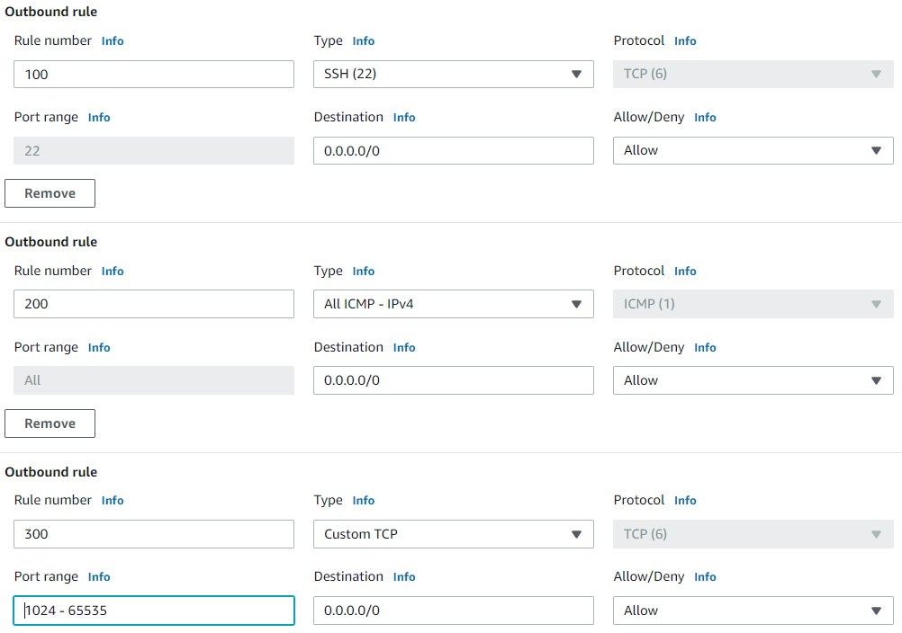
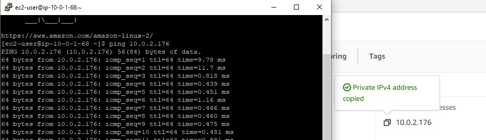

<br />

<p align="center">
  <a href="img/">
    
  </a>
  <h3 align="center">100 days in Cloud</h3>
<p align="center">
    Layered Security in a VPC
    <br />
    Lab 25
    <br/>
  </p>


</p>

<details open="open">
  <summary><h2 style="display: inline-block">Lab Details</h2></summary>
  <ol>
    <li><a href="#services-covered">Services covered</a>
    <li><a href="#lab-description">Lab description</a></li>
    </li>
    <li><a href="#lab-date">Lab date</a></li>
    <li><a href="#prerequisites">Prerequisites</a></li>    
    <li><a href="#lab-steps">Lab steps</a></li>
    <li><a href="#lab-files">Lab files</a></li>
    <li><a href="#acknowledgements">Acknowledgements</a></li>
  </ol>
</details>

---

## Services Covered
*  **EC2**
*  **VPC**

---

## Lab description

In this lab I will configure multi layered VPC security and launch 2 EC2 instances.


---

### Learning Objectives
* Create VPC with custom CIDR IP block range
* Create Internet Gateway, NACL, Security Group
* Launch private and public instance
* SSH to public instance and ping the private one

### Lab date
06-12-2021

---

### Prerequisites
* AWS account

---

### Lab steps
1. Create a custom VPC in the VPC Dashboard. For the IPV4 CIDR block enter: ***10.0.0.0/16***, no IPV6 needed, tenancy: ***Default***. 

2. Create Internet Gateway. Next attach it to the VPC. 

   

3. Create 2 Subnets one public one private so called them accordingly. Public one should provide ***10.0.1.0/24*** as IPv4 CIDR block, no preference for AZs. For the private one enter ***10.0.2.0/24*** for the CIDR block. 

   

4. Create **2 route tables,** one for public routes and another for private routes. Create a **public route table** in your VPC.

5. **Add routes to the Route Tables**. **Select Public_Route_Table** and then click on **Routes** in the bottom window --> Click on **Edit Routes** --> Click on **Add Route** --> **Destination → \*0.0.0.0/0\*** and in **Target → IGW** select the Internet Gateway and choose our Internet Gateway (leave the existing route ). Click **Save Routes.**

   

6. Associate the **Public subnet** with this **Public_Route_Table**. **Select** Public_Route_Table --> Click on the **Subnets associations** Tab in the bottom window --> Click on **Edit subnet Association** --> **Select** the **public_subnet** --> Click on **Save.**

   

   Similarly associate private Route Table with private subnet. 

7. Create a **security group** which will provide security at the instance level. Under **Inbound Rules,** click on **Add Rule** to allow SSH and ICMP traffic from anywhere

   

8.  Create Network ACL. Select your **NACL** and then in the bottom window click on **Inbound Rules** → **Edit Inbound Rules** and then click on the **Add Rule** to allow traffic for SSH and ICMP.

   

9. Add the same rules in Outbound rules.

   

10. **Associate both public and private subnets** with this NACL. To do so, **Select the NACL** → Click on **Subnet Association** in the bottom window → **Edit the Subnet association** → **Select both** subnets we created and click on **Edit.**

11. Launch two EC2 instance. One in public subnet and one in private one. Enable auto-assign public IP and leave the other values as default. For the security group choose the one created in step 7.

12. SSH to the public instance. **Ping** to the **private IP** of your **private_instance** by using the below command:

    ```
    ping < your Private EC2 IP address >
    ```

    

   Press [Ctrl] + C again to cancel the process.

    


### Lab files

* 
---

### Acknowledgements
* [whizlabs](https://play.whizlabs.com/site/task_details?lab_type=1&task_id=66&quest_id=35)

