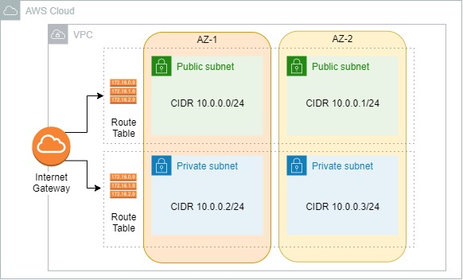
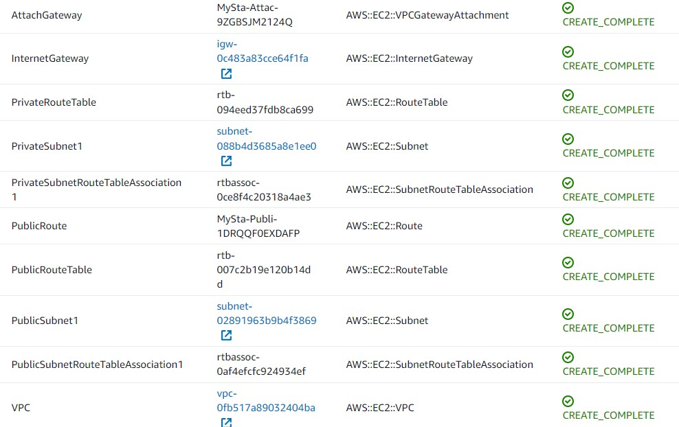
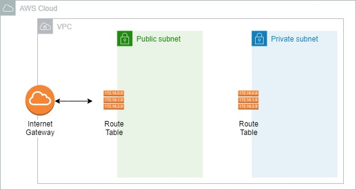
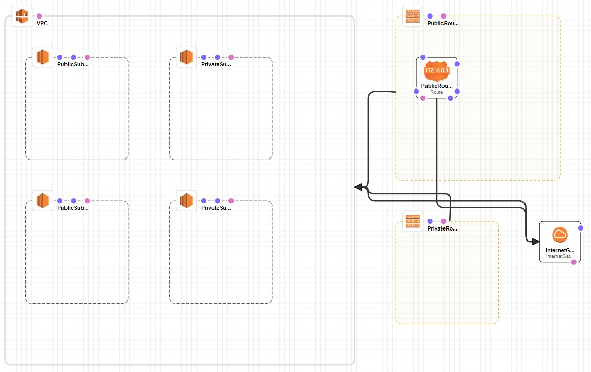

 

  
  <h3 align="center">100 days in Cloud</h3>

    Creating VPC with CloudFormation
     
    Lab 26
     
  

  
<h2 style="display: inline-block">Lab Details</h2>

  <ol>
    <li><a href="#services-covered">Services covered</a>
    <li><a href="#lab-description">Lab description</a></li>
    </li>
    <li><a href="#lab-date">Lab date</a></li>
    <li><a href="#prerequisites">Prerequisites</a></li>    
    <li><a href="#lab-steps">Lab steps</a></li>
    <li><a href="#lab-files">Lab files</a></li>
    <li><a href="#acknowledgements">Acknowledgements</a></li>
  </ol>

---

## Services Covered
*  **CloudFormation**
*  **VPC**

---

## Lab description
In this lab I will deploy resource using CloudFormation template. The first stack will include a VPC with two subnets - one private, one public - and route tables associated with them and with Internet Gateway. Then I will update the stack by replacing the template with another one with additional two private and public subnets in another Availability Zone. 

---

### Learning Objectives
* Create CloudFormation template
* Deploy CloudFormation template that create a VPC
* Update CloudFormation stack

### Lab date
05-12-2021

---

### Prerequisites
* AWS account

---

### Lab steps
1. Navigate to CloudFormation and create stack. Choose *Template is ready* and upload [VPC_template.json](VPC_template.json) to create a VPC with one private and one public subnets and route tables accordingly.

   

   The stack resources look like that:

   

2. Update the stack by using [VPC_template_update.json](VPC_template_update.json). Choose the stack created in previous step and click on **Update**, then choose **Replace current template**. This template will updated the stack to the following state:

   

   

### Lab files

* [VPC_template.json](VPC_template.json)
* [VPC_template_update.json](VPC_template_update.json)
---

### Acknowledgements
* [whizlabs](https://play.whizlabs.com/site/task_details?lab_type=1&task_id=22&quest_id=35)

