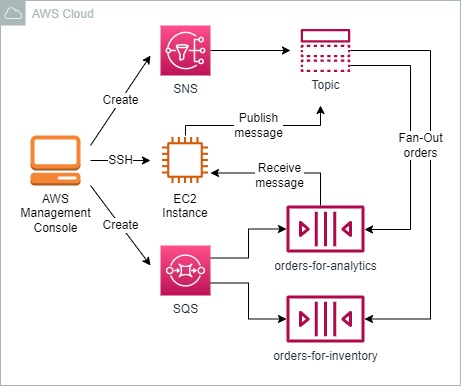
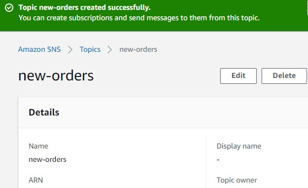
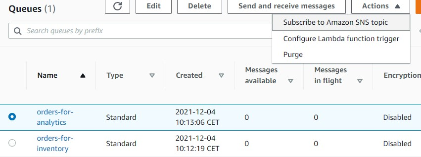
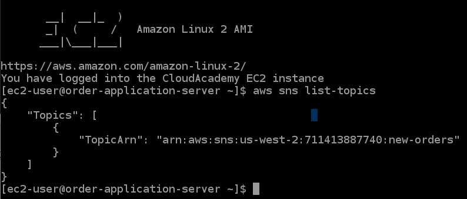
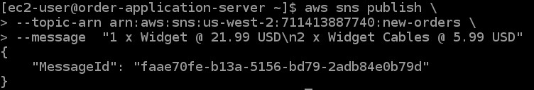
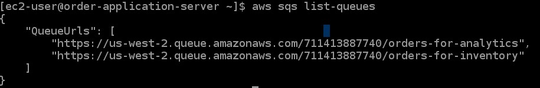
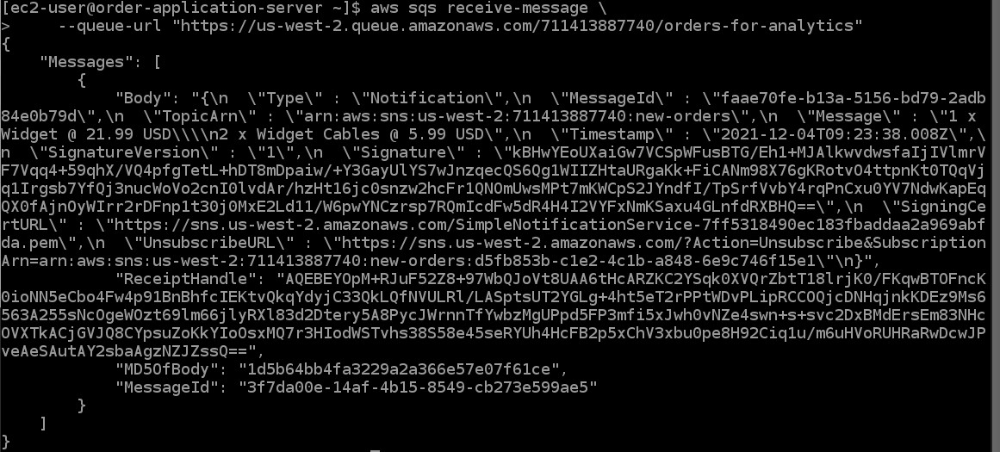

<br />

<p align="center">
  <a href="img/">
    
  </a>
  <h3 align="center">100 days in Cloud</h3>
<p align="center">
    Fan-Out Orders using Amazon SNS and SQS
    <br />
    Lab 27
    <br/>
  </p>


</p>

<details open="open">
  <summary><h2 style="display: inline-block">Lab Details</h2></summary>
  <ol>
    <li><a href="#services-covered">Services covered</a>
    <li><a href="#lab-description">Lab description</a></li>
    </li>
    <li><a href="#lab-date">Lab date</a></li>
    <li><a href="#prerequisites">Prerequisites</a></li>    
    <li><a href="#lab-steps">Lab steps</a></li>
    <li><a href="#lab-files">Lab files</a></li>
    <li><a href="#acknowledgements">Acknowledgements</a></li>
  </ol>
</details>

---

## Services Covered
*  **SQS**
*  **SNS**

---

## Lab description

*In this lab, you will implement the backbone of a fan-out order messaging scenario using Amazon Simple Notification Service (SNS) and Amazon Simple Queue Service (SQS). Messages are published to an Amazon SNS topic and then pushed to Amazon SQS subscriber queues. This eliminates the need for periodic polling and allows for messages to be processed in parallel asynchronously by the subscribers.*

---

### Learning Objectives
* Create a Fan-Out pattern for messages
* Use SNS ans SQS for processing messages
* Use AWS CLI on EC2 to publish and receive messages

### Lab date
04-12-2021

---

### Prerequisites
* AWS account

---

### Lab steps
1. In the **SNS dashboard** create a topic, choose the **standard** one. In the **Access policy** section, under **Define who can publish messages to the topic**, select **Everyone**. For  **Define who can subscribe to this topic**, select **Everyone**. *This Amazon SNS topic is where orders are published to. In a non-lab environment it would most likely be a web application or other application that accepts orders that will publish messages to this topic.*

   

2. Navigate to SQS Dashboard and create two standard queues. First one might be named *order-for-inventory* with default configuration. Second one called *orders-for-analytics* will be similar with default settings. 

3. Subscribe the *orders-for-analytics* queue to previously created topic

   

   Repeat the topic subscription process for your **orders-for-inventory** Amazon SQS queue. 

4. Navigate to EC2 and launch an t3.micro instance with Security Group allowing SSH access to it. The instance will also need an IAM role that has permissions to interact with Amazon SNS topic and SQS queues. Then connect to it using EC2 Instance Connect or SSH client. In the terminal window enter following command:

   ```
   aws sns list-topics
   ```

   

5. To publish a message, enter the following, replacing `<YOUR-TOPIC-ARN>` with the ARN you listed in a previous instruction:

   ```
   aws sns publish \
   --topic-arn <YOUR-TOPIC-ARN> \
   --message  "1 x Widget @ 21.99 USD\n2 x Widget Cables @ 5.99 USD"
   ```

   

6. To list Amazon Simple Queue Service queues, enter the following command:

   ```
   aws sqs list-queues
   ```

   

7. To retrieve a message from the **orders-for-analytics** queue, enter the following command, replacing `<YOUR-ANALYTICS-QUEUE-URL>` 

   ```
   aws sqs receive-message \
       --queue-url <YOUR-ANALYTICS-QUEUE-URL>
   ```

   

8. Repeat the previous instruction, using the **orders-for-inventory** queue.

9. To delete a message, enter the following command for the **orders-for-inventory** queue or the second one.

   ```
   aws sqs delete-message \
       --queue-url <YOUR-QUEUE-URL> \
       --receipt-handle <YOUR-RECEIPT-HANDLE>
   ```

### Lab files

* 
---

### Acknowledgements
* [cloud academy](https://cloudacademy.com/lab/manage-message-queue-amazon-sqs/?context_id=2977&context_resource=lp)

