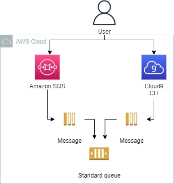
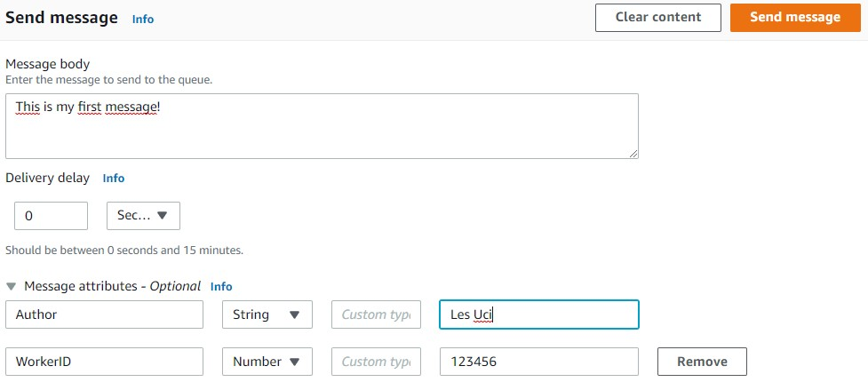
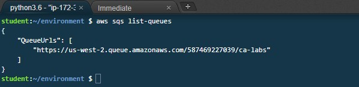
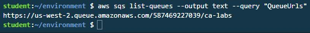
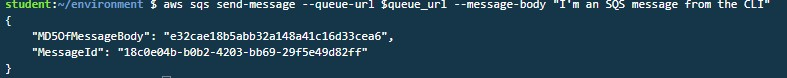
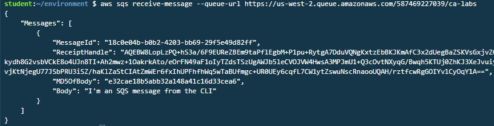

<br />

<p align="center">
  <a href="img/">
    
  </a>
  <h3 align="center">100 days in Cloud</h3>
<p align="center">
    Manage Message Queues Using Amazon SQS
    <br />
    Lab 28
    <br/>
  </p>


</p>

<details open="open">
  <summary><h2 style="display: inline-block">Lab Details</h2></summary>
  <ol>
    <li><a href="#services-covered">Services covered</a>
    <li><a href="#lab-description">Lab description</a></li>
    </li>
    <li><a href="#lab-date">Lab date</a></li>
    <li><a href="#prerequisites">Prerequisites</a></li>    
    <li><a href="#lab-steps">Lab steps</a></li>
    <li><a href="#lab-files">Lab files</a></li>
    <li><a href="#acknowledgements">Acknowledgements</a></li>
  </ol>
</details>

---

## Services Covered
*  **SQS**

---

## Lab description


---

### Learning Objectives
* Creating queue and sending messages to it
* Using Cloud9 and CLI to interact with SQS

### Lab date
03-12-2021

---

### Prerequisites
* AWS account

---

### Lab steps
1. Navigate to SQS Dashboard and create a standard queue, keep all the defaults.

2. Go to *Send and receive messages* and send some message, Add some attributes. 

   

3. Click **Poll for Messages**. You message will be on the received list. Then delete it. 

4. Navigate to Cloud9. Click on *Open IDE*. In your Cloud9 **Terminal**, enter the `sqs list-queues` command to display the URL of your SQS queue

   ```
   aws sqs list-queues
   ```

   

5. Issue the following command to display only the QueueUrls field in text format:

   ```
   aws sqs list-queues --output text --query "QueueUrls"
   ```

   

6. Store the queue URL in a shell variable and send a message to the queue using the `send-message` command:

   ```
   # Store the Queue URL in a shell variable named queue_url 
   # The command is surrounded with $(...) to store the result of the command
   queue_url=$(aws sqs list-queues --output text --query "QueueUrls")
   
   # Send a message to the queue (use $ to substitute the value stored in the variable)
   aws sqs send-message --queue-url $queue_url --message-body "I'm an SQS message from the CLI"
   ```

   

7. In your Cloud9 terminal, enter the following command:

   ```
   aws sqs receive-message --queue-url <QUEUE URL>
   ```

   

8. In terminal enter the following command:

   ```
   aws sqs delete-message --queue-url $queue_url --receipt-handle <YOUR_RECEIPT_HANDLE>
   ```

9. Delete the queue in SQS.

### Lab files

* 
---

### Acknowledgements
* [cloud academy](https://cloudacademy.com/lab/manage-message-queue-amazon-sqs/?context_id=2977&context_resource=lp)

