<br />

<p align="center">
  <a href="img/">
    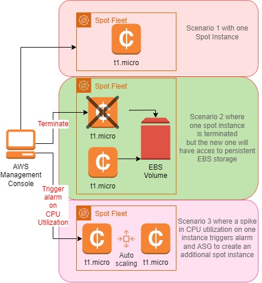
  </a>
  <h3 align="center">100 days in Cloud</h3>
<p align="center">
    Using EC2 Spot Instances
    <br />
    Lab 29
    <br/>
  </p>


</p>

<details open="open">
  <summary><h2 style="display: inline-block">Lab Details</h2></summary>
  <ol>
    <li><a href="#services-covered">Services covered</a>
    <li><a href="#lab-description">Lab description</a></li>
    </li>
    <li><a href="#lab-date">Lab date</a></li>
    <li><a href="#prerequisites">Prerequisites</a></li>    
    <li><a href="#lab-steps">Lab steps</a></li>
    <li><a href="#lab-files">Lab files</a></li>
    <li><a href="#acknowledgements">Acknowledgements</a></li>
  </ol>
</details>

---

## Services Covered
*  **EC2**

---

## Lab description

In this lab step, I will maintain spot requests behavior in case of termination or spike in CPU utilization.

*In this lab step, you will see that spot fleets support Auto Scaling groups in all their glory. Specifically, you will simulate a high CPU load on an instance and create a CloudWatch alarm to trigger a scale up event for your Auto Scaling group.*

*In this lab step, you saw how to create a spot fleet that gets auto-scaled based on a CloudWatch metric. The auto scaling works the same as when using on-demand instances but you also have the option of using metrics specific to spot fleets. By using a spot request with a target capacity of vCPUs, you have more ways of fulfilling spot requests compared to when instances specify the capacity. By combining spot instances with autoscaling groups you can cost effectively scale your services.* 

---

### Learning Objectives
* Dealing with Spot Instance Termination by creating EBS persistence storage
* Creating Auto Scaling for Spot Instances and triggering an alarm on high CPU utilization

### Lab date
02-12-2021

---

### Prerequisites
* AWS account

---

### Lab steps
1. Navigate to EC2 Dashboard. Under Instances choose **Spot Request**. Click **Request Spot Instances** and then **Search for AMI**, enter **ami-016028fa52af68cc7** 

   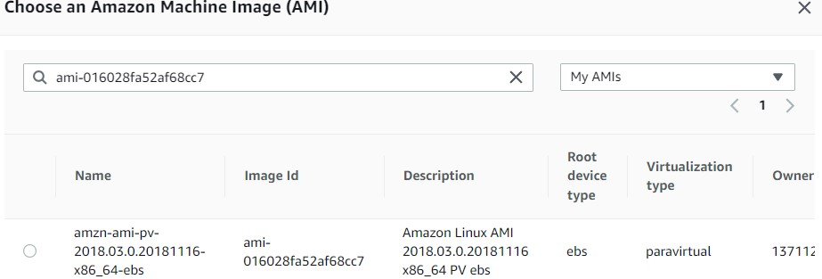

   This is a paravirtual AMI that will allow you to select a t1.micro instance in upcoming instructions.

2. Under Additional request details uncheck Apply defaults and set:

   IAM fleet role: Select aws-ec2-spot-fleet-role
   Maximum price: Select Set your max price, then enter $0.02
   Request valid from: Keep default of current date and time 
   Request valid until: Set to one day from the current date

   Total target capacity is 1:

   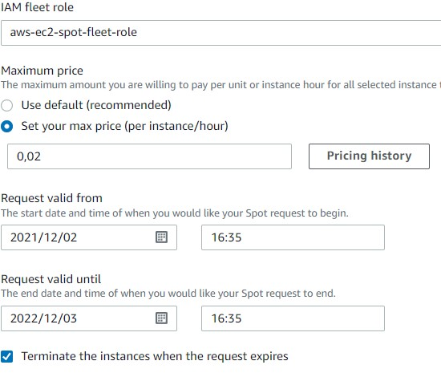

3. Under **Instance type requirements**, select **Manually select instance types**. Click **Add instance types**:

   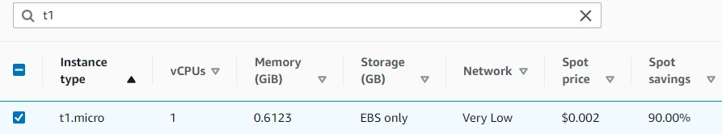

   Back in the **Fleet** **request** table, select **all instance types** except for **t1.micro**, then click **Delete**:

   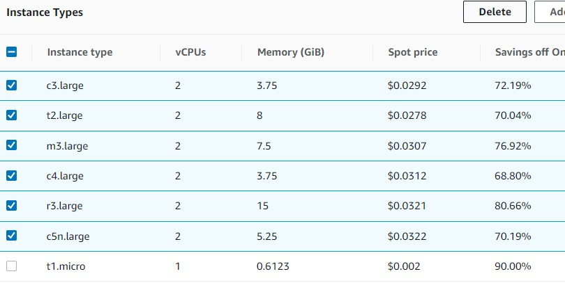

   Under **Allocation strategy**, select **Lowest price**.

4. Scroll back up to the **Launch parameters** section and expand the **Additional launch parameters** fields. Enter the following code into the **User data** field:

   ```
   #!/bin/bash
   yum install -y httpd24 php56
   service httpd start
   ```

5. The summary should look something like this:

   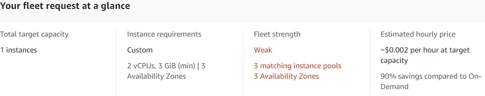

   Click on **Launch** button.

6. Since the current price is lower then the 0.02 $/h I got my instance running

   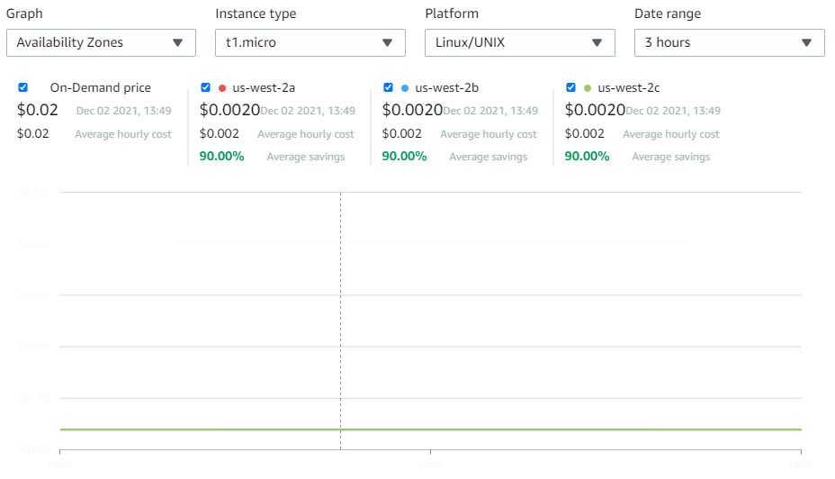

   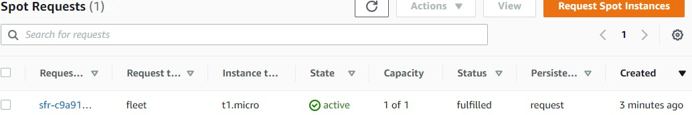

7. Navigating to the Public DNS of the instance would return the Apache splash website

   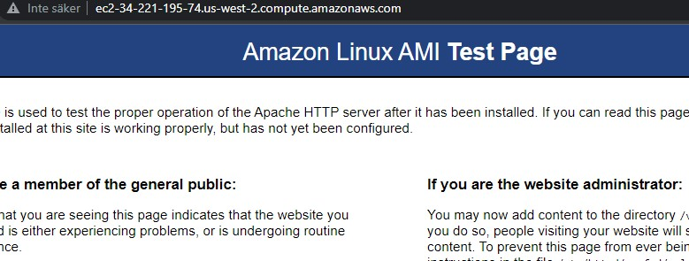

8. Return to your AWS Console tab and with the spot instance still selected, click **Instance state**, then **Terminate instance.** Confirm by clicking **Terminate** in the confirmation dialog.

9. Return to the Spot Requests Console and click on Request Spot Instances to create a new request.Enter *ami-016028fa52af68cc7* into the search field, ensure **My AMIs** is selected for the AMI group, and then hit Enter.

10. Under Additional request details uncheck Apply defaults and set:

    IAM fleet role: Select aws-ec2-spot-fleet-role
    Maximum price: Select Use default
    Request valid from: Keep default of current date and time 
    Request valid until: Set to one day from the current date

    Total target capacity as 1

    Select **Maintain target capacity** and keep the default value of **Terminate** for **Interruption behavior**

11. Under **Network** choose one AZ because you will use an EBS volume for persistence. Follow the instructions form step 3.

12. Similarly to step 4 enter the user data:

    ```
    #!/bin/bash
    
    # Install web server dependencies
    yum install -y httpd24 php56
    
    # Attach existing EBS volume
    export AWS_DEFAULT_REGION=us-west-2
    volume=`aws ec2 describe-volumes --out text | grep available | cut -f 9`
    aws ec2 attach-volume --volume-id $volume --instance-id $(curl -s http://169.254.169.254/latest/meta-data/instance-id) --device /dev/xvdb
    sleep 10 # there is some delay until the device is available
    
    # Configure persistent storage location for website data
    mkdir /persistent
    mount /dev/xvdb /persistent
    echo 0 > /tmp/instance-uptime.dat
    chmod o+w /tmp/instance-uptime.dat
    echo "<?php
    \$total_uptime = file_get_contents('/persistent/data/total-uptime.dat', FILE_USE_INCLUDE_PATH);
    \$instance_uptime = file_get_contents('/tmp/instance-uptime.dat', FILE_USE_INCLUDE_PATH);
    echo \"Total uptime: \$total_uptime seconds<br>Instance uptime: \$instance_uptime seconds\"
    ?>" > /var/www/html/index.php
    sudo chown apache:apache /var/www/html/index.php
    echo "DirectoryIndex index.php" > /var/www/html/.htaccess
    
    # Start web server and script to increment website data
    service httpd start
    nohup /persistent/scripts/increment.sh >/dev/null 2>&1 &
    
    ```

    *This script performs two main tasks: attaching the EBS volume where data is being persisted across spot instances and setting up a web server that uses the persisted data. The persisted data in this example keeps track of the total uptime of the website, or the number of seconds the website has been available since the spot request is created.*

13. Navigating to instances Public DNS address will show two uptime values: the total uptime, and the instance uptime. Since the website has only been served on one instance the two values are the same.

    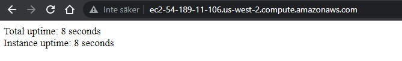

14. In the EC2 Instances Console, select the running instance and terminate it by clicking **Instance state** > **Terminate instance** and click **Terminate** in the dialog confirmation to see how the uptime is persisted using the EBS volume.

    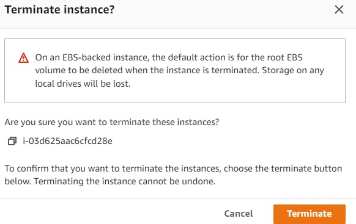

15. Return to the spot request **History** and refresh every 30 seconds until you observe a new bid **submitted** and finally, a new instance **launched**. Another instance will be launched although it may take a minute for the spot request to detect that the request is no longer fulfilled.

    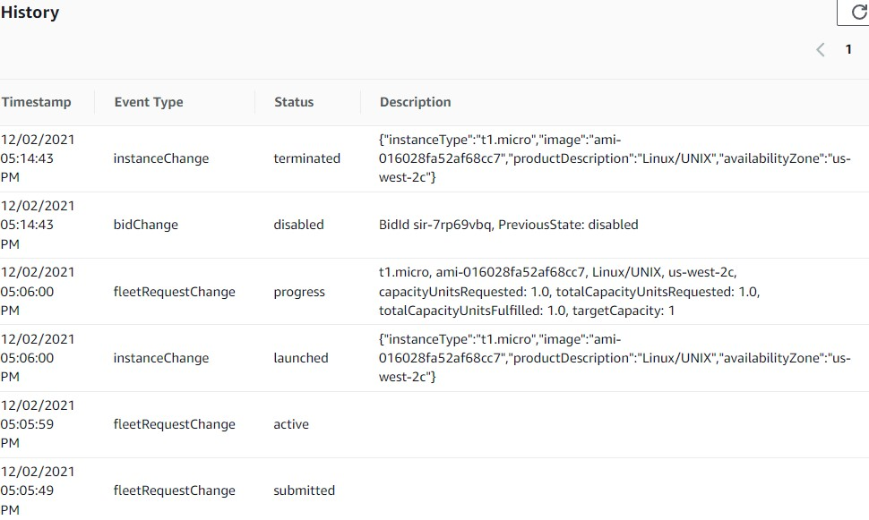

16. Copy the **Public DNS** of the new spot instance once the instance is running and navigate to the address in a new browser tab:

    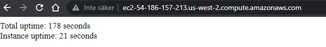

    This demonstrates how the uptime data is persisted to the EBS volume and survives spot instance interruptions.

17. From the **Spot Requests** Console, select your request and click **Actions** > **Cancel Spot request** and ensure **Terminate instances** is selected before clicking **Confirm**.

18. In the Spot Requests Console, click **Request Spot Instances** to open the Spot instance launch wizard and set the following values:

    - Launch parameters

      - **AMI**: Search for, and select, **ami-016028fa52af68cc7**

    - Additional request details

      - **Apply defaults**: Unchecked
      - **IAM fleet role**: **aws-ec2-spot-fleet-role**
      - **Maximum price**: Select **Use default**
      - **Request valid from**: Keep default of current date and time
      - **Request valid until**: Set to **one day** from the current date

    - Target capacity

      - **Total target capacity**: 1
      - **Maintain target capacity**: Checked

    - Network

      - **Network**: Select **Spot Lab VPC**
      - **Availability Zone:** Select each of **us-west-2a**, **us-west-2b**, **us-west-2c**

    - Instance type requirements

      - **Manually select instance types**: Checked
      - **Fleet request**: Add **t1.micro** instance type then select **all** instance types except for **t1.micro** and delete them

    - **Allocation strategy**: Select **Diversified across instance pools in my fleet** and **All** from the resulting dropdown menu. This Diversified strategy will attempt to balance instances across availability zones for high availability.

    - Additional launch parameters (under Launch parameters)

      - **Monitoring**: Check **Enable CloudWatch detailed monitoring** (this allows 1-minute resolution of EC2 instance metrics, compared to the default 5-minute maximum resolution)

      - **Tenancy**: Keep as **Default**

      - **Security groups**: Select **cloudacademylabs-SpotLabSecurityGroup-xxxx**

      - **IAM instance profile**: Select **cloudacademylabs-Ec2InstanceProfile-xxxx**

      - **User data**: Paste the following script that will make heavy use of the instance CPU:

        ```
        #!/bin/bash
        yum -y install stress
        nohup stress --cpu 2 >/dev/null 2>&1 &
        ```

        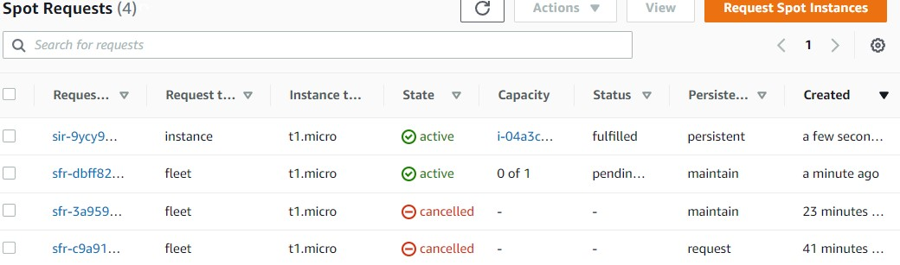

19. Check your spot request and click on the **Instances** tab to see the launched instance. Click on the **Instance Id** to open a new browser tab showing the instance information. Select the instance, click the **Monitoring** tab, the look at the **CPU Utilization (percent)** graph. After a few minutes and a few clicks of the refresh button, you will see the CPU is being utilized at around 100%. This is to simulate an overburdened instance. To alleviate the simulated bottleneck, you will create an Auto Scaling group that can create more instances when the group is using a high percentage of CPU.

    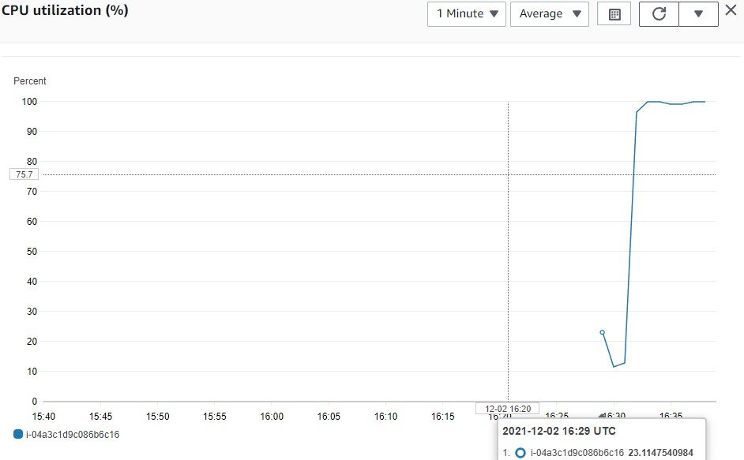

20. Return to the **Spot Requests** Console click the **Auto Scaling** tab under your current active request.

    Scale capacity between

    - **Minimum capacity**: Enter *1*
    - **Maximum capacity**: Enter *2*

    * *IAM role for fleet auto scaling**: Select **aws-ec2-spot-fleet-autoscale-role**

    * Keep the default values to configure the group to target **50% Average CPU utilization**

21. In the Spot Request browser tab, select the **History** tab and after a minute, click the refresh button and you should see an event with a **Status** of **modify_in_progress:**

    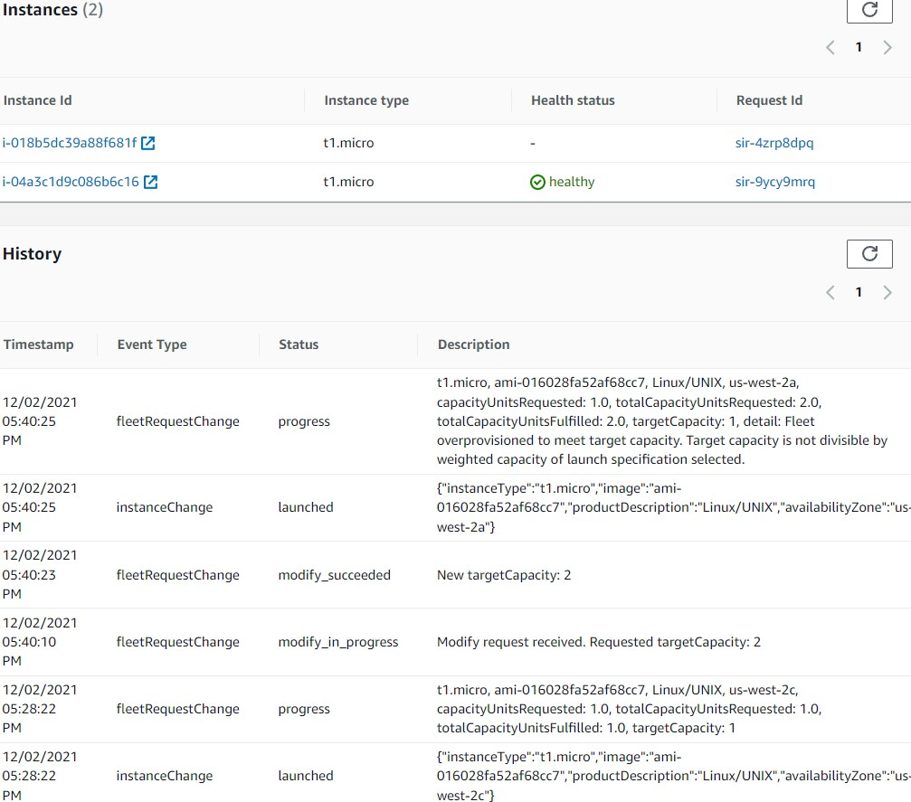

    This is the effect of the Alarm being triggered because the instance CPU is higher than 50%. A short while later, a new instance is **launched**.

### Lab files
* 
---

### Acknowledgements
* [cloud academy](https://cloudacademy.com/lab/using-ec2-spot-instances/?context_id=2654&context_resource=lp)

