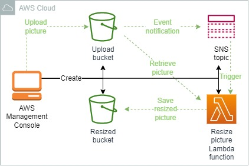
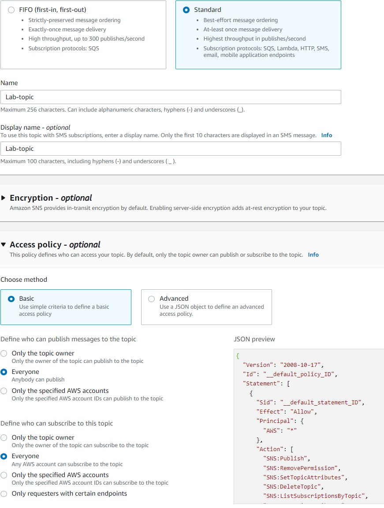
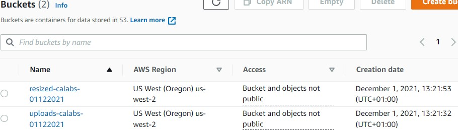
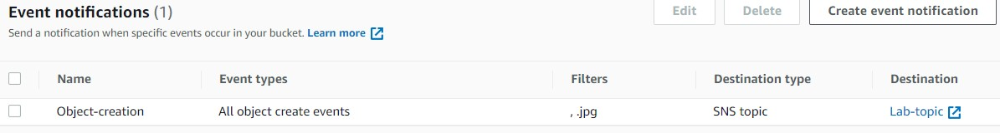
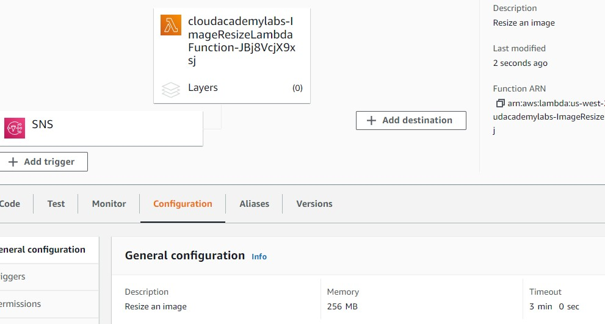
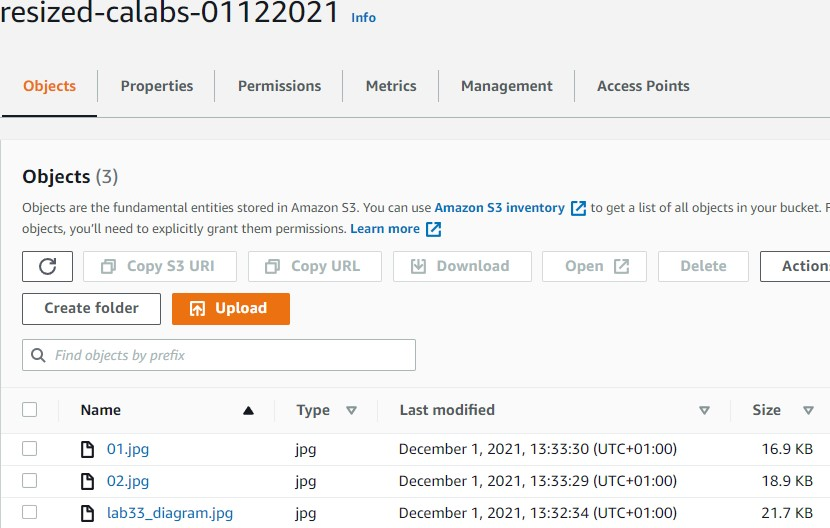

<br />

<p align="center">
  <a href="img/">
    
  </a>
  <h3 align="center">100 days in Cloud</h3>
<p align="center">
    SNS Image Resizing Challenge
    <br />
    Lab 30
    <br/>
  </p>


</p>

<details open="open">
  <summary><h2 style="display: inline-block">Lab Details</h2></summary>
  <ol>
    <li><a href="#services-covered">Services covered</a>
    <li><a href="#lab-description">Lab description</a></li>
    </li>
    <li><a href="#lab-date">Lab date</a></li>
    <li><a href="#prerequisites">Prerequisites</a></li>    
    <li><a href="#lab-steps">Lab steps</a></li>
    <li><a href="#lab-files">Lab files</a></li>
    <li><a href="#acknowledgements">Acknowledgements</a></li>
  </ol>
</details>

---

## Services Covered
*  **SNS**
*  **S3**
*  **Lambda**

---

## Lab description

*You have been tasked with creating a prototype replacement infrastructure using Amazon Web Services (AWS). Amazon SNS has been chosen because of its flexibility. Your company would like the option of extending the system in the future and have the ability to notify customers when an image has been processed.*

---

### Learning Objectives
* Create a event notification on object creation in S3 bucket
* Trigger Lambda function with SNS 

### Lab date
01-12-2021

---

### Prerequisites
* AWS account

---

### Lab steps
1. **Create an Amazon SNS Topic**. Using the Amazon SNS console, create a topic that satisfies the following:

   Type is Standard
   Access Policy is Basic
   Everyone can publish and subscribe

   

2. **Create two Amazon S3 buckets**. 

   

3. **Notify Amazon SNS when images are uploaded**. Using the Amazon S3 console, create an event notification on your uploads-calabs bucket that satisfies the following:

   Notification is triggered by all object creation events and not triggered by any other type of event
   Notification is triggered only by uploaded objects whose name ends with .jpg
   Uses your Amazon SNS topic as the Destination

   

4. **Create a Lambda function**. Use Python as runtime and following code:

   ```python
   import boto3
   from PIL import Image
   from io import BytesIO
   import json
   import urllib
   
   upload_bucket_name = "uploads-calabs-xxxxxx"
   resize_bucket_name = "resized-calabs-xxxxxx"
   
   size = 500, 500
   
   s3 = boto3.resource('s3')
   
   def handler(event, context):
       for record in event['Records']:
           print(f'--- processing event record: {record} ---')
           message = json.loads(record['Sns']['Message'])
   
           for s3_record in message['Records']:
               print(f'--- processing s3 record: {s3_record} ---')
               key = urllib.parse.unquote_plus(s3_record['s3']['object']['key'])
               
               print(f'--- {key} image was uploaded to {upload_bucket_name} ---')
               
               upload_file = BytesIO()
               s3.Bucket(upload_bucket_name).download_fileobj(key, upload_file)
                   
               print(f'--- downloaded {key} image from {upload_bucket_name} bucket to in memory file ---')
                   
               image = Image.open(upload_file)
               image = image.resize(size)
               resize_file = BytesIO()
               image.save(resize_file, format='JPEG')
               
               print(f'--- resized {key} image to {size} ---')
               
               s3.Object(resize_bucket_name, key).put(Body=resize_file.getvalue())
               
               print(f'--- uploaded {key} file to {resize_bucket_name} bucket ---')
   ```

   Change the bucket names and set the timeout to 3 minutes and 256 MB memory limit.

5. **Subscribe the image resizing AWS Lambda function to your Amazon SNS topic**. Using the Amazon SNS console, create a subscription for your topic that satisfies the following:

   Uses the AWS Lambda Protocol
   Subscription Endpoint set to the AWS Lambda function that you created in previous step (manually copy it from the Lambda console if it doesn't show up)

   

6. **Upload an image file** to the *uploads* bucket. I uploaded three files that were > 1MB and in result the resized files in *resized* bucket were muck smaller:

   

### Lab files
* [image-resize-lambda.py](image-resize-lambda.py)
---

### Acknowledgements
* [cloud academy](https://cloudacademy.com/lab-challenge/sns-image-resize-challenge/)

