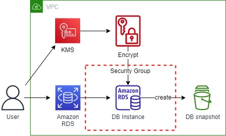
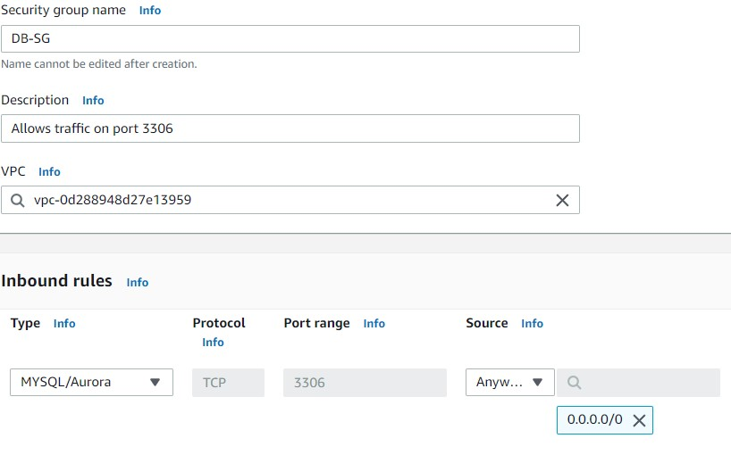
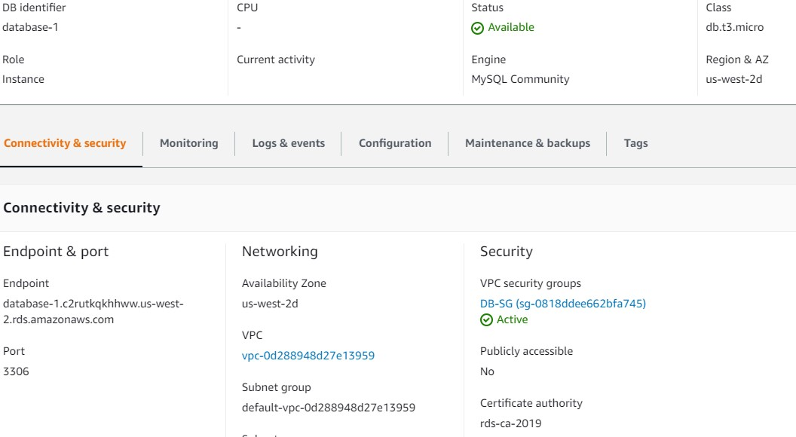
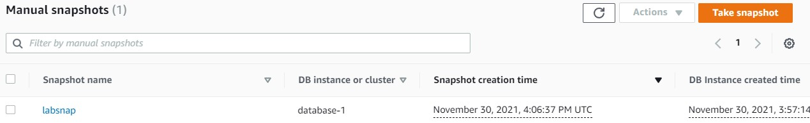

 

  
  <h3 align="center">100 days in Cloud</h3>

    Amazon RDS Database Instance Challenge
     
    Lab 31
     
  

  
<h2 style="display: inline-block">Lab Details</h2>

  <ol>
    <li><a href="#services-covered">Services covered</a>
    <li><a href="#lab-description">Lab description</a></li>
    </li>
    <li><a href="#lab-date">Lab date</a></li>
    <li><a href="#prerequisites">Prerequisites</a></li>    
    <li><a href="#lab-steps">Lab steps</a></li>
    <li><a href="#lab-files">Lab files</a></li>
    <li><a href="#acknowledgements">Acknowledgements</a></li>
  </ol>

---

## Services Covered
*  **RDS**
*  **VPC**
*  **KMS**

---

## Lab description

*Your company is planning to deploy a new web application into an AWS environment. They have tasked you with providing a MySQL 8.0 Amazon RDS database instance.*

---

### Learning Objectives
* Create an AWS KMS Customer Master Key
* Create a MySQL 8.0 Amazon RDS Instance
* Create an Amazon VPC Security Group that Allows MySQL traffic
* Take a Snapshot of the Amazon RDS Instance

### Lab date
30-11-2021

---

### Prerequisites
* AWS account

---

### Lab steps
1. **Create an AWS KMS Customer Master Key**. In the KMS dashboard create a symmetric KMS customer master key. Assign yourself as Key administrator.

2. **Create an Amazon VPC Security Group that Allows MySQL traffic**. In the VPC Dashboard go to **Security Groups** and create a SG that satisfies the following conditions:

   Uses the TCP protocol
   Allows inbound traffic on port 3306
   Allows traffic from any IP address

   

3. **Create a MySQL 8.0 Amazon RDS Instance**. Create a MySQL 8.0 Amazon RDS instance that satisfies the following conditions:

   - Use **Dev/Test** as the template
   - Encryption is enabled and uses your KMS customer master key
   - Uses your security group with port 3306 open publicly
   - Uses the **db.t3.micro** database class
   - Uses no more than 20 GB of storage

   *Note*: Leave all other options at their defaults.

   

1. **Take a Snapshot of the Amazon RDS Instance**. 

   

### Lab files
* 
---

### Acknowledgements
* [cloud academy](https://cloudacademy.com/lab-challenge/create-amazon-rds-database-challenge/)

