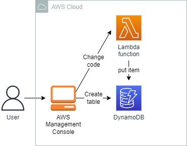
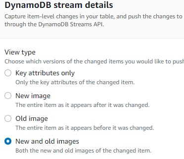
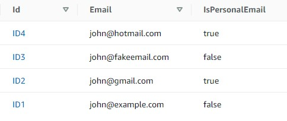

<br />

<p align="center">
  <a href="img/">
    
  </a>
  <h3 align="center">100 days in Cloud</h3>
<p align="center">
    Configure Amazon DynamoDB triggers with AWS Lambda
    <br />
    Lab 32
    <br/>
  </p>


</p>

<details open="open">
  <summary><h2 style="display: inline-block">Lab Details</h2></summary>
  <ol>
    <li><a href="#services-covered">Services covered</a>
    <li><a href="#lab-description">Lab description</a></li>
    </li>
    <li><a href="#lab-date">Lab date</a></li>
    <li><a href="#prerequisites">Prerequisites</a></li>    
    <li><a href="#lab-steps">Lab steps</a></li>
    <li><a href="#lab-files">Lab files</a></li>
    <li><a href="#acknowledgements">Acknowledgements</a></li>
  </ol>
</details>

---

## Services Covered
*  **DynamoDB**
*  **Lambda**

---

## Lab description

*In this lab you will create a new Lambda Function and connect it to the DynamoDB Stream. The table will contain basic data about users, defining only the existing fields. You will implement a simple trigger to keep the **IsPersonalEmail** and **Email** fields synchronized: every time a new record is created, the Lambda Function will add the computed field (*IsPersonalEmail*). Additionally, each time a record is updated, the two fields will keep in sync.*

---

### Learning Objectives
* Enabling streams on DynamoDB table
* Create a Lambda function and connect it to the DynamoDB Stream

### Lab date
29-11-2021

---

### Prerequisites
* AWS account

---

### Lab steps
1. In the DynamoDB dashboard create a table. Then in the **Exports and streams** tab enable **DynamoDB streams**. Select the **New and old images** option to view both modified and pre-modified items

   

2. Navigate to the Lambda dashboard. Create a new function with Python 3.8 as runtime. The code will check newly created items in the table and if the provided email has *gmail.com, outlook.com or hotmail.com* it will mark the *IsPersonalEmail* field in the table as true. Implement the following code:

   ```
   import json
   import boto3
   DDB = boto3.resource("dynamodb").Table("CloudAcademyLabs")
   def lambda_handler(event, context):
       records = event["Records"]
       print("Received %s records" % len(records))
       for record in records:
           print(record)
           # if new record or update
           if record["eventName"].upper() in {"INSERT", "MODIFY"}:
               # primary key
               record_id = record["dynamodb"]["Keys"]["Id"]["S"]
               # init local vars
               old_email = old_is_personal = new_email = new_is_personal = None
               # new and old images
               old_image = record["dynamodb"].get("OldImage") or {}
               new_image = record["dynamodb"].get("NewImage") or {}
               # old values (optional, only on update)
               if "Email" in old_image:
                   old_email = old_image["Email"]["S"]
               if "IsPersonalEmail" in old_image:
                   old_is_personal = old_image["IsPersonalEmail"]["BOOL"]
               # new values
               if "Email" in new_image:
                   new_email = new_image["Email"]["S"]
                   new_is_personal = is_personal_email(new_email)
               # avoid recursion on update and write only if strictly needed
               if old_email != new_email and old_is_personal != new_is_personal:
                   update_record(record_id, new_is_personal)
       print("Processed %s records" % len(records))
   def update_record(record_id, is_personal):
       print("Updating %s: IsPersonalEmail=%s" % (record_id, is_personal))
       DDB.update_item(
           Key={"Id": record_id},
           UpdateExpression="SET IsPersonalEmail = :val",
           ExpressionAttributeValues={":val": is_personal or False},
       )
   def is_personal_email(email):
       domains = {"gmail.com", "outlook.com", "hotmail.com"}
       return any(email.endswith(domain) for domain in domains)
   ```

   Change the function's timeout, click **Edit**, change the value of the **Timeout** to 1 minute.

3. In the **Function overview** section, click **Add trigger**. Select DynamoDB and the table created earlier. **Starting position**: Select **Trim horizon** from the dropdown menu.

4. Back in the DynamoDB, create an item in JSON format. 

   ```
   {
    "Id": {
     "S": "ID1"
    },
    "Email": {
     "S": "john@example.com"
    }
   }
   ```

   Put more items to see if the code works

   

   


### Lab files
* [lambda_function.py](lambda_function.py)
---

### Acknowledgements
* [cloud academy](https://cloudacademy.com/lab/aws-lambda-dynamodb-triggers/)

