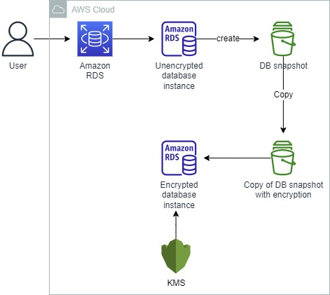
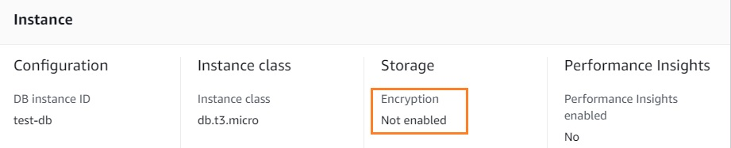
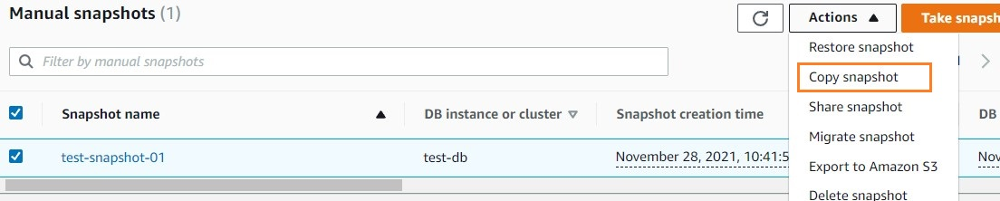
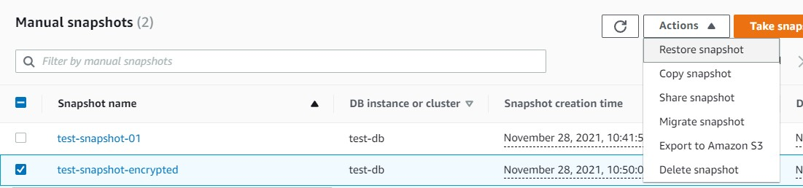
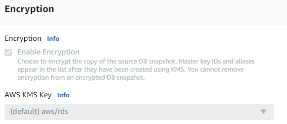
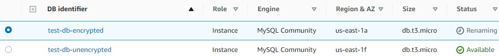
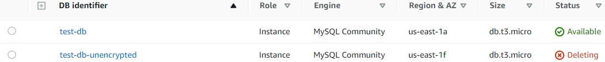

 

  
  <h3 align="center">100 days in Cloud</h3>

    Encrypting an unencrypted RDS database
     
    Lab 33
     
  

  
<h2 style="display: inline-block">Lab Details</h2>

  <ol>
    <li><a href="#services-covered">Services covered</a>
    <li><a href="#lab-description">Lab description</a></li>
    </li>
    <li><a href="#lab-date">Lab date</a></li>
    <li><a href="#prerequisites">Prerequisites</a></li>    
    <li><a href="#lab-steps">Lab steps</a></li>
    <li><a href="#lab-files">Lab files</a></li>
    <li><a href="#acknowledgements">Acknowledgements</a></li>
  </ol>

---

## Services Covered
*  **RDS**

---

## Lab description

In this lab a database created without the encryption will be encrypted. 

---

### Learning Objectives
* Create a database without encryption
* Create a encrypted snapshot of DB
* Restore a DB with encryption

### Lab date
28-11-2021

---

### Prerequisites
* AWS account

---

### Lab steps
1. In RDS dashboard create a MySQL instance of a database, but leave the **Enablge encryption** field unchecked. 

   

   After creating the database there's no way to enable encryption.

2. Create a snapshot from existing database instance. It is not possible to encrypt the snapshot in this stage. We need to encrypt the snapshot while taking a copy of it. Under the Manual snapshots, select the created snapshot and click on Actions. Click Copy snapshot from the options. Under settings, provide the following details. New DB Snapshot Identifier: Enter test-snapshot-encrypted. Under Encryption, check Enable Encryption. Leave the master key as default as it is a demo. (IMPORTANT) Click on the Copy snapshot button.

   

3. Restore DB Instance from the encrypted snapshot. Click on the encrypted snapshot and click on Actions. Click on Restore snapshot from the options.Under DB instance class, select Burstable classes (including t classes) and select db.t3.micro. Under **Encryption**, you can see the **Enable Encryption** is enabled and cannot make changes since the snapshot is encrypted. Click on *Restore DB instance*.

   

   

4. Change the name of the original DB Instance. Change the name of the Restored DB Instance to the original DB Instance name. 

   

5. Delete the unencrypted RDS DB Instance and snapshot. 

   

6. 

### Lab files
* 
---

### Acknowledgements
* [whizlabs](https://play.whizlabs.com/site/task_details?lab_type=1&task_id=218&quest_id=35)

