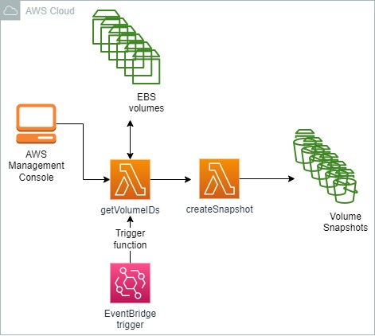
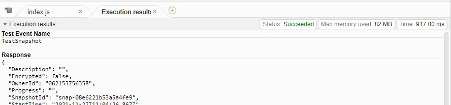
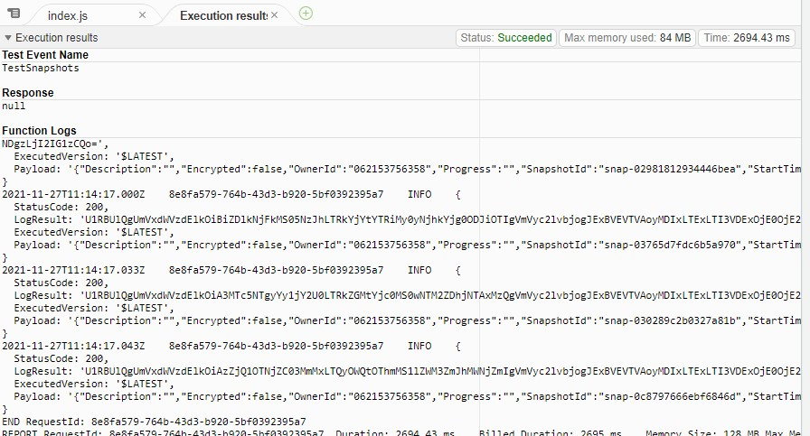
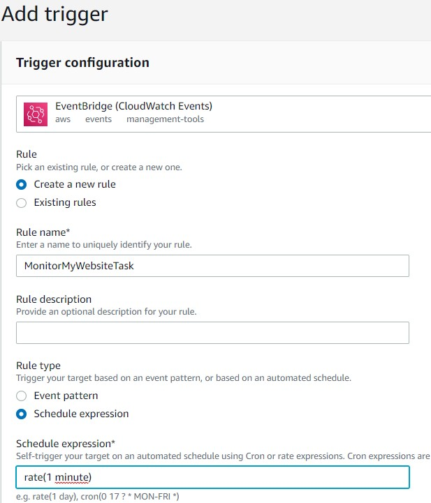
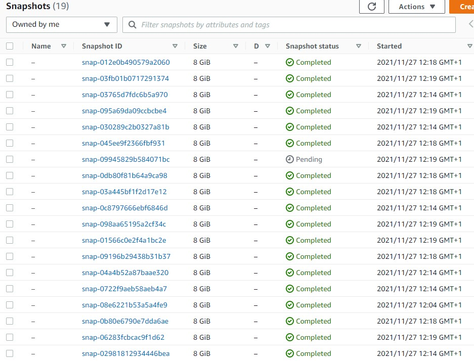

<br />

<p align="center">
  <a href="img/">
    
  </a>
  <h3 align="center">100 days in Cloud</h3>
<p align="center">
    VAutomating EBS snapshots with Lambda and EventBridge
    <br />
    Lab 34
    <br/>
  </p>

</p>

<details open="open">
  <summary><h2 style="display: inline-block">Lab Details</h2></summary>
  <ol>
    <li><a href="#services-covered">Services covered</a>
    <li><a href="#lab-description">Lab description</a></li>
    </li>
    <li><a href="#lab-date">Lab date</a></li>
    <li><a href="#prerequisites">Prerequisites</a></li>    
    <li><a href="#lab-steps">Lab steps</a></li>
    <li><a href="#lab-files">Lab files</a></li>
    <li><a href="#acknowledgements">Acknowledgements</a></li>
  </ol>
</details>

---

## Services Covered
*  **EBS**
*  **EventBridge**

---

## Lab description

In this lab, I will automate the snapshots' creation by creating Lambda functions that will retrieve the Volume IDs and create a CloudWatch Event to schedule the functions.


---

### Learning Objectives
* Create EBS snapshots with Lambda function
* Add EventBridge trigger

### Lab date
27-11-2021

---

### Prerequisites
* AWS account

---

### Lab steps
1. Create a Lambda function with Node.js as runtime. Use the following code:

   ```js
   "use strict";
   console.log("Loading function");
   var AWS = require("aws-sdk");
   var ec2 = new AWS.EC2({ region: "us-west-2" });
   
   exports.handler = (event, context, callback) => {
     var params = {
       VolumeId: event.volume,
     };
     ec2.createSnapshot(params, function (err, data) {
       if (err) {
         console.log(err, err.stack);
         callback(err, err.message);
       } else {
         console.log(data);
         callback(null, data);
       }
     });
   };
   ```

2. Go to EC2 Dashboard. If you don't have a volume deployed create one. Copy the volume ID. Go back to Lambda and configure test event using the volume ID:

   ```
   {
     "volume": "<volume_ID>"
   }
   ```

   This will execute the Lambda function and create a snapshot:

   

   

3. Return to the Lambda Console and create a new function. Use the following code:

   ```js
   "use strict";
   console.log("Loading function");
   var AWS = require("aws-sdk");
   var ec2 = new AWS.EC2({ region: "us-west-2" });
   var lambda = new AWS.Lambda();
   
   exports.handler = (event, context, callback) => {
     ec2.describeVolumes(null, function (err, data) {
       if (err) {
         console.log(err, err.stack);
         callback(err, err.stack);
       } else {
         for (var i = 0; i < data.Volumes.length; i++) {
           var params = {
             FunctionName: "TakeEbsSnapshot", //Or the name of the function you created
             Payload: JSON.stringify({ volume: data.Volumes[i].VolumeId }),
             LogType: "Tail",
           };
   
           lambda.invoke(params, function (err, data) {
             if (err) {
               console.log(err, err.stack);
               callback(err, err.stack);
             } else {
               console.log(data);
             }
           });
         }
       }
     });
   };
   ```

   This function will gets the volume IDs (ec2.describeVolumes on line 8) and calls the first Lambda function to take the snapshot of each volume (lambda.invoke on line 20). Change the timeout of the function to 10 seconds.

4. Configure test event with an empty event and run it

   

5. In the Function overview section, click on Add triggers and select EventBridge. Create a new rule. Schedule expression: *rate(1 minute)*. 

   

6. Now the process is automated and results with Lambda creating snapshots for all the existing EBS volumes every minute

   


### Lab files
* [createSnapshot.js](createSnapshot.js)
* [getVolumeIds.js](getVolumeIds.js)
---

### Acknowledgements
* [cloud academy](https://cloudacademy.com/lab-challenge/amazon-vpc-implementation-challenge/)

