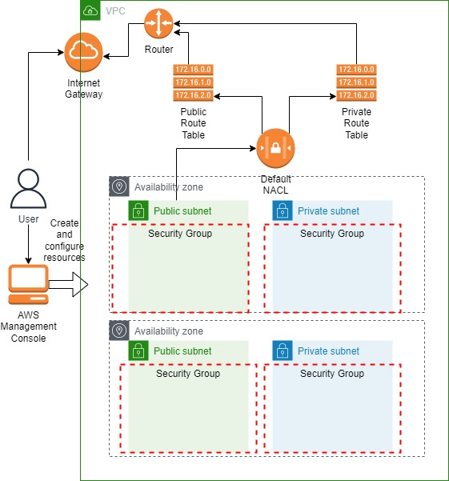
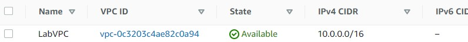
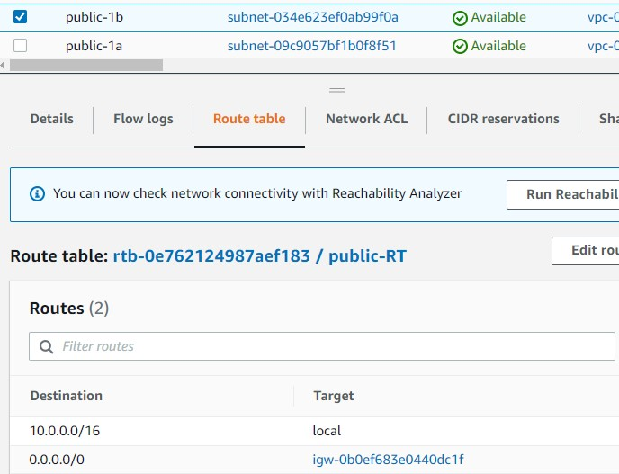
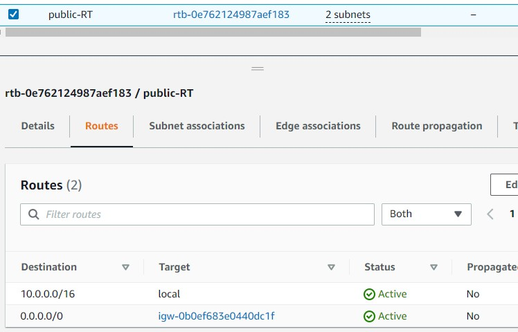
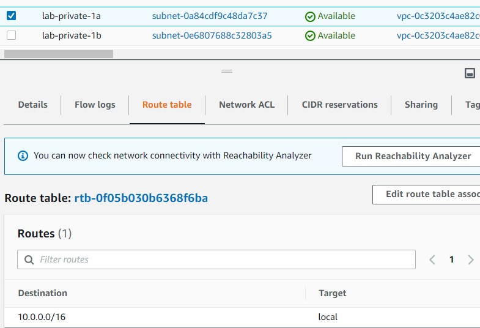
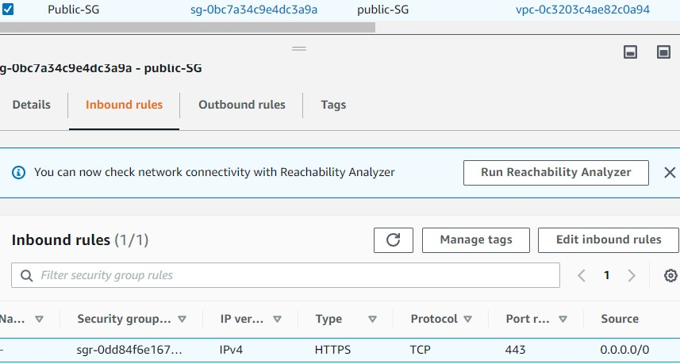
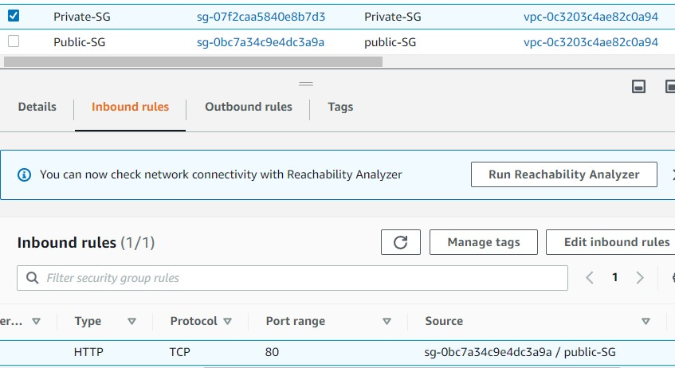
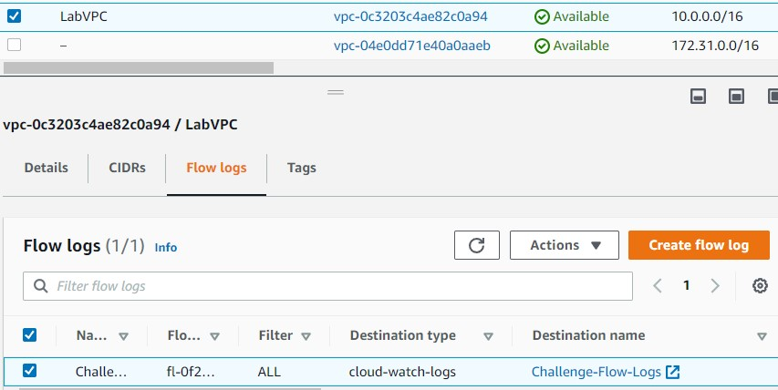

 

  
  <h3 align="center">100 days in Cloud</h3>

    VPC Challenge
     
    Lab 35
     
  

  
<h2 style="display: inline-block">Lab Details</h2>

  <ol>
    <li><a href="#services-covered">Services covered</a>
    <li><a href="#lab-description">Lab description</a></li>
    </li>
    <li><a href="#lab-date">Lab date</a></li>
    <li><a href="#prerequisites">Prerequisites</a></li>    
    <li><a href="#lab-steps">Lab steps</a></li>
    <li><a href="#lab-files">Lab files</a></li>
    <li><a href="#acknowledgements">Acknowledgements</a></li>
  </ol>

---

## Services Covered
*  **VPC**

---

## Lab description

*This lab assumes that you understand Amazon VPC features, concepts, and terminology. In this lab challenge, you will be tested on your practical ability to build out a solution in a production-like AWS environment. You are presented with a task and a set of requirements that you must fulfill to pass the challenge. This is a real environment, which means you can prove your knowledge in an applied situation, leaving behind multiple choice questions for a dynamic performance-based exam situation.*

---

### Learning Objectives
* Create VPC, highly available public and private subnets
* Create a Route Table and associate it with subnets and IGW
* Create VPC Flow Logs

### Lab date
26-11-2021

---

### Prerequisites
* AWS account

---

### Lab steps
1. Create a VPC. Create a new VPC with the CIDR block 10.0.0.0/16.

   

2. Create Public Subnets for Highly Available Hosts. Create subnets that satisfy the following:

   Are capable of hosting infrastructure that can directly access the public internet
   Are capable of hosting highly available infrastructure
   Have the word public in the subnet name tag

   So create at least two subnets in two different AZ's. Additionally create Route table association to an Internet Gateway. 

   

3. Create a Route Table for your Public Subnets. Create a route table and configure your public subnets so that the following is satisfied:

   Route table contains the word public in its tag name
   Traffic not addressable within the VPC is routed to the public internet

   

4. Create Private Subnets for Highly Available Hosts. Create private subnets that satisfy the following:

   Are capable of hosting highly available infrastructure
   Do not have routes for public internet traffic
   Have the word private in the subnet name tag

   

5. Create a Public Security Group. Create a security group that satisfies the following:

   Contains the word public in the group's name
   Has a rule that allows inbound HTTPS traffic from all sources

   

6. Create a Private Security Group. Create a security group that satisfies the following:

   Contains the word private in the group's name
   Has a rule that allows inbound HTTP traffic from the public security group

   

7. Create Flow Logs for Public and Private Subnets. Create flow logs that log all traffic in your subnets to the CloudWatch Logs log group named Challenge-Flow-Logs

   

### Lab files
* 
---

### Acknowledgements
* [cloud academy](https://cloudacademy.com/lab-challenge/amazon-vpc-implementation-challenge/)

