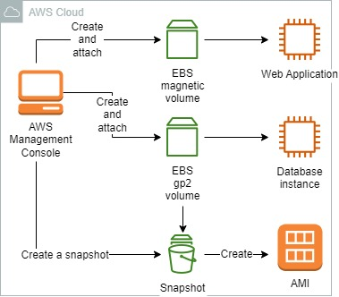
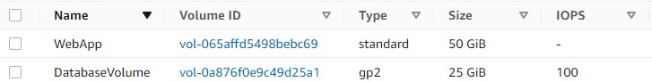
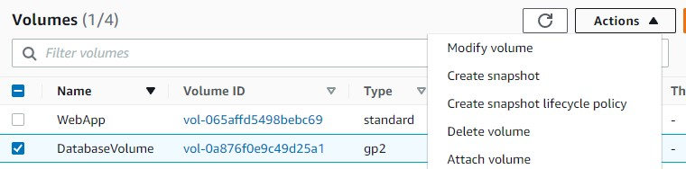
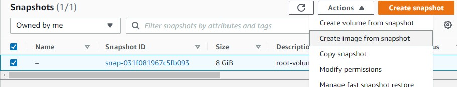

 

  
  <h3 align="center">100 days in Cloud</h3>

    Create Elastic Block Store and attach it to the EC2
     
    Lab 36
     
  

  
<h2 style="display: inline-block">Lab Details</h2>

  <ol>
    <li><a href="#services-covered">Services covered</a>
    <li><a href="#lab-description">Lab description</a></li>
    </li>
    <li><a href="#lab-date">Lab date</a></li>
    <li><a href="#prerequisites">Prerequisites</a></li>    
    <li><a href="#lab-steps">Lab steps</a></li>
    <li><a href="#lab-files">Lab files</a></li>
    <li><a href="#acknowledgements">Acknowledgements</a></li>
  </ol>

---

## Services Covered
*  **EC2**
*  **EBS**
---

## Lab description

*Your manager has asked you to investigate volume management for the proposed migration. You've been asked to set up the following so that a test migration can be performed later by another team:*

*Create volumes for the web application and database
Attach the volumes to existing EC2 instances
Verify the volume snapshot and image creation processes
It's been determined that the database server will benefit by storing its data on a gp2 type elastic block store volume. The web application does not have demanding input/output requirements and should use the magnetic standard volume type for storage.*

---

### Learning Objectives
* Create EBS volumes
* Create snapshots
* Create AMI from volume snapshots

### Lab date
25-11-2021

---

### Prerequisites
* AWS account
* EC2 instance running

---

### Lab steps
1. Navigate to **EC2 dashboard** and then under **Elastic Block Store** create a volume for the database server of type **gp2** and 25GiB size.

2. Create an EBS Volume for a web application. This time of type **Volume** and size of 50GiB.

   

3. Attach the database volume to the database EC2 instance and accordingly the web app volume.

   

4. Create a snapshot of the 12 GiB boot volume attached to the database instance. 

5. Create an Image of the Database Boot Volume. Create an Amazon Machine Image (AMI) from the database instance's 12 GiB boot volume snapshot.

   

   

### Lab files
* 
---

### Acknowledgements
* [cloud academy](hhttps://cloudacademy.com/lab-challenge/amazon-elastic-block-store-challenge/)

