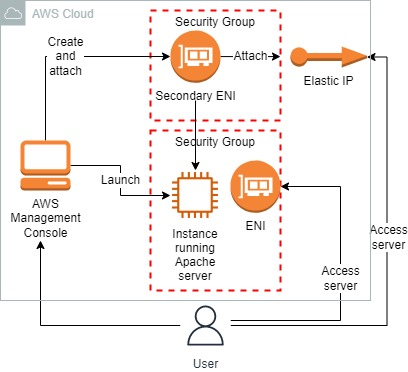
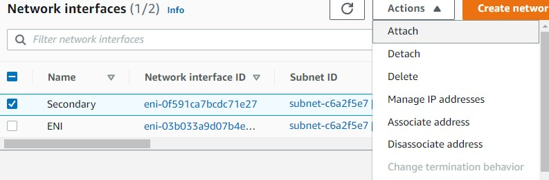
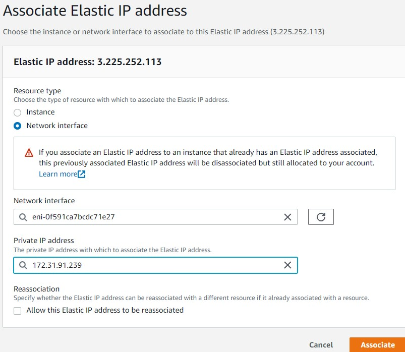
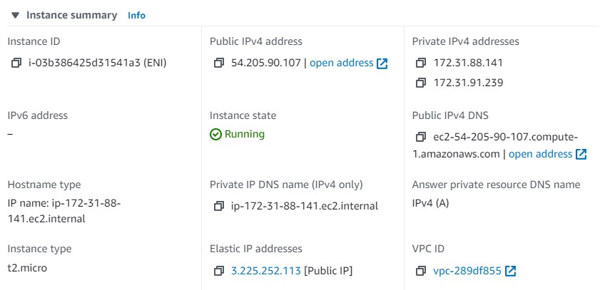
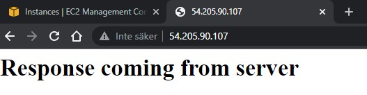
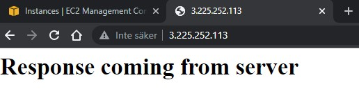

<br />

<p align="center">
  <a href="img/">
    
  </a>
  <h3 align="center">100 days in Cloud</h3>
<p align="center">
    Create Elastic Network Interface - Multiple IPs on an EC2
    <br />
    Lab 37
    <br/>
  </p>

</p>

<details open="open">
  <summary><h2 style="display: inline-block">Lab Details</h2></summary>
  <ol>
    <li><a href="#services-covered">Services covered</a>
    <li><a href="#lab-description">Lab description</a></li>
    </li>
    <li><a href="#lab-date">Lab date</a></li>
    <li><a href="#prerequisites">Prerequisites</a></li>    
    <li><a href="#lab-steps">Lab steps</a></li>
    <li><a href="#lab-files">Lab files</a></li>
    <li><a href="#acknowledgements">Acknowledgements</a></li>
  </ol>
</details>

---

## Services Covered
*  **EC2**
---

## Lab description

*This lab walks you through the steps to launch and configure a virtual machine in the Amazon cloud. You will practice using Amazon Machine Images to launch Amazon EC2 Instances and use user data to create and install a web page using the instance. You will create a web page and publish it. You will also create an additional elastic network interface and an additional elastic IP. Attach these additional created resources with EC2, and use another security group with HTTPS permission to test it.*


---

### Learning Objectives
* Create an EC2 Instance
* Create an additional ENI
* Allocate an Elastic IP and associate it to the ENI

### Lab date
24-11-2021

---

### Prerequisites
* AWS account

---

### Lab steps
1. Create a Security Group for the EC2 Instance that allows inbound HTTP traffic from anywhere.

2. Create a Security Group for the Network interface with the same configuration as in step 1.

3. Launch an EC2 Amazon Linux t2.micro instance. Use the default and add additional **User data**:

   ```
   #!/bin/bash
   
   sudo su
   
   yum update -y
   
   yum install -y httpd
   
   systemctl start httpd
   
   systemctl enable httpd
   
   echo "<html> <h1> Response coming from server </h1> </ html>" > /var/www/html/index.html
   ```

   Use the security group created in step 1. Copy the **availability zone,** and **subnet id**, we'll need them in the next steps.

4. Create a Network interface and attach it with EC2 Instance. Choose the same subnet as the one the instance runs in. Use the security group created in step 2. When created attach it to the instance.

   

5. Allocate Elastic IP. Then associate it with with the ENI

   

6. Go to the **EC2** Instance, **Refresh** the entire browser tab and we can see that **IPv4 Public IP** and **Elastic IP address** assigned to the same **EC2 Instance.** ie. Multiple Public IPs for a Single EC2 instance. And, there will be **2 Private IPv4 addresses** assigned.

   

7. Navigate to both of the Public IP and the Elastic IP to validate that the server responses.






### Lab files
* 
---

### Acknowledgements
* [whizlabs](https://play.whizlabs.com/site/task_details?lab_type=1&task_id=231&quest_id=35)

