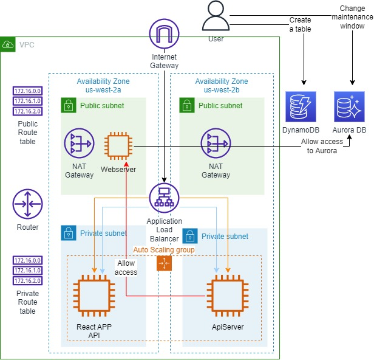
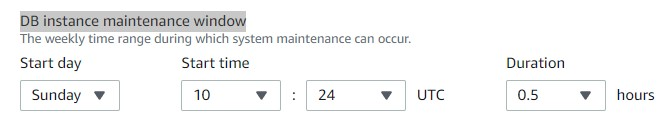
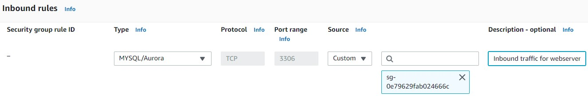
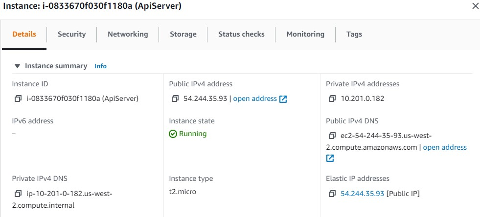
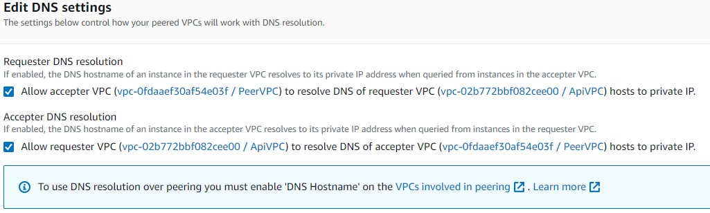
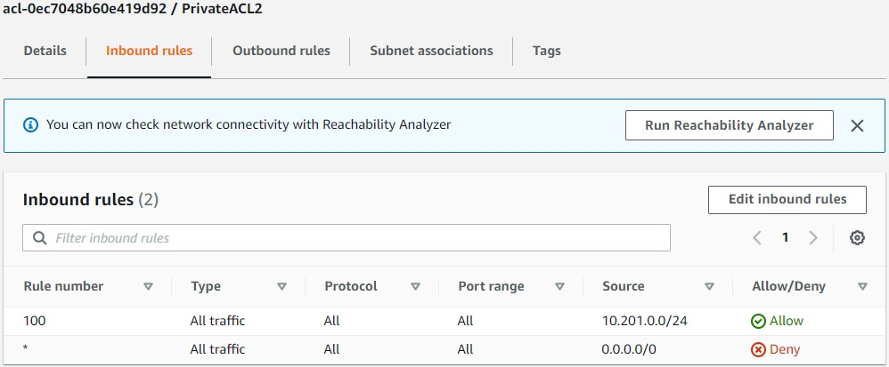
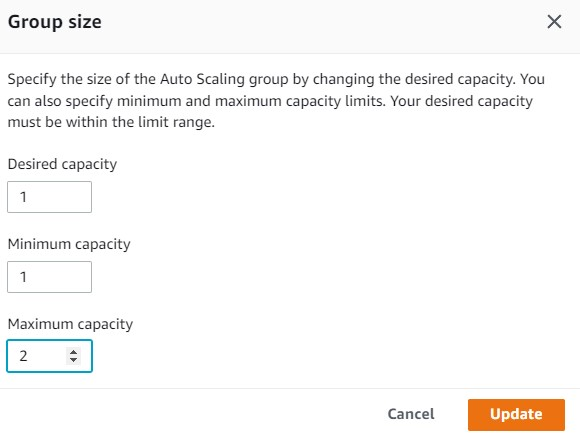

 

  
  <h3 align="center">100 days in Cloud</h3>

    AWS Solutions Architect - Associate Certification Challenge
     
    Lab 38
     
  

  
<h2 style="display: inline-block">Lab Details</h2>

  <ol>
    <li><a href="#services-covered">Services covered</a>
    <li><a href="#lab-description">Lab description</a></li>
    </li>
    <li><a href="#lab-date">Lab date</a></li>
    <li><a href="#prerequisites">Prerequisites</a></li>    
    <li><a href="#lab-steps">Lab steps</a></li>
    <li><a href="#lab-files">Lab files</a></li>
    <li><a href="#acknowledgements">Acknowledgements</a></li>
  </ol>

---

## Services Covered
*  **VPC**
*  **EC2**
*  **DynamoDB**
*  **RDS**
---

## Lab description

*In this lab challenge, you will be provided with a real AWS environment. This environment will emulate a real-world scenario, where you will be asked to perform the kind of tasks commonly done by those with the AWS Solutions Architect - Associate certification. This lab challenge will avoid multiple choice answers in favor of real-world work in a cloud environment. Additionally, while this lab challenge will not cover every aspect of the [certification requirements,](https://aws.amazon.com/certification/certified-solutions-architect-associate/) completion of the challenge will go a long way toward showing you have a comprehensive grasp of architecting within AWS.*

---

### Learning Objectives
* 

### Lab date
23-11-2021

---

### Prerequisites
* AWS account

---

### Lab steps
1. *Your manager has tasked you with delivering a database solution that must meet the following criteria:*

   - *It must offer single-digit millisecond latency*
   - *It must be managed by AWS, meaning your team shouldn't be responsible for managing any servers*

   *Your company currently uses a single RDS instance. For scheduling purposes, you've been asked to move that maintenance window to Sundays.*

   Create a database fulfilling the requirements. Fully-managed and millisecond latency is provided by **DynamoDB**. So I'll go for that. Since there's no specific requirements above those two mentioned I just create a table with default configuration. 

2. Move the maintenance window of a existing **RDS** database to Sundays. Go to the RDS Dashboard and choose the running RDS DB instance. Click on modify and in the *Maintenance->DB instance maintenance window* section change the *Start day* to Sunday. 

   

3. *The EC2 instance needs to be able to access the database to store and retrieve data, but the EC2 instance is displaying a timeout error when attempting to connect to the RDS instance. Find out why and fix the issue.* 

   Database's security group needs an inbound rule allowing traffic on port 3306 coming from webserver's instance security group.

   

4. *ApiServer that serves an API to third-party companies. These companies use the public IP address of the ApiServer to connect to it and make API requests. However, whenever the APIServer restarts, its public IP address changes and third-party companies are forced to update their configuration to point to the new IP. Your task is to make whatever change is necessary so that the ApiServer's public IP no longer changes when it restarts.* 

   The ApiServer needs an ElasticIP. Create an ElasticIP and associate it with the ApiServer.

   

5. *Your ApiServer is inside an AWS VPC named ApiVPC. There is another server named PeerServer, which is hosted in a VPC named PeerVPC. These two VPCs are connected using AWS VPC Peering. These two servers need to be able to communicate with each other, over private DNS, using all ports. However, when one of your coworkers attempts to communicate with the PeerServer from within the ApiServer, they are receiving timeout errors. Find out why and fix the issue.*

   Go to the **VPC** dashboard and then to **Peering connections** and edit **DNS settings** allowing resolving DNS of requests. Additionally enable *DNS Hostname* in both VPC's.

   

   Afterwards continue to **Network ACLs** and add an inbound rule that allow access on all ports form the ApiServer subnet.

   

6. *Your company uses an autoscaling group to determine the number of instances of the WebServer EC2 to have deployed at any point. Your manager wants you to optimize your company's AWS costs wherever possible. You have investigated and come to the conclusion that your company's autoscaling group only ever deploys up to half of the max instances configured in the autoscaling group. Update the autoscaling group's configuration to reflect an appropriate number of max instances.*

   Change the maximum capacity to two.

   

   

### Lab files
* 
---

### Acknowledgements
* [cloud academy](https://cloudacademy.com/lab-challenge/aws-solutions-architect-associate-certification-challenge-lab/?context_id=954&context_resource=lp)

