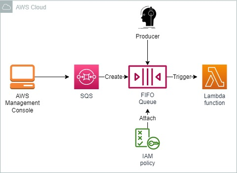
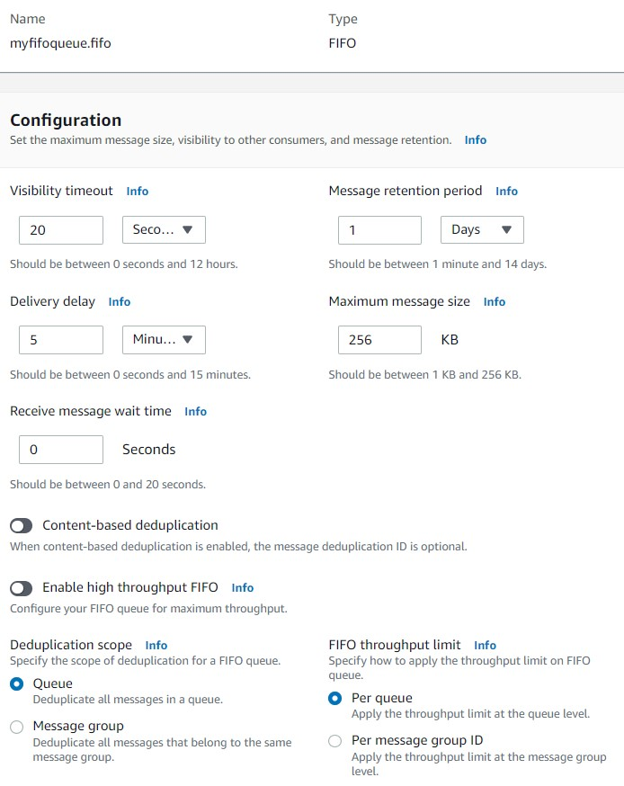

<br />

<p align="center">
  <a href="img/">
    
  </a>
  <h3 align="center">100 days in Cloud</h3>
<p align="center">
     SQS Queue Creation Challenge
    <br />
    Lab 39
    <br/>
  </p>


</p>

<details open="open">
  <summary><h2 style="display: inline-block">Lab Details</h2></summary>
  <ol>
    <li><a href="#services-covered">Services covered</a>
    <li><a href="#lab-description">Lab description</a></li>
    </li>
    <li><a href="#lab-date">Lab date</a></li>
    <li><a href="#prerequisites">Prerequisites</a></li>    
    <li><a href="#lab-steps">Lab steps</a></li>
    <li><a href="#lab-files">Lab files</a></li>
    <li><a href="#acknowledgements">Acknowledgements</a></li>
  </ol>
</details>

---

## Services Covered
*  **SQS**
---

## Lab description

*You have been tasked with creating a prototype new Amazon SQS queue that satisfies the new requirements.*

*To complete this challenge, you will need to use the following Amazon Resource Names (ARNs):*

- *An IAM role for producers to access queues exists.*
- *An AWS Lambda function for processing messages exists.*
- *An Amazon SQS queue exists for storing undeliverable messages.*

---

### Learning Objectives
* Create and configure a FIFO Queue
* Restrict access to queue to an existing producer
* Create a trigger for a Lambda function

### Lab date
22-11-2021

---

### Prerequisites
* AWS account

---

### Lab steps
1. **Create an Amazon SQS Queue**. Create an Amazon SQS queue that guarantees that each message will be delivered exactly once. So it's a FIFO queue. 

2. **Set a Window for SQS Queue Consumers to Process Messages**. Configure your queue to hide a message from other consumers for twenty seconds after a message is received from a queue. Set the visibility timeout for 20 seconds.

3. **Delay the Delivery of New SQS Messages**. Configure your queue to delay the delivery of new messages for five minutes. Delivery delay set to 5 minutes.

4. **Set the SQS Message Retention Period**. Set the message retention period for your Amazon SQS queue to one day.

   

5. **Restrict SQS Queue Access to an IAM Role**. Create and apply an IAM access policy for your Amazon SQS queue that allows all actions for the existing producer IAM role.

   ```
   {
     "Version": "2008-10-17",
     "Id": "__default_policy_ID",
     "Statement": [
       {
         "Sid": "__owner_statement",
         "Effect": "Allow",
         "Principal": {
           "AWS": "arn:aws:iam::<<Your-account-number>>:role/<<Producer-name>>"
         },
         "Action": [
           "SQS:*"
         ],
         "Resource": "arn:aws:sqs:us-west-2:<<Your-account-number>>:MyQueue.fifi"
       }
     ]
   }
   ```

6. **Configure an SQS Dead Letter Queue**. Configure your Amazon SQS queue to use the existing dead letter queue. Enable the option and choose a DLQ. 

7. **Create an AWS Lambda Trigger**. Configure your Amazon SQS queue to trigger the existing lambda when receiving messages. After creating the queue, go to **Lambda triggers** and choose a Lambda function to be triggered by the queue.  

### Lab files
* 
---

### Acknowledgements
* [cloud academy](https://cloudacademy.com/lab-challenge/amazon-sqs-queue-creation-challenge/)

