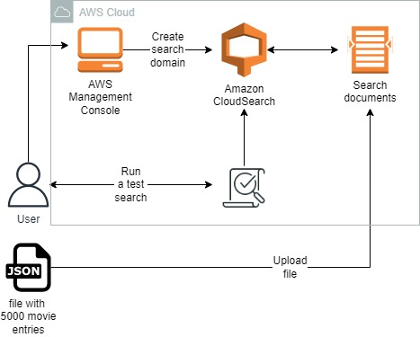
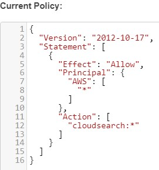
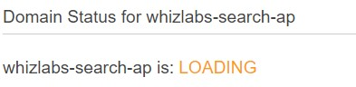
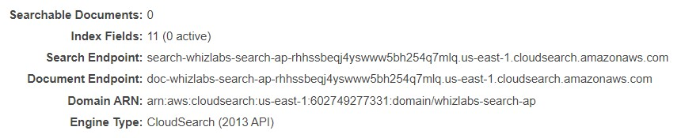
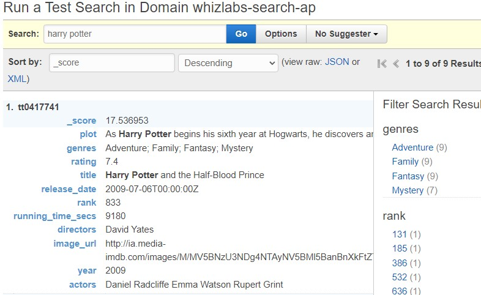
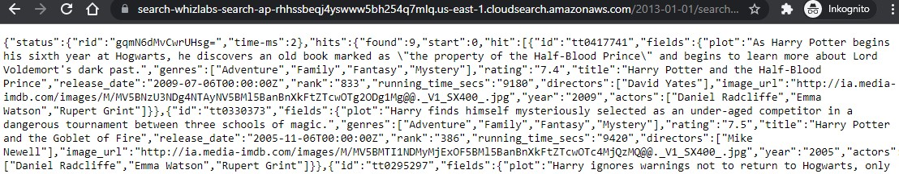

<br />

<p align="center">
  <a href="img/">
    
  </a>
  <h3 align="center">100 days in Cloud</h3>
<p align="center">
     Build a sample search application using Amazon CloudSearch
    <br />
    Lab 41
    <br/>
  </p>


</p>

<details open="open">
  <summary><h2 style="display: inline-block">Lab Details</h2></summary>
  <ol>
    <li><a href="#services-covered">Services covered</a>
    <li><a href="#lab-description">Lab description</a></li>
    </li>
    <li><a href="#lab-date">Lab date</a></li>
    <li><a href="#prerequisites">Prerequisites</a></li>    
    <li><a href="#lab-steps">Lab steps</a></li>
    <li><a href="#lab-files">Lab files</a></li>
    <li><a href="#acknowledgements">Acknowledgements</a></li>
  </ol>
</details>

---

## Services Covered
*  **CloudSearch**
---

## Lab description

This lab walks you through the steps to create a search domain in Amazon CloudSearch, upload a sample data and test the application.

---

### Learning Objectives
* Create a search domain
* Upload a sample JSON data
* Test the Search Application

### Lab date
20-11-2021

---

### Prerequisites
* AWS account

---

### Lab steps
1. Create a search domain. Navigate to **CloudSearch** and create a new search domain. Give it a name, choose one *search.small* as instance type. On the next tab choose *Analyze sample file(s) from my local machine* and use the [sample_search_data.json](sample_search_data.json) file. This file includes 5000 movie entries to play with. Leave the suggested index field configuration as default and continue. Set my policy to *Allow open access to all services*.

   

   Confirm the settings and create the domain. It might take quite a long time until it gets active status.

   

2. When your Domain status changes to PROCESSING, you will get a Search Endpoint. 

   

   Wait till the status changes to ACTIVE. Upload a sample JSON data. Click on the /  button and navigate to the JSON file which you have downloaded previously. Upload documents. 

3. Test the Search Application. In the textbox enter Harry Potter and click on the *go* button. 

   

   Try running different searches to test the engine. 

4. Now test the search endpoint by copying the URL and adding some parameters to it for example:

   ```
   <your-search-endpoint>/2013-01-01/search?q=harry+potter&return=_all_fields
   ```

   This will return a JSON with all the Harry Potter movie list.

   

   Or maybe all **Tom Hanks** entries:

   ```
   <your-search-endpoint>/2013-01-01/search?q=Hanks&return=_all_fields
   ```

   

### Lab files
* [sample_search_data.json](sample_search_data.json)
---

### Acknowledgements
* [whizlabs](https://play.whizlabs.com/site/task_details?lab_type=1&task_id=187&quest_id=31)

