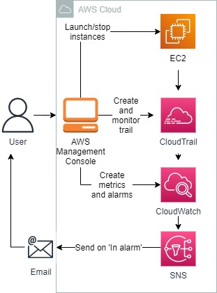
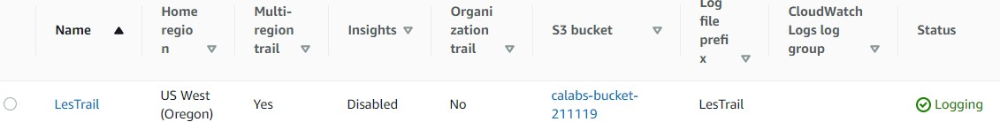
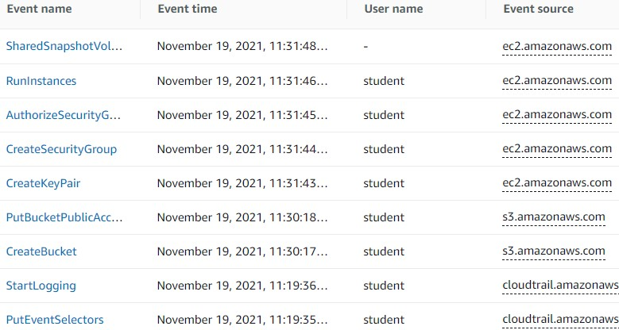
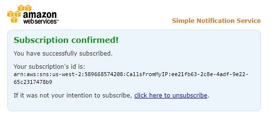
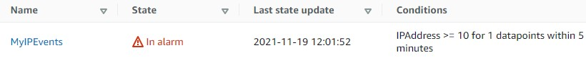
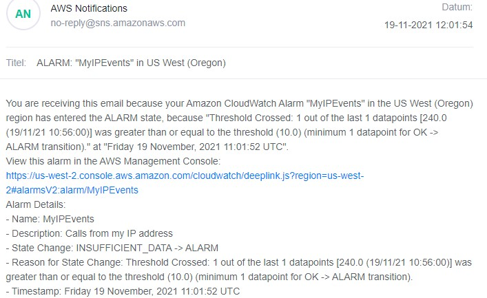
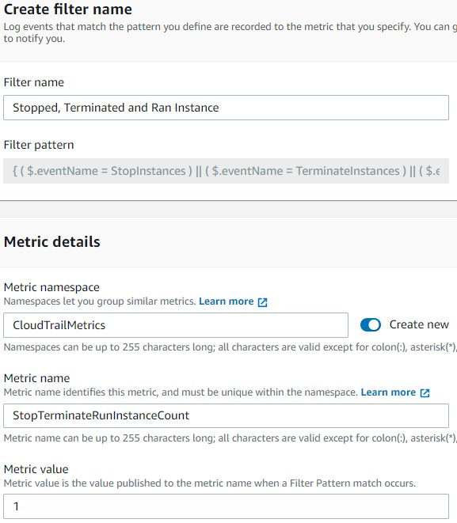
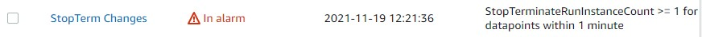
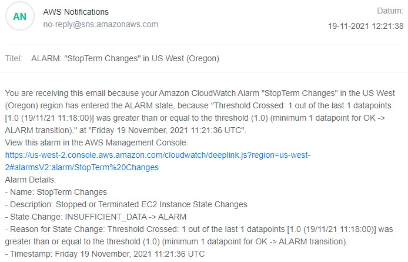

<br />

<p align="center">
  <a href="img/">
    
  </a>
  <h3 align="center">100 days in Cloud</h3>
<p align="center">
    Monitoring AWS CloudTrail Events with Amazon CloudWatch
    <br />
    Lab 42
    <br/>
  </p>


</p>

<details open="open">
  <summary><h2 style="display: inline-block">Lab Details</h2></summary>
  <ol>
    <li><a href="#services-covered">Services covered</a>
    <li><a href="#lab-description">Lab description</a></li>
    </li>
    <li><a href="#lab-date">Lab date</a></li>
    <li><a href="#prerequisites">Prerequisites</a></li>    
    <li><a href="#lab-steps">Lab steps</a></li>
    <li><a href="#lab-files">Lab files</a></li>
    <li><a href="#acknowledgements">Acknowledgements</a></li>
  </ol>
</details>

---

## Services Covered
*  **CloudTrail**
*  **CloudWatch**
*  **EC2**
---

## Lab description

*By default, CloudTrail records the last 90 days of events for AWS accounts. However, the default events do not support triggering alerts, event metrics, and long term storage. You need to create a Trail for that. In this Lab Step, you will create your first Trail. When configuring your first Trail, although you can point to an existing S3 bucket and IAM policy for access, it is simpler and generally recommended that you let AWS create them for you during the configuration process. The instructions below will guide you through doing that.*

*In this Lab Step you'll use the console to perform several tasks, then verify that CloudTrail is indeed capturing them to a log file and delivering that log file to S3.* 

*In this Lab Step you will configure a more realistic use case: Configuring CloudWatch to isolate stop and terminate EC2 instances from the CloudTrail logs sent to the CloudWatch log group. When captured, it will trigger an alarm that sends an email notification*

---

### Learning Objectives
* Setting up CloudTrail, CloudWatch and SNS
* Generate traffic in order to verify CloudTrail is working
* Use the CloudTrail console to learn more about the events CloudTrail captures
* Configure CloudTrail to send events to CloudWatch
* Create a metric filter and alarm so that you receive a notification when specific events occur in AWS

### Lab date
19-11-2021

---

### Prerequisites
* AWS account

---

### Lab steps
1. In the AWS Management Console navigate to **CloudTrail** and create a trail. Ensure that logs will be stored in a new S3 bucket. Make note of the name of the bucket. You don't need neither encryption or log file validation. As **Event type** choose **Management events**. 

   

2. In order to create some trail to monitor create a S3 bucket and launch an EC2 instance. After couple of minutes you may see the events in CloudTrails **Event history**.

   

3. Navigate to CloudTrail, then select Trails, select the actionable CloudTrail name you created earlier. Scroll down to the **CloudWatch Logs** section. Click on **Edit** and enable it.

4. Get you public IP address ([whatismyip.com](http://www.whatismyip.com/)). Navigate to CloudWatch and then Log group and the name you created in previous step. Click Actions -> Create Metric Filter. For the Filter Pattern, enter:  

   ```
   {$.sourceIPAddress="YourIPaddress"}
   ```

   Click **Test Patter**. If you're not getting any results, try creating a resource or terminate an instance, that will trigger CloudTrail to send or choose another log data to test. Then continue to the next tab and provide names for the filter and metric and value set to 10. Create filter.

5. Check the created filter and click on **Create alarm**. Set the conditions to **static**, **greater/equal** than **10**. On the next tab create a new SNS topic and call it for ex. **CallsFromMyIP**. Put an email and confirm the subscription.

   

6. Navigate to some services, maybe upload a file to one of the buckets, basically make some API calls in your account. When the value of 10 calls from your IP address is reach you should receive an email saying that the event is in alarm state

   

   

7. From CloudWatch > Log Groups, select the Log Group you just created. Click Create Metric Filter. For the **Filter Pattern**, enter: 

   ```
   { ( $.eventName = StopInstances ) || ( $.eventName = TerminateInstances ) || ( $.eventName = RunInstances ) }
   ```

  Click **Test Pattern**. Although the Results will find 0 matches against the default log data to test against, it will confirm the syntax for your filter is correct and the search was performed. Click the **Assign Metric** button. On the next tab provide following values:

   

8.  In the CloudWatch console, click Alarms in the left pane, then click the Create Alarm. Click Select metric, select CloudTrailMetrics under Custom namespaces, select Metrics with no dimensions. Here you've to choose the StopTerminateInstanceCount metric and select Sum as Statistic and 1 minute as Period. Now you can click the Select metric button. 

9.  Set the section as described:
  ```
   Threshold type: Static
   Whenever StopTerminateInstanceCount is...: Greater/Equal
   than...: 1

   Set the section as described;

   Whenever this alarm state is...: In Alarm
   Select an SNS topic: Create new topic
   Create a new topic…: StopTermInstances
   Email endpoints that will receive the notification…: your personal email
   Click Create topic and then Next.

   Set the section as described:

   Define a unique name: StopTerm Changes
   Alarm description: Stopped or Terminated EC2 Instance State Changes
   Click Next.

   Click Create Alarm when ready.
  ```
10. Then stop, launch or terminate an instance. This should trigger an alarm and SNS will send you en email.

    

    

### Lab files
* 
---

### Acknowledgements
* [cloudacademy](https://cloudacademy.com/lab/monitoring-aws-cloudtrail-events-amazon-cloudwatch/?context_id=954&context_resource=lp)

