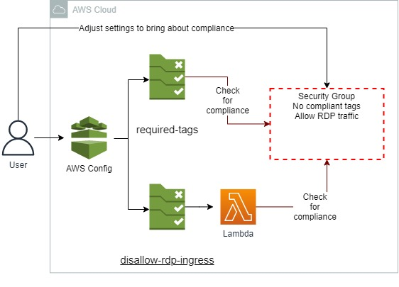
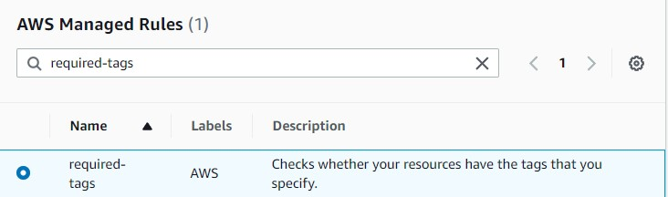
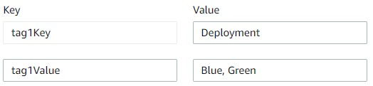
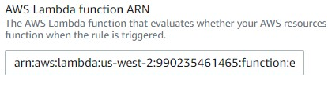
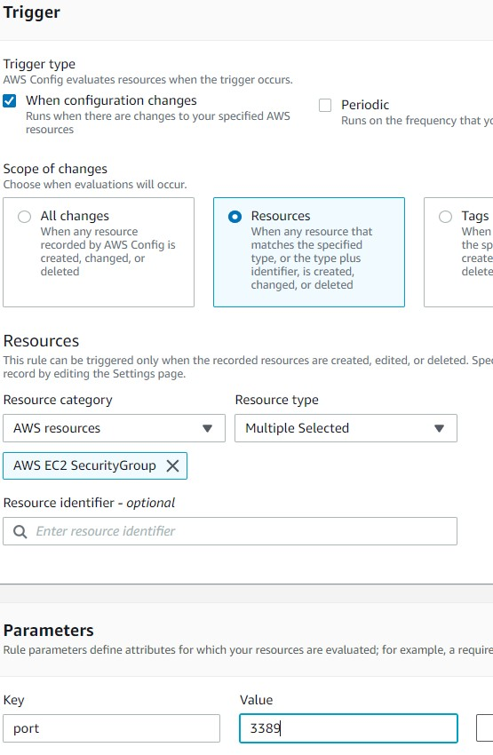
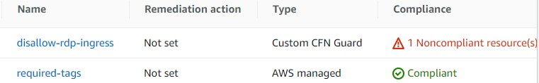
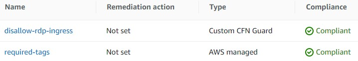

 

  
  <h3 align="center">100 days in Cloud</h3>

    Bring compliance using AWS Config managed and custom rules
     
    Lab 44
     
  

  
<h2 style="display: inline-block">Lab Details</h2>

  <ol>
    <li><a href="#services-covered">Services covered</a>
    <li><a href="#lab-description">Lab description</a></li>
    </li>
    <li><a href="#lab-date">Lab date</a></li>
    <li><a href="#prerequisites">Prerequisites</a></li>    
    <li><a href="#lab-steps">Lab steps</a></li>
    <li><a href="#lab-files">Lab files</a></li>
    <li><a href="#acknowledgements">Acknowledgements</a></li>
  </ol>

---

## Services Covered
*  **AWS Config**
*  **Lambda**
---

## Lab description

In this lab I will create a managed rule in AWS Config then a custom rule for AWS Config. The rule use a Lambda function that detects if a security group is allowing incoming TCP traffic over the default RDP port. I will practice investigating non-compliant resources and modifying configurations to bring about compliance.

---

### Learning Objectives
* Setting up a configuration recorder
* Use AWS Managed Rule to bring compliance
* Create a Lambda function for a custom Config rule

### Lab date 
17-11-2021

---

### Prerequisites
* AWS account
* A Security Group allowing RDP traffic on port 3389 and without tags

---

### Lab steps
1. Set up AWS Config using the setup form. Create a new AWS Config role if you don't have one. Create a bucket. Don't add any rules at this time. Confirm creation of AWS Config.

1. Add new rules.  Choose **required-tags** from Managed Rules. 

   
   
   In the Configure rule form, keep the default values for Name, Description, and Scope of changes fields. As for resources choose only AWS EC2 SecurityGroup. In the Parameters section at the bottom of the form, enter: tag1Key: Deployment, tag1Value: Blue, Green.
   
   
   
   Add rule.
   
1. In lab environment there's one security group that is noncompliant. Adding tags makes it compliant with the rule.

1. Add another rule, but this time a custom rule. This one will check if the RDP traffic over tcp is allowed. Go to Lambda dashboard and create a rule. Choose Node.js as runtime. Lambda need a role that allows *(ec2.describeSecurityGroups)* and put evaluations into AWS Config *(config.putEvaluations)*. Copy the code from [index.js](index.js). Change Lambda's timeout to 30 seconds. Copy Lambda's function ARN and back in Config rule creator paste it

   
   
   For trigger configuration use following:
   
   
   
1. After some time AWS Config rule will evaluate and report that there is one noncompliant resource:

   
   
1. Go to the noncompliant security group and choose **Manage resource** then **Edit inbound rules** by deleting it from SG. After some time the *dissalow-rdp-ingress* rule should report that all resources are compliant.

   
   
   
   
   

### Lab files
* [lambda](index.js) - Lambda function that describes Security Groups
---

### Acknowledgements
* [cloudacademy](https://cloudacademy.com/lab/compliance-check-using-aws-config-rules-managed-custom/?context_resource=lp&context_id=954)

