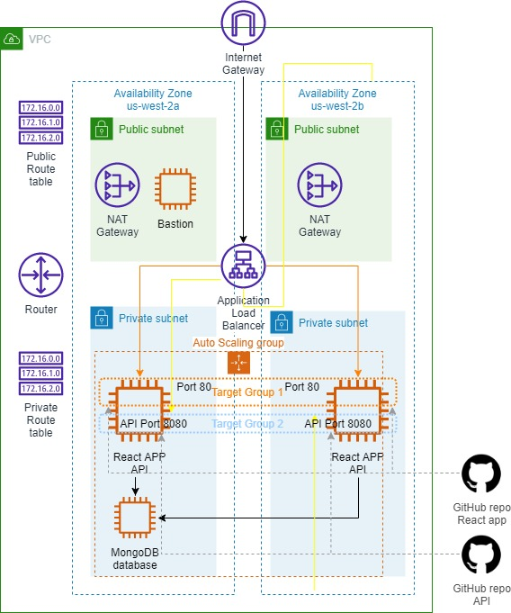
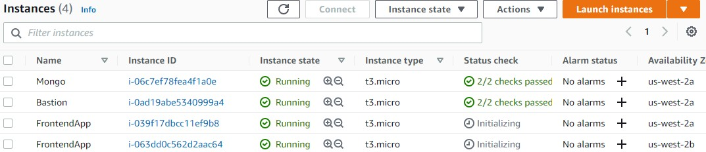
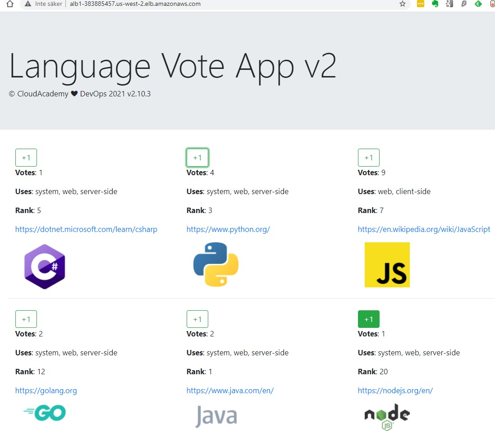

<br />

<p align="center">
  <a href="img/">
    
  </a>
  <h3 align="center">100 days in Cloud</h3>
<p align="center">
    Using Terraform create VPC with subnets, Application Load Balancer with EC2 Instance running React App, API and MongoDB
    <br />
    Lab 45
    <br/>
  </p>


</p>

<details open="open">
  <summary><h2 style="display: inline-block">Lab Details</h2></summary>
  <ol>
    <li><a href="#services-covered">Services covered</a>
    <li><a href="#lab-description">Lab description</a></li>
    </li>
    <li><a href="#lab-date">Lab date</a></li>
    <li><a href="#prerequisites">Prerequisites</a></li>    
    <li><a href="#lab-steps">Lab steps</a></li>
    <li><a href="#lab-files">Lab files</a></li>
    <li><a href="#acknowledgements">Acknowledgements</a></li>
  </ol>
</details>

---

## Services Covered
*  **Terraform**
---

## Lab description

Create an advanced AWS VPC spanning 2 AZs with both public and private subnets. An internet gateway and NAT gateway will be deployed into it. Public and private route tables will be established. An application load balancer (ALB) will be installed which will load balance traffic across an auto scaling group (ASG) of Nginx web servers. Security groups will be created and deployed to secure all network traffic between the various components.

Private subnets will host the frontend application and ALB will distribute traffic to them. Application includes bootstrapped React app with API backed with a MongoDB instance. The public subnet will host bastion host for connectivity.

## Project structure
```
├── main.tf
├── modules
│   ├── application
│   │   ├── main.tf
│   │   ├── outputs.tf
│   │   └── vars.tf
│   ├── bastion
│   │   ├── main.tf
│   │   ├── outputs.tf
│   │   └── vars.tf
│   ├── network
│   │   ├── main.tf
│   │   ├── outputs.tf
│   │   └── vars.tf
│   ├── security
│   │   ├── main.tf
│   │   ├── outputs.tf
│   │   └── vars.tf
│   └── storage
│       ├── install.sh
│       ├── main.tf
│       ├── outputs.tf
│       └── vars.tf
├── outputs.tf
├── terraform.tfvars
└── variables.tf├── ec2.userdata
├── main.tf
├── outputs.tf
├── terraform.tfvars
└── variables.tf
```

---

### Learning Objectives
* Create Terraform template to launch resources
* Create AWS environment including VPC, subnets, EC2 instance, route table, internet gateway
* Provide EC2 userdata from a separate file
* Use terraform modules for application, network, bastion, storage and security layers

### Lab date 
16-11-2021

---

### Prerequisites
* AWS account
* Terraform installed
* KeyPair in EC2 (I called my *cloudacademydemo*)


---

### Lab steps
1. Start off with initializing terraform project in your directory

   ```
   terraform init
   ```

   

2. Plan the terraform environment execution by running

   ```
   terraform plan
   ```

   

3. Deploy the resources by running

   ```
   terraform apply
   ```

   When terraform completes there should be 4 instances running

   

   

   Navigate to the DNS name found in the Load Balancers tab. You should be able to vote on your favorite language. Votes are send by executing a Ajax request to API and logged in the MongoDB database.

   

4. Try connecting to the bastion host and jump over to the MongoDB instance. I use PuTTY to connect to the bastion's public IP and use *Allow agent forwarding* option to connect to database instance.

   
   
4. Delete all the resources by running:

   ```
   terraform destroy
   ```

   
   
   

### Lab files
* [main.tf](main.tf)
* [variables.tf](main.tf)
* [outputs.tf](main.tf)
---

### Acknowledgements
* [cloudacademy](https://github.com/cloudacademy/terraform-aws)

