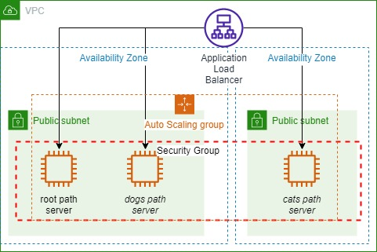
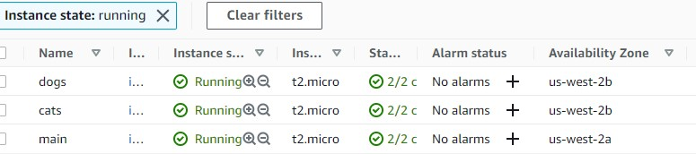
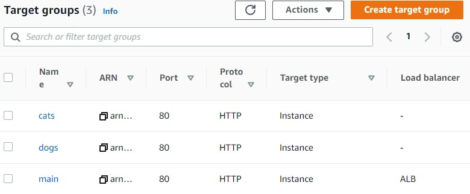
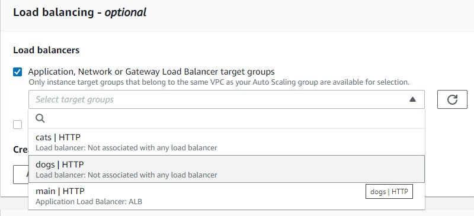
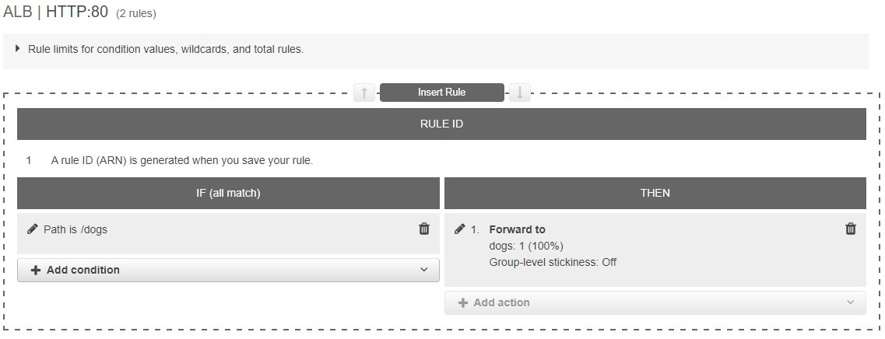
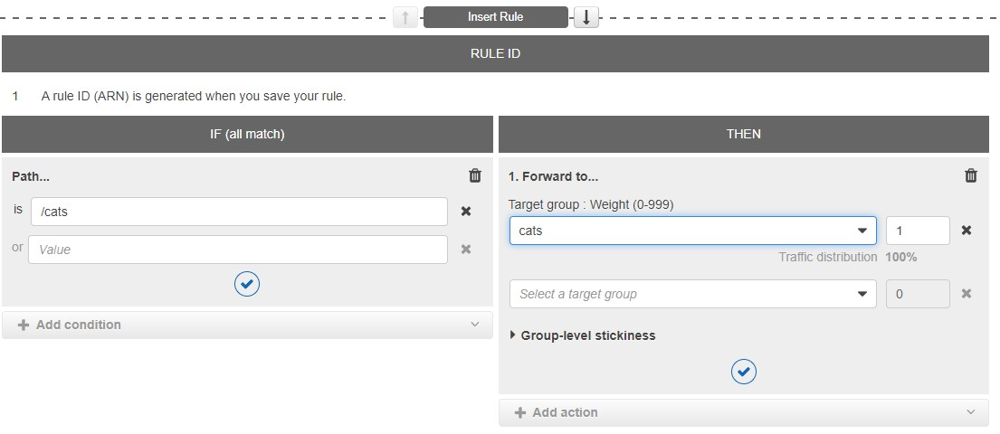
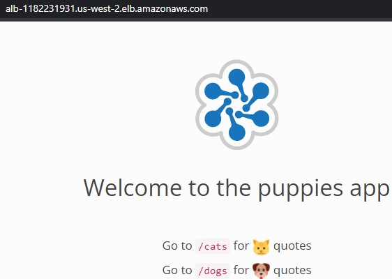
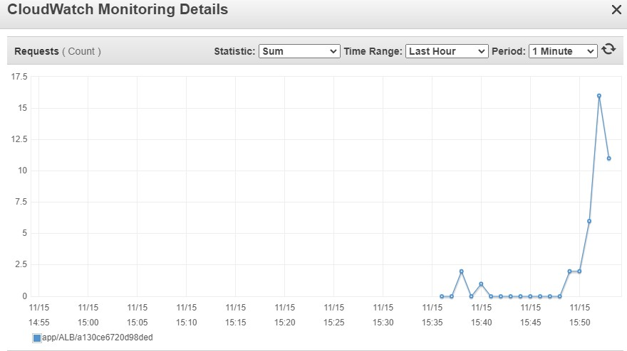

 

  
  <h3 align="center">100 days in Cloud</h3>

    Creating and monitoring Application Load Balancer, Auto Scaling Groups and Target Groups
     
    Lab 46
     
  

  
<h2 style="display: inline-block">Lab Details</h2>

  <ol>
    <li><a href="#services-covered">Services covered</a>
    <li><a href="#lab-description">Lab description</a></li>
    </li>
    <li><a href="#lab-date">Lab date</a></li>
    <li><a href="#prerequisites">Prerequisites</a></li>    
    <li><a href="#lab-steps">Lab steps</a></li>
    <li><a href="#lab-files">Lab files</a></li>
    <li><a href="#acknowledgements">Acknowledgements</a></li>
  </ol>

---

## Services Covered
*  **EC2**
---

## Lab description

In this lab I will create an Application Load Balancer that will route the traffic to three instances based on path value.

---

### Learning Objectives
* Create Target Groups
* Register instances on Target Groups
* Create an Application Load Balancer
* Associate Auto Scaling groups with Target Groups
* Configure listeners and rules

### Lab date
15-11-2021

---

### Prerequisites
* AWS account

---

### Lab steps
1. Navigate to **EC2 Dashboard**. Create two Auto Scaling groups. One for the *dogs* group of instances with minimum capacity set to 1, desired: 1 and maximum: 1. In the launch template specify type t2.micro with Amazon Linux 2 AMI (two in the same AZ and one in another). Call them with some convenient name (in my case it's: **main** - for requests on the root path, **dogs** - requests on the /dogs path and **cats** for /cats path).

   

2. Create a **Application Load Balancer**. Leave the defaults for *scheme*, *IP address type*, *VPC* and select all AZ's. **Create new security group** and allow inbound HTTP traffic from anywhere. Back in ALB creation tab, choose the SG you just created. **Create target group** for the listener. This will be the TG for root path, you might wanna call it *main*. Leave the default values and continue to **Register targets** in next step. Mark the instance called **main** and include it as pending. Back in the ALB creation tab add that TG to the listener for HTTP protocol om port 80. Then click **Create load balancer**.

3. Create additional **Target Groups**. First one called *dogs* for */dogs* path, then *cats* for */cats* path. Don't register targets yet.

   

4. Edit the ASG for dog group and add the ALB called *dogs*.

   

   Update the *cats* ASG with the ALB called accordingly.

5. Navigate to the ALB, and then **Listeners** and edit rules for *dogs* and *cats* accordingly

   

   

6. Copy the DNS name of the ALB and navigate to that address

   

   Generate some "traffic" by hitting the *dogs* and *cats* path. 

7. Back in the ALB tab, go to monitoring where you can see the CloudWatch metrics.

​		

### Lab files
* 
---

### Acknowledgements
* [cloudacademy](https://cloudacademy.com/lab/working-application-load-balancer/?context_id=2654&context_resource=lp)

