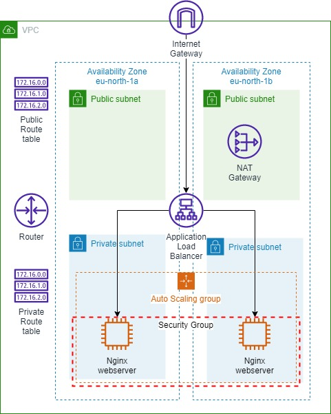
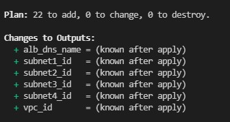
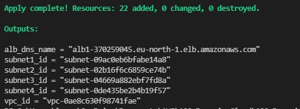
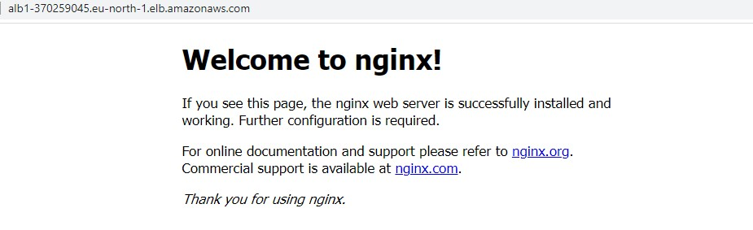

<br />

<p align="center">
  <a href="img/">
    
  </a>
  <h3 align="center">100 days in Cloud</h3>
<p align="center">
    Using Terraform create VPC with subnets, Application Load Balancer with EC2 Instance running NGINX server
    <br />
    Lab 47
    <br/>
  </p>


</p>

<details open="open">
  <summary><h2 style="display: inline-block">Lab Details</h2></summary>
  <ol>
    <li><a href="#services-covered">Services covered</a>
    <li><a href="#lab-description">Lab description</a></li>
    </li>
    <li><a href="#lab-date">Lab date</a></li>
    <li><a href="#prerequisites">Prerequisites</a></li>    
    <li><a href="#lab-steps">Lab steps</a></li>
    <li><a href="#lab-files">Lab files</a></li>
    <li><a href="#acknowledgements">Acknowledgements</a></li>
  </ol>
</details>

---

## Services Covered
*  **Terraform**
---

## Lab description

Create an advanced AWS VPC spanning 2 AZs with both public and private subnets. An internet gateway and NAT gateway will be deployed into it. Public and private route tables will be established. An application load balancer (ALB) will be installed which will load balance traffic across an auto scaling group (ASG) of Nginx web servers. Security groups will be created and deployed to secure all network traffic between the various components.

## Project structure
```
├── ec2.userdata
├── main.tf
├── outputs.tf
├── terraform.tfvars
└── variables.tf
```

---

### Learning Objectives
* Create Terraform template to launch resources
* Create AWS environment including VPC, subnets, EC2 instance, route table, internet gateway
* Provide EC2 userdata from a separate file
* Use ***cidrsubnet()*** terraform function

### Lab date
14-11-2021

---

### Prerequisites
* AWS account
* Terraform installed
* KeyPair in EC2 (I called my *cloudacademydemo*)


---

### Lab steps
1. Start off with initializing terraform project in your directory

   ```
   terraform init
   ```

   

2. Launch the terraform environment execution by running

   ```
   terraform plan
   ```

   

   The main template includes creating a new VPC with 4 subnets (two public and two private), an internet gateway, elastic ip for nat gateway, route tables, security groups, application load balancer, launch template.

3. Deploy the resources by running

   ```
   terraform apply
   ```

   And paste your IP for SSH connection.

   

   Alright! Now the two webserver instances are running behind an ALB. 

   

   Navigate to the ALB's DNS name to verify that nginx responses.

   

4. To wrap-up run the destroy command to clean-up the environment.

   ```
   terraform destroy
   ```

   

### Lab files
* [main.tf](main.tf)
* [variables.tf](main.tf)
* [outputs.tf](main.tf)
* [ec2.userdate](ec2.userdata)
---

### Acknowledgements
* [cloudacademy](https://github.com/cloudacademy/terraform-aws)

