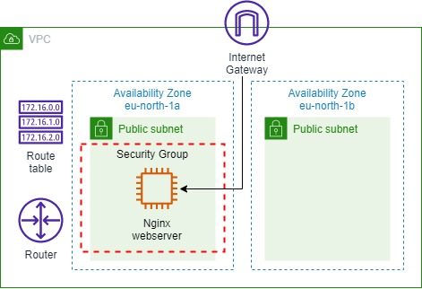
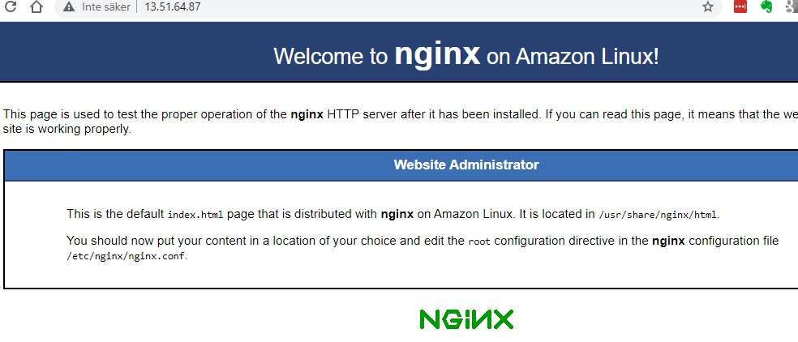
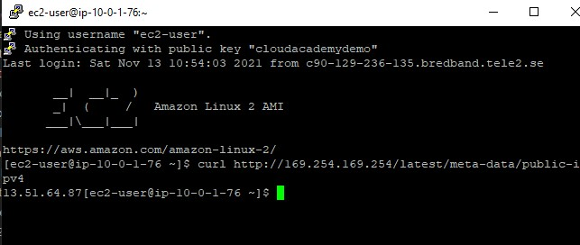
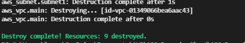

<br />

<p align="center">
  <a href="img/">
    
  </a>
  <h3 align="center">100 days in Cloud</h3>
<p align="center">
    Using Terraform create VPC with subnets, EC2 Instance running NGINX server
    <br />
    Lab 48
    <br/>
  </p>


</p>

<details open="open">
  <summary><h2 style="display: inline-block">Lab Details</h2></summary>
  <ol>
    <li><a href="#services-covered">Services covered</a>
    <li><a href="#lab-description">Lab description</a></li>
    </li>
    <li><a href="#lab-date">Lab date</a></li>
    <li><a href="#prerequisites">Prerequisites</a></li>    
    <li><a href="#lab-steps">Lab steps</a></li>
    <li><a href="#lab-files">Lab files</a></li>
    <li><a href="#acknowledgements">Acknowledgements</a></li>
  </ol>
</details>

---

## Services Covered
*  **Terraform**
---

## Lab description

Create a simple AWS VPC spanning 2 AZs. Public subnets will be created, together with an internet gateway, and single route table. A t3.micro instance will be deployed and installed with Nginx for web serving. Security groups will be created and deployed to secure all network traffic between the various components.

## Project structure
```
├── main.tf
├── outputs.tf
├── terraform.tfvars
└── variables.tf
```

---

### Learning Objectives
* Create Terraform template to launch resources
* Create AWS environment including VPC, subnets, EC2 instance, route table, internet gateway
* Connect to the instance to verify deployment
* Use variables in the template

### Lab date
13-11-2021

---

### Prerequisites
* AWS account
* Terraform installed
* KeyPair in EC2 (I called my *cloudacademydemo*)


---

### Lab steps
1. Start with cloning the repo with Terraform files. In the `main.tf` make sure that your using the latest version of provider and your region.

   ```
   terraform {
     required_providers {
       aws = {
         source  = "hashicorp/aws"
         version = "3.65.0"
       }
     }
   }
   
   provider "aws" {
     region = "eu-north-1"
   }
   ```

2.  In the `terraform.tfvars` change your region and AZ's accordingly.

   ```tcl
   region             = "eu-north-1"
   availability_zones = ["eu-north-1a", "eu-north-1b"]
   instance_type      = "t3.micro"
   key_name           = "cloudacademydemo"
   ```

3. In the `variables.tf` change the variable "amis" accordingly with your region:

   ```tcl
   variable "amis" {
     type = map(any)
     default = {
       "eu-north-1" : "ami-08b0de3847e24ff84"
       "eu-north-1" : "ami-0b8276f75e6c746d4"
     }
   }
   ```

4. Initialize Terraform by running:

   ```
   terraform init
   ```

5. The Security Group resource in `main.tf` includes an ingress rule that takes an environment variable for the cidr_block, it allows inbound traffic to the server only from your IP address. You'll be prompted to input you public IP address in cidr block form such as `<<YOUR-IP>>/32`.

6. Run the plan command in the terminal:

   ```
   terraform plan
   ```

   This will return a list of resources that will be deployed, in this case it will add 9 resources.

7. Continue and deploy resources by running:

   ```
   terraform apply
   ```

8. If you navigate to the *web_instance_public_ip* from the **Outputs** section you'll see that NGINX server is up and running'

   

9. SSHing to the instance also works thanks to the ingress rule in the security group

   

10. In order to clean-up the environment run:

    ```
    terraform destroy -auto-approve
    ```

    

### Lab files
* [main.tf](main.tf)
* [variables.tf](main.tf)
* [outputs.tf](main.tf)
---

### Acknowledgements
* [cloudacademy](https://github.com/cloudacademy/terraform-aws)

