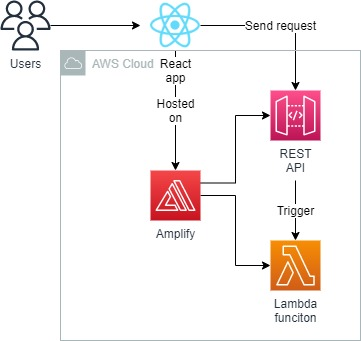
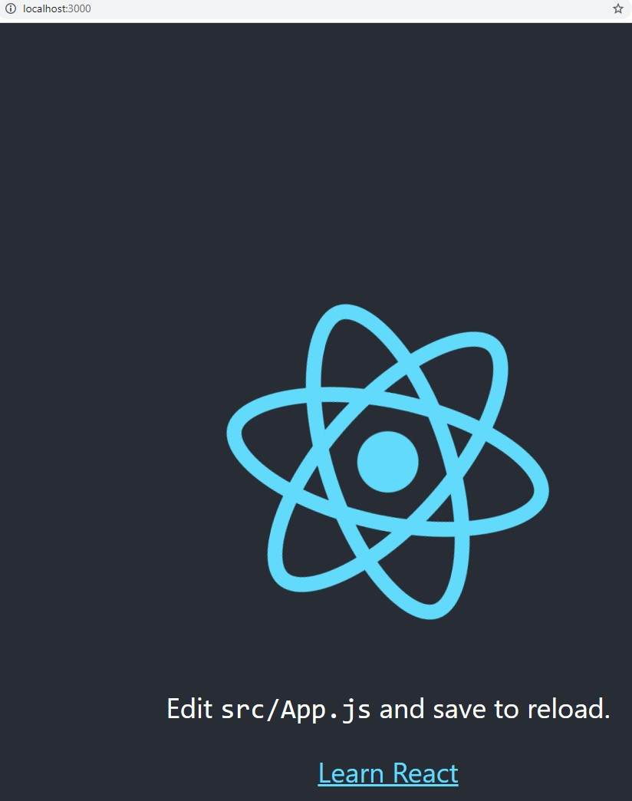
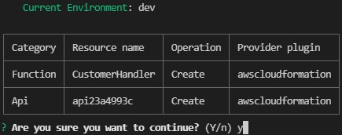
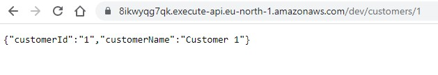

<br />

<p align="center">
  <a href="img/">
    
  </a>
  <h3 align="center">100 days in Cloud</h3>
<p align="center">
    React app on Amplify
    <br />
    Lab 49
    <br/>
  </p>


</p>

<details open="open">
  <summary><h2 style="display: inline-block">Lab Details</h2></summary>
  <ol>
    <li><a href="#services-covered">Services covered</a>
    <li><a href="#lab-description">Lab description</a></li>
    </li>
    <li><a href="#lab-date">Lab date</a></li>
    <li><a href="#prerequisites">Prerequisites</a></li>    
    <li><a href="#lab-steps">Lab steps</a></li>
    <li><a href="#lab-files">Lab files</a></li>
    <li><a href="#acknowledgements">Acknowledgements</a></li>
  </ol>
</details>

---

## Services Covered
*  **Lambda**
*  **React**
*  **Amplify**
---

## Lab description

In this lab I will deploy a React app using Amplify CLI. The application will be integrated with REST API and Lambda function and in the next lab with a  database. This lab is thought as a part of a bigger project.

---

### Learning Objectives

* Create a React app using npx
* Initialize and deploy Amplify environment using Amplify CLI
* Create and mock lambda function

### Lab date
12-11-2021

---

### Prerequisites
* AWS account
* Amplify CLI
* npm installed

---

### Lab steps
1. Start with creating a sample hello world React app with npx. I'll call this one amplify-demo-app, when done cd into the project folder

   ```
   npx create-react-app amplify-demo-app
   cd amplify-demo-app
   ```

2. To verify that everythings is correct run:

   ```
   npm start
   ```

   This should run the local server and open the app in your browser

   

3. To start the creation of an Amplify set-up run following command in your root directory:

   ```
   amplify init
   ```

   Then accept the configuration. This will start rolling out resources by using CloudFormation. If you navigate to AWS Console and then to CloudFromation you'll see that a new stack was created and two IAM Roles and a S3 bucket were created

   

   You could even notice that there's an app created in the Amplify section of AWS Management Console.

4. Time to add an API for the application. Run:

   ```
   amplify add api
   ```

   Choose the REST type of API. Leave the deafult name, provide */customers/{customerId}* as path, choose *Create a new Lambda function*, call it *CustomerHandler*, select NodeJS, select Hello World, then no to advanced settings. Then if your using VSC it should oppen the *index.js* for you. Edit the code:

   ```javascript
   exports.handler = async (event) => {
       console.log(event)
       const customerId = event.pathParameters.customerId;
       const customer = {'customerId': customerId, 'customerName': "Customer " + customerId };
       const response = {
           statusCode: 200,
       //  Uncomment below to enable CORS requests
           headers: {
               "Access-Control-Allow-Origin": "*",
               "Access-Control-Allow-Headers": "*"
           }, 
           body: JSON.stringify(customer),
       };
       return response;
   };
   ```

   Back in the command line set-up, answer **no** to restrict API access, and **no** to add another path.

5. Apply the configuration to the stack by running:

   ```
   amplify push
   ```

   When the confirmation is prompted answer yes

   

   This will deploy the Lambda funciton, API Gateway REST API and bind them together. The deploment process wil return the Root URL of the API Gateway. 

6. Try the calling the endpoint API with the right path */customers/{yourdata}*

   

   So, now the API invokes the Lambda function and returns the result back to your browser.

7. In order to test the funciton locally you can pass the *event.json* as the event and mock the function execution by running following command:

   ```
   amplify mock function CustomerHandler --event <<relative-path-to-event.json>>
   ```
---

### Lab files
* 
---

### Acknowledgements
* [be a better dev](https://www.beabetterdev.com/2021/10/28/aws-amplify-setup-react/)

