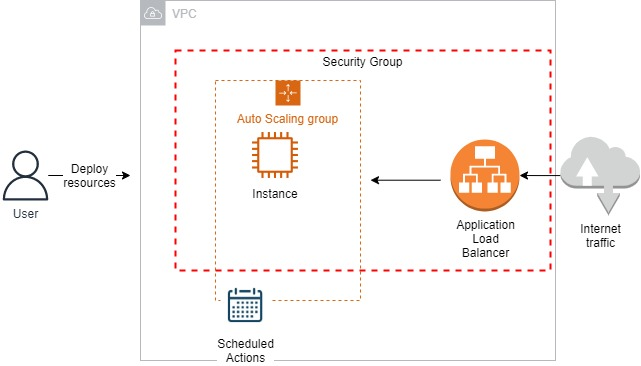
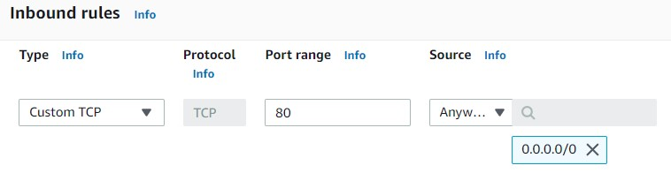
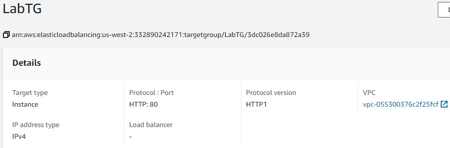
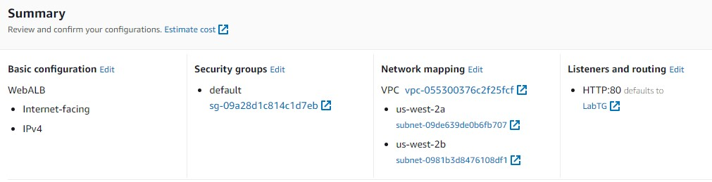
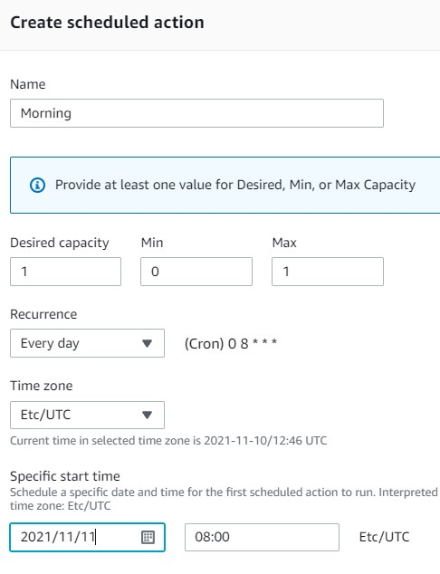
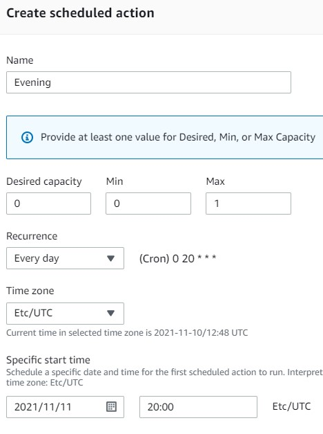

<br />

<p align="center">
  <a href="img/">
    
  </a>
  <h3 align="center">100 days in Cloud</h3>
<p align="center">
    Amazon Elastic Compute Cloud (EC2) Auto Scaling Challenge 
    <br />
    Lab 51
    <br/>
  </p>


</p>

<details open="open">
  <summary><h2 style="display: inline-block">Lab Details</h2></summary>
  <ol>
    <li><a href="#services-covered">Services covered</a>
    <li><a href="#lab-description">Lab description</a></li>
    </li>
    <li><a href="#lab-date">Lab date</a></li>
    <li><a href="#prerequisites">Prerequisites</a></li>    
    <li><a href="#lab-steps">Lab steps</a></li>
    <li><a href="#lab-files">Lab files</a></li>
    <li><a href="#acknowledgements">Acknowledgements</a></li>
  </ol>
</details>

---

## Services Covered
*  **VPC**
*  **EC2**
---

## Lab description

*In this lab challenge, you will be tested on your practical ability to build out a solution in a production-like AWS environment. You are presented with a task and a set of requirements that you must fulfill to pass the challenge. This is a real environment, which means you can prove your knowledge in an applied situation, leaving behind multiple choice questions for a dynamic performance-based exam situation.*

---

### Learning Objectives

* Create an Amazon VPC Security Group allowing HTTP traffic
* Create an Amazon EC2 Auto Scaling Launch Template
* Create an Elastic Load Balancing Target Group
* Create an Elastic Load Balancing Application Load Balancer
* Create an Amazon EC2 Auto Scaling Group
* Create Scheduled Actions for Business Hours

### Lab date
10-11-2021

---

### Prerequisites
* AWS account

---

### Lab steps
1. Create an Amazon VPC Security Group allowing HTTP traffic. In the **VPC** dashboard go to Security Groups and create a new one. Add an *Inbound rule* that allows TCP traffic on port 80 from any IP address.

   

2. Create an Amazon EC2 Auto Scaling Launch Template. Navigate to **EC2** dashboard. Create a new **Launch template** that uses t2.micro instance type, Amazon Linux 2 AMI, the security group created in step 1 and specifies the following command for User data:

   ```
   nohup python -m SimpleHTTPServer 80 &
   ```

   

3. Create an Elastic Load Balancing Target Group. It should use the Instance target type and uses the HTTP protocol and port 80. Don't register targets yet.

   

4. Create an Elastic Load Balancing Application Load Balancer. Choose the internet-facing scheme, listener using the HTTP protocol on port 80, uses two subnets in two AZ, and routes traffic to Target Group created in step 3.

   

5. Create an Amazon EC2 Auto Scaling Group. Use the Launch Template created in step 2. It should use the same two subnets and AZ as the ALB. Attach the ALB from step 4. Has Max capacity and Desired capacity set to one, Min capacity set to zero. 

6. Create Scheduled Actions for Business Hours. Choose you ASG and go to **Automatic scaling** tab then create ascheduled action for businness hours

   

   

   

---

### Lab files
* 
---

### Acknowledgements
* [cloud academy](https://cloudacademy.com/lab-challenge/amazon-elastic-compute-cloud-ec2-auto-scaling-challenge/)

