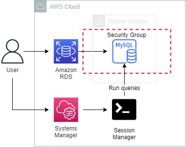
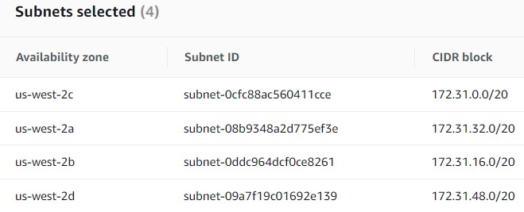
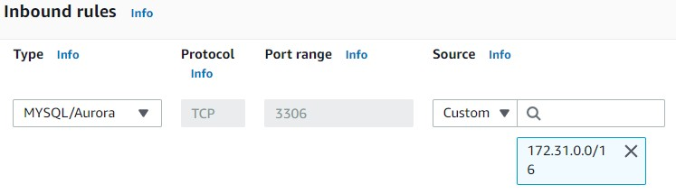
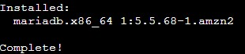
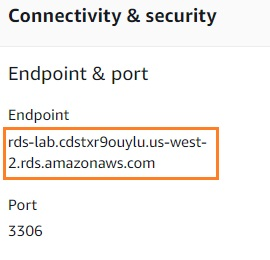

<br />

<p align="center">
  <a href="img/">
    
  </a>
  <h3 align="center">100 days in Cloud</h3>
<p align="center">
    Create and connect to a RDS MySQL database using Systems Manager 
    <br />
    Lab 52
    <br/>
  </p>

</p>

<details open="open">
  <summary><h2 style="display: inline-block">Lab Details</h2></summary>
  <ol>
    <li><a href="#services-covered">Services covered</a>
    <li><a href="#lab-description">Lab description</a></li>
    </li>
    <li><a href="#lab-date">Lab date</a></li>
    <li><a href="#prerequisites">Prerequisites</a></li>    
    <li><a href="#lab-steps">Lab steps</a></li>
    <li><a href="#lab-files">Lab files</a></li>
    <li><a href="#acknowledgements">Acknowledgements</a></li>
  </ol>
</details>

---

## Services Covered
*  **Systems Manager**
*  **RDS**
---

## Lab description

In this lab I will create a RDS database in a **DB Subnet Group**. I will use an EC2 instance to run queries against the database. I will use Session Manager to start a session on an running EC2 instance.

---

### Learning Objectives


* Create a DB Subnet Group
* Create a MySQL Database in RDS
* Run queries against database using Session Manager

### Lab date
09-11-2021

---

### Prerequisites
* AWS account
* An EC2 Instance running

---

### Lab steps
1. In the **RDS** dashboard go to **Subnet groups** and create DB Subnet Group. Select all available AZ and subnets.

   

2. Go to the **VPC** dashboard and then **Security Groups** and create a new security group. This secuiry group will allow acces to the database. 

   

3. Back in the **RDS** dashboard create a database. Choose **MySQL** Free tier template. Set up the name, user and password, choose db.t2.micro instance class, disable storage autoscaling. In the Connectivity section choose the Security Group created in previous step. In the Additional configuration give the db an Initial name, uncheck the automatic backups. Leave all the other fields as default. 

4. Navigate to **Systems Manager** and then to **Session Manager** and start a session. Choose the running EC2 Instance. When in shell session change the role by running:

   ```
   sudo -i -u ec2-user
   ```

5. Install the mysql client:

   ```
   sudo yum -y install mysql
   ```

   

6.  Navigate to the RDS Databases view and copy the endpoint:

   

7. In your session, run the following command replacing your.endpoint.aws.com with the endpoint you noted earlier:

   ```
   mysql -h <<your.endpoint.aws.com>> -u cloudacademy -p rdsappdb
   ```

   

8. Create a new table by executing this command:

   ```mysql
   CREATE TABLE laboratory ( id INT, name VARCHAR(100) );
   ```

9. Verify that your table was created by executing this command:

   ```mysql
   DESC laboratory;
   ```

10. Close your database connection by executing this command:

    ```mysql
    quit;
    ```

11. Back in the RDS Console click **Databases** and delete the earlier created database. 

---

### Lab files
* 
---

### Acknowledgements
* [cloud academy](https://cloudacademy.com/lab/create-your-first-amazon-rds-database/?context_resource=lp&context_id=954)

