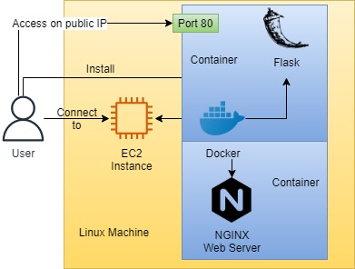
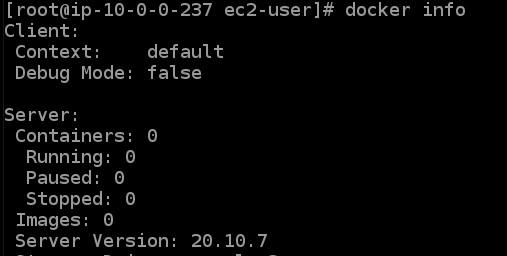
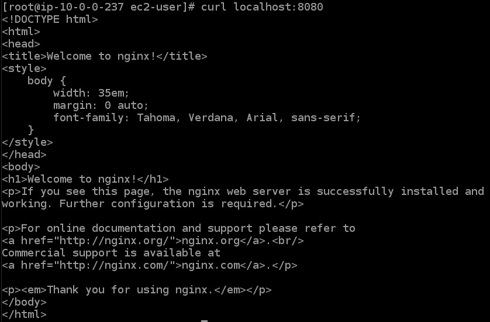
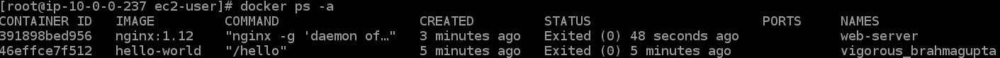
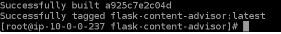
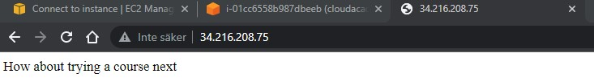

<br />

<p align="center">
  <a href="img/">
    
  </a>
  <h3 align="center">100 days in Cloud</h3>
<p align="center">
    Create and run Docker containers on EC2 Linux Instance
    <br />
    Lab 53
    <br/>
  </p>

</p>

<details open="open">
  <summary><h2 style="display: inline-block">Lab Details</h2></summary>
  <ol>
    <li><a href="#services-covered">Services covered</a>
    <li><a href="#lab-description">Lab description</a></li>
    </li>
    <li><a href="#lab-date">Lab date</a></li>
    <li><a href="#prerequisites">Prerequisites</a></li>    
    <li><a href="#lab-steps">Lab steps</a></li>
    <li><a href="#lab-files">Lab files</a></li>
    <li><a href="#acknowledgements">Acknowledgements</a></li>
  </ol>
</details>

---

## Services Covered
*  **EC2**
*  **Docker**
---

## Lab description

In this lab I will get up and running with Docker on Linux using an AWS virtual machine. I will work with images from the public Docker registry, run a handful of containers, and create my own image from which to create containers. Then I will connect to the Flask app running as a container using the instances public IP address.

---

### Learning Objectives


* Install Docker on Linux using an AWS virtual machine
* Find and use images from the public Docker Registry
* Build your own images using Dockerfile

### Lab date
08-11-2021

---

### Prerequisites
* AWS account

---

### Lab steps
1. Create and connect to an **EC2 instance** using the **Instance Connect**.

2. Install **Docker** using yum (assume the su role):

   ```
   yum -y install docker
   ```

   Then start the docker as a service:

   ```
   systemctl start docker
   ```

   Verify if it's running:

   ```
   docker info
   ```

   

3. Get the first container by running:

   ```
   docker run hello-world
   ```

4. Try to run something more complex, like a nginx web server:

   ```
   docker run --name web-server -d -p 8080:80 nginx:1.12
   ```

   Then verify that web-server is responding:

   ```
   curl localhost:8080
   ```

   

5. To list all running and stopped containers run_

   ```
   docker ps -a
   ```

   

6. To stop the nginx server enter:

   ```
   docker stop web-server
   ```

7.  Search for an image that you don't know the exact name of, say an image for Microsoft .NET Core, by entering:

   ```
   docker search "Microsoft .NET Core"
   ```

   This will help you find container images in the future.

8. Install Git:

   ```
   yum -y install git
   ```

9. Clone the code repository to your virtual machine:

   ```
   git clone https://github.com/cloudacademy/flask-content-advisor.git
   ```

   Continue to the apps directory

   ```
   cd flask-content-advisor
   ```

   Create and star editing a Dockerfile:

   ```
   vi Dockerfile
   ```

   and type in following:

   ```
   # Python v3 base layer
   FROM python:3
   
   # Set the working directory in the image's file system
   WORKDIR /usr/src/app
   
   # Copy everything in the host working directory to the container's directory
   COPY . .
   
   # Install code dependencies in requirements.txt
   RUN pip install --no-cache-dir -r requirements.txt
   
   # Indicate that the server will be listening on port 5000
   EXPOSE 5000
   
   # Set the default command to run the app
   CMD [ "python", "./src/app.py" ]
   ```

   then escape and save using :wq.

10. Build the image from the Dockerfile:

    ```
    docker build -t flask-content-advisor:latest .
    ```

    

11. Run following command to get the public IP address:

    ```
    curl ipecho.net/plain; echo
    ```

12. Now you can run a container using the image you just built:

13. Paste the public IP address into web browsers tab you should get response from flask app:

    

---

### Lab files
* 
---

### Acknowledgements
* [cloud academy](https://cloudacademy.com/lab/start-with-docker-linux-aws/?context_id=129&context_resource=lp)

